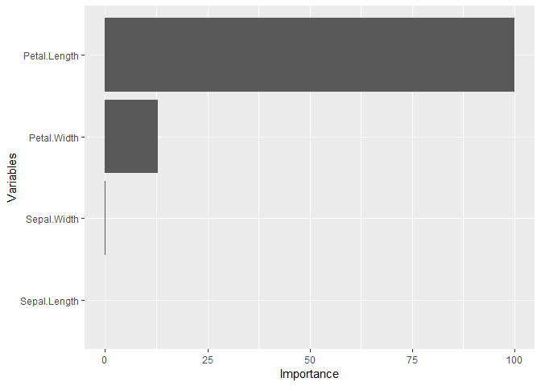
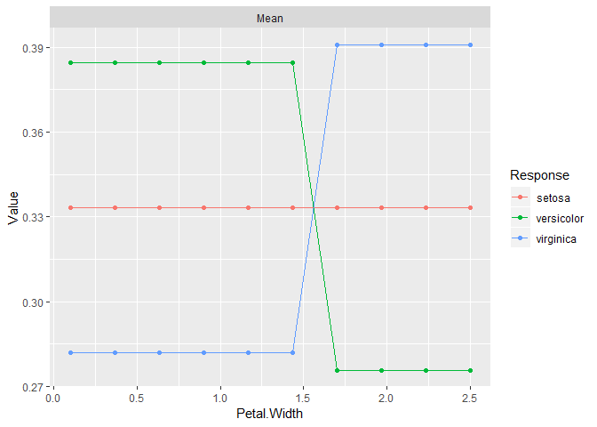

<!-- README.md is generated from README.Rmd. Please edit that file -->
MachineShop: Machine Learning Models and Tools
==============================================

Overview
--------

`MachineShop` is a meta-package for statistical and machine learning with a common interface for model fitting, prediction, performance assessment, and presentation of results. Support is provided for predictive modeling of numerical, categorical, and censored time-to-event outcomes, including those listed in the table below, and for resample (bootstrap, cross-validation, and split training-test sets) estimation of model performance.

<table class="table table-striped" style="width: auto !important; margin-left: auto; margin-right: auto;">
<thead>
<tr>
<th style="border-bottom:hidden" colspan="1">
</th>
<th style="border-bottom:hidden" colspan="1">
</th>
<th style="border-bottom:hidden; padding-bottom:0; padding-left:3px;padding-right:3px;text-align: center; " colspan="4">
Response Variable Types

</th>
</tr>
<tr>
<th style="text-align:left;">
</th>
<th style="text-align:center;">
Constructor
</th>
<th style="text-align:center;">
factor
</th>
<th style="text-align:center;">
numeric
</th>
<th style="text-align:center;">
ordered
</th>
<th style="text-align:center;">
Surv
</th>
</tr>
</thead>
<tbody>
<tr>
<td style="text-align:left;">
C5.0 Classification
</td>
<td style="text-align:center;">
C50Model
</td>
<td style="text-align:center;">
x
</td>
<td style="text-align:center;">
</td>
<td style="text-align:center;">
</td>
<td style="text-align:center;">
</td>
</tr>
<tr>
<td style="text-align:left;">
Conditional Inference Trees
</td>
<td style="text-align:center;">
CForestModel
</td>
<td style="text-align:center;">
x
</td>
<td style="text-align:center;">
x
</td>
<td style="text-align:center;">
</td>
<td style="text-align:center;">
x
</td>
</tr>
<tr>
<td style="text-align:left;">
Cox Regression
</td>
<td style="text-align:center;">
CoxModel
</td>
<td style="text-align:center;">
</td>
<td style="text-align:center;">
</td>
<td style="text-align:center;">
</td>
<td style="text-align:center;">
x
</td>
</tr>
<tr>
<td style="text-align:left;">
Generalized Linear Models
</td>
<td style="text-align:center;">
GLMModel
</td>
<td style="text-align:center;">
x
</td>
<td style="text-align:center;">
x
</td>
<td style="text-align:center;">
</td>
<td style="text-align:center;">
</td>
</tr>
<tr>
<td style="text-align:left;">
Gradient Boosted Models
</td>
<td style="text-align:center;">
GBMModel
</td>
<td style="text-align:center;">
x
</td>
<td style="text-align:center;">
x
</td>
<td style="text-align:center;">
</td>
<td style="text-align:center;">
x
</td>
</tr>
<tr>
<td style="text-align:left;">
Lasso and Elastic-Net
</td>
<td style="text-align:center;">
GLMNetModel
</td>
<td style="text-align:center;">
x
</td>
<td style="text-align:center;">
x
</td>
<td style="text-align:center;">
</td>
<td style="text-align:center;">
x
</td>
</tr>
<tr>
<td style="text-align:left;">
Feed-Forward Neural Networks
</td>
<td style="text-align:center;">
NNetModel
</td>
<td style="text-align:center;">
x
</td>
<td style="text-align:center;">
x
</td>
<td style="text-align:center;">
</td>
<td style="text-align:center;">
</td>
</tr>
<tr>
<td style="text-align:left;">
Partial Least Squares
</td>
<td style="text-align:center;">
PLSModel
</td>
<td style="text-align:center;">
x
</td>
<td style="text-align:center;">
x
</td>
<td style="text-align:center;">
</td>
<td style="text-align:center;">
</td>
</tr>
<tr>
<td style="text-align:left;">
Ordered Logistic Regression
</td>
<td style="text-align:center;">
POLRModel
</td>
<td style="text-align:center;">
</td>
<td style="text-align:center;">
</td>
<td style="text-align:center;">
x
</td>
<td style="text-align:center;">
</td>
</tr>
<tr>
<td style="text-align:left;">
Random Forests
</td>
<td style="text-align:center;">
RandomForestModel
</td>
<td style="text-align:center;">
x
</td>
<td style="text-align:center;">
x
</td>
<td style="text-align:center;">
</td>
<td style="text-align:center;">
</td>
</tr>
<tr>
<td style="text-align:left;">
Stacked Regression
</td>
<td style="text-align:center;">
StackedModel
</td>
<td style="text-align:center;">
x
</td>
<td style="text-align:center;">
x
</td>
<td style="text-align:center;">
x
</td>
<td style="text-align:center;">
x
</td>
</tr>
<tr>
<td style="text-align:left;">
Super Learner
</td>
<td style="text-align:center;">
SuperModel
</td>
<td style="text-align:center;">
x
</td>
<td style="text-align:center;">
x
</td>
<td style="text-align:center;">
x
</td>
<td style="text-align:center;">
x
</td>
</tr>
<tr>
<td style="text-align:left;">
Parametric Survival Regression
</td>
<td style="text-align:center;">
SurvRegModel
</td>
<td style="text-align:center;">
</td>
<td style="text-align:center;">
</td>
<td style="text-align:center;">
</td>
<td style="text-align:center;">
x
</td>
</tr>
<tr>
<td style="text-align:left;">
Support Vector Machines
</td>
<td style="text-align:center;">
SVMModel
</td>
<td style="text-align:center;">
x
</td>
<td style="text-align:center;">
x
</td>
<td style="text-align:center;">
</td>
<td style="text-align:center;">
</td>
</tr>
<tr>
<td style="text-align:left;">
Extreme Gradient Boosting
</td>
<td style="text-align:center;">
XGBModel
</td>
<td style="text-align:center;">
x
</td>
<td style="text-align:center;">
x
</td>
<td style="text-align:center;">
</td>
<td style="text-align:center;">
</td>
</tr>
</tbody>
</table>

Installation
------------

``` r
# Current release from CRAN
install.packages("MachineShop")

# Development version from GitHub
# install.packages("devtools")
devtools::install_github("brian-j-smith/MachineShop")

# Development version with vignettes
devtools::install_github("brian-j-smith/MachineShop", build_vignettes = TRUE)
```

Documentation
-------------

Once the package is installed, general documentation on its usage can be viewed with the following console commands.

``` r
library(MachineShop)

# Package help summary
?MachineShop

# Vignette
RShowDoc("Introduction", package = "MachineShop")
```

Example
-------

The following is a brief example illustrating use of the package to predict the species of flowers in Edgar Anderson's iris data set.

### Training and Test Set Analysis

``` r
## Load the package
library(MachineShop)
library(magrittr)

## Iris flower species (3 level response) data set
df <- iris
df$Species <- factor(df$Species)

## Training and test sets
set.seed(123)
trainindices <- sample(nrow(df), nrow(df) * 2 / 3)
train <- df[trainindices, ]
test <- df[-trainindices, ]

## Model formula
fo <- Species ~ .

## Gradient boosted mode fit to training set
gbmfit <- fit(fo, data = train, model = GBMModel)

## Variable importance
(vi <- varimp(gbmfit))
#>                  Overall
#> Petal.Length 100.0000000
#> Petal.Width   12.9638575
#> Sepal.Width    0.1409401
#> Sepal.Length   0.0000000

plot(vi)
```



``` r
## Test set predicted probabilities
predict(gbmfit, newdata = test, type = "prob") %>% head
#>         setosa   versicolor    virginica
#> [1,] 0.9999755 2.449128e-05 2.828117e-08
#> [2,] 0.9999365 6.346918e-05 6.535304e-09
#> [3,] 0.9999365 6.346918e-05 6.535304e-09
#> [4,] 0.9999755 2.449128e-05 2.828117e-08
#> [5,] 0.9998941 1.059313e-04 8.577135e-09
#> [6,] 0.9999291 7.084465e-05 5.736212e-09

## Test set predicted classifications
predict(gbmfit, newdata = test) %>% head
#> [1] setosa setosa setosa setosa setosa setosa
#> Levels: setosa versicolor virginica

## Test set performance
obs <- response(fo, data = test)
pred <- predict(gbmfit, newdata = test, type = "prob")
modelmetrics(obs, pred)
#>  Accuracy     Kappa     Brier  MLogLoss 
#> 0.9200000 0.8793727 0.1570015 0.4522663
```

### Resampling

``` r
## Resample estimation of model performance
(perf <- resample(fo, data = df, model = GBMModel, control = CVControl))
#> An object of class "Resamples"
#> 
#> Metrics: Accuracy, Kappa, Brier, MLogLoss 
#> 
#> Resamples control object of class "CVMLControl"
#> 
#> Method: K-Fold Cross-Validation
#> 
#> Folds: 10
#> 
#> Repeats: 1
#> 
#> Class cutoff probability: 0.5 
#> 
#> Omit missing responses: TRUE
#> 
#> Seed: 9279906

summary(perf)
#>                Mean     Median         SD          Min       Max NA
#> Accuracy 0.93333333 0.93333333 0.06285394 8.000000e-01 1.0000000  0
#> Kappa    0.90000000 0.90000000 0.09428090 7.000000e-01 1.0000000  0
#> Brier    0.09409409 0.08887763 0.08302550 5.911564e-07 0.2260197  0
#> MLogLoss 0.22653409 0.12128540 0.23089382 3.321915e-04 0.5716866  0

plot(perf)
```


### Model Tuning

``` r
## Select optimal model over a grid of tuning parameters
gbmtune <- tune(fo, data = df, model = GBMModel,
                grid = expand.grid(n.trees = c(25, 50, 100),
                                   interaction.depth = 1:3,
                                   n.minobsinnode = c(5, 10)))

plot(gbmtune, type = "line")
```


``` r
## Fit the selected model
gbmtunefit <- fit(fo, data = df, model = gbmtune)
varimp(gbmtunefit)
#>               Overall
#> Petal.Length 100.0000
#> Petal.Width   41.5202
#> Sepal.Length   0.0000
#> Sepal.Width    0.0000
```

### Model Comparisons

``` r
## Model comparisons
control <- CVControl(folds = 10, repeats = 5)

gbmperf <- resample(fo, data = df, model = GBMModel, control = control)
rfperf <- resample(fo, data = df, model = RandomForestModel, control = control)
nnetperf <- resample(fo, data = df, model = NNetModel, control = control)

perf <- Resamples(GBM = gbmperf, RF = rfperf, NNet = nnetperf)
summary(perf)
#> , , Accuracy
#> 
#>           Mean    Median         SD Min Max NA
#> GBM  0.9386667 0.9333333 0.05360475 0.8   1  0
#> RF   0.9533333 0.9333333 0.05259696 0.8   1  0
#> NNet 0.7560000 0.8666667 0.26687407 0.2   1  0
#> 
#> , , Kappa
#> 
#>       Mean Median         SD  Min Max NA
#> GBM  0.908    0.9 0.08040713  0.7   1  0
#> RF   0.930    0.9 0.07889544  0.7   1  0
#> NNet 0.634    0.8 0.40031110 -0.2   1  0
#> 
#> , , Brier
#> 
#>            Mean     Median         SD          Min       Max NA
#> GBM  0.10129338 0.11061105 0.08946454 1.107334e-05 0.3572127  0
#> RF   0.07134018 0.05526187 0.06836264 4.053333e-04 0.3150320  0
#> NNet 0.26163450 0.20816834 0.25188258 3.593928e-07 0.6666667  0
#> 
#> , , MLogLoss
#> 
#>           Mean     Median        SD          Min       Max NA
#> GBM  0.2518192 0.16342373 0.2688835 0.0010846265 1.0332245  0
#> RF   0.1148603 0.08794764 0.1026771 0.0059784000 0.4879684  0
#> NNet 0.4484417 0.46209826 0.4244811 0.0002317343 1.0986124  0

plot(perf)
```


``` r
## Pairwise model differences and t-tests
perfdiff <- diff(perf)
summary(perfdiff)
#> , , Accuracy
#> 
#>                   Mean     Median         SD        Min        Max NA
#> GBM - RF   -0.01466667 0.00000000 0.03877957 -0.1333333 0.06666667  0
#> GBM - NNet  0.18266667 0.06666667 0.26283299 -0.1333333 0.73333333  0
#> RF - NNet   0.19733333 0.03333333 0.25906162 -0.1333333 0.73333333  0
#> 
#> , , Kappa
#> 
#>              Mean Median         SD  Min Max NA
#> GBM - RF   -0.022   0.00 0.05816935 -0.2 0.1  0
#> GBM - NNet  0.274   0.10 0.39424948 -0.2 1.1  0
#> RF - NNet   0.296   0.05 0.38859244 -0.2 1.1  0
#> 
#> , , Brier
#> 
#>                  Mean      Median         SD         Min       Max NA
#> GBM - RF    0.0299532  0.02470100 0.03682158 -0.01908523 0.1307530  0
#> GBM - NNet -0.1603411 -0.05156092 0.24631397 -0.66665560 0.1842272  0
#> RF - NNet  -0.1902943 -0.11429173 0.24189899 -0.66621067 0.1501570  0
#> 
#> , , MLogLoss
#> 
#>                  Mean      Median        SD         Min        Max NA
#> GBM - RF    0.1369589  0.06137821 0.1849732 -0.04170943 0.66167256  0
#> GBM - NNet -0.1966225 -0.01021118 0.4405118 -1.09726064 0.58532527  0
#> RF - NNet  -0.3335814 -0.22890815 0.4066831 -1.09142835 0.08762133  0

t.test(perfdiff)
#> An object of class "ResamplesHTest"
#> 
#> Upper diagonal: mean differences (row - column)
#> Lower diagonal: p-values
#> P-value adjustment method: holm
#> 
#> , , Accuracy
#> 
#>               GBM            RF      NNet
#> GBM            NA -1.466667e-02 0.1826667
#> RF   1.014730e-02            NA 0.1973333
#> NNet 2.074356e-05  6.097090e-06        NA
#> 
#> , , Kappa
#> 
#>               GBM           RF  NNet
#> GBM            NA -2.20000e-02 0.274
#> RF   1.014730e-02           NA 0.296
#> NNet 2.074356e-05  6.09709e-06    NA
#> 
#> , , Brier
#> 
#>               GBM           RF       NNet
#> GBM            NA 2.995320e-02 -0.1603411
#> RF   1.687958e-06           NA -0.1902943
#> NNet 2.973266e-05 2.192459e-06         NA
#> 
#> , , MLogLoss
#> 
#>               GBM           RF       NNet
#> GBM            NA 1.369589e-01 -0.1966225
#> RF   6.863865e-06           NA -0.3335814
#> NNet 2.733302e-03 1.425115e-06         NA

plot(perfdiff)
```


### Ensemble Models

``` r
## Stacked regression
stackedperf <- resample(fo, data = df, model = StackedModel(GBMModel, RandomForestModel, NNetModel))
summary(stackedperf)
#>                Mean     Median         SD        Min       Max NA
#> Accuracy 0.95333333 0.93333333 0.04499657 0.86666667 1.0000000  0
#> Kappa    0.93000000 0.90000000 0.06749486 0.80000000 1.0000000  0
#> Brier    0.07173538 0.07422913 0.05626301 0.00721325 0.1604355  0
#> MLogLoss 0.13189257 0.11165006 0.09045890 0.03491990 0.2853765  0

## Super learners
superperf <- resample(fo, data = df, model = SuperModel(GBMModel, RandomForestModel, NNetModel))
summary(superperf)
#>               Mean     Median         SD          Min       Max NA
#> Accuracy 0.9466667 0.96666667 0.06126244 8.666667e-01 1.0000000  0
#> Kappa    0.9200000 0.95000000 0.09189366 8.000000e-01 1.0000000  0
#> Brier    0.0863423 0.03179952 0.10443637 1.271082e-07 0.2524129  0
#> MLogLoss 0.1593310 0.05192877 0.19311366 1.043113e-04 0.4880625  0
```

### Partial Dependence Plots

``` r
pd <- dependence(gbmfit, data = df, select = c(Petal.Length, Petal.Width))
plot(pd)
```



### Calibration Curves

``` r
cal <- calibration(perf)
plot(cal, se = TRUE)
```


### Lift Curves

``` r
## Requires binary outcomes
fo_versicolor <- factor(Species == "versicolor") ~ .
control = CVControl()

gbmperf_versicolor <- resample(fo_versicolor, data = iris,  model = GBMModel, control = control)
lf <- lift(gbmperf_versicolor)
plot(lf)
```


``` r
rfperf_versicolor <- resample(fo_versicolor, data = iris,  model = RandomForestModel, control = control)
nnetperf_versicolor <- resample(fo_versicolor, data = iris,  model = NNetModel, control = control)

perf_versicolor <- Resamples(gbmperf_versicolor, rfperf_versicolor, nnetperf_versicolor)
lf <- lift(perf_versicolor)
plot(lf, find = 75)
```


### Preprocessing Recipes

``` r
library(recipes)

rec <- recipe(fo, data = df) %>%
  step_center(all_predictors()) %>%
  step_scale(all_predictors()) %>%
  step_pca(all_predictors())

fit_rec <- fit(rec, model = GBMModel)
varimp(fit_rec)
#>        Overall
#> PC1 100.000000
#> PC3   6.012454
#> PC2   2.980838
#> PC4   0.000000

perf_rec <- resample(rec, model = GBMModel, control = CVControl)
summary(perf_rec)
#>                Mean    Median         SD          Min       Max NA
#> Accuracy 0.95333333 0.9666667 0.05488484 0.8666666667 1.0000000  0
#> Kappa    0.93000000 0.9500000 0.08232726 0.8000000000 1.0000000  0
#> Brier    0.06045794 0.0311148 0.06031867 0.0008898002 0.1500439  0
#> MLogLoss 0.13134483 0.0598847 0.14605459 0.0098464025 0.4610990  0
```
