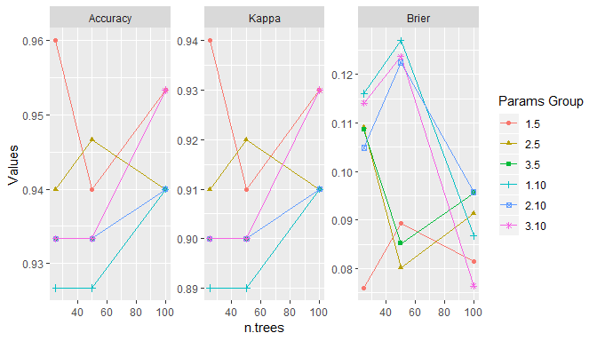
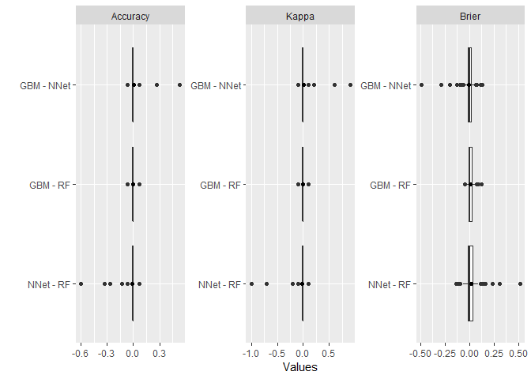
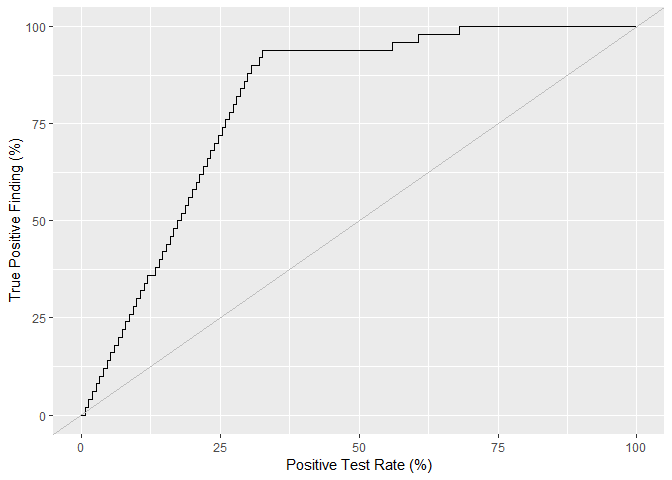
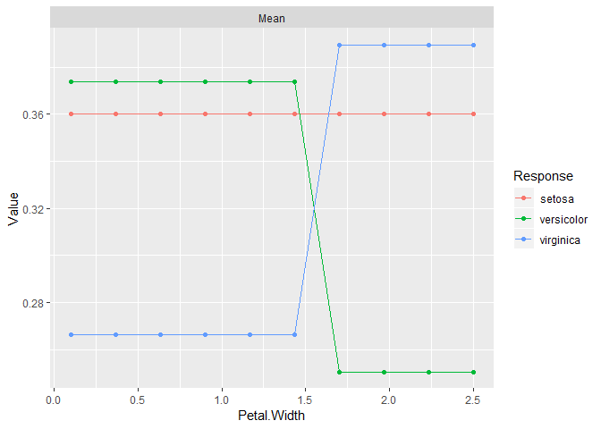
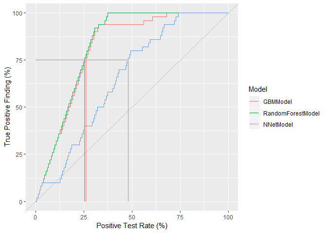
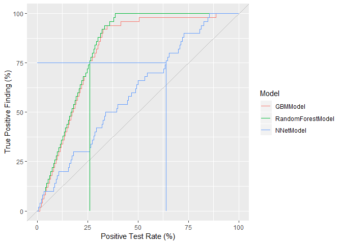

# MachineShop: Machine Learning Models and Tools

[](http://cran.r-project.org/web/packages/MachineShop)

## Overview

`MachineShop` is a meta-package for statistical and machine learning
with a common interface for model fitting, prediction, performance
assessment, and presentation of results. Support is provided for
predictive modeling of numerical, categorical, and censored
time-to-event outcomes, including those listed in the table below, and
for resample (bootstrap, cross-validation, and split training-test sets)
estimation of model
performance.

<div>

<table class="table table-striped" style="width: auto !important; margin-left: auto; margin-right: auto;">

<thead>

<tr>

<th style="border-bottom:hidden" colspan="1">

</th>

<th style="border-bottom:hidden" colspan="1">

</th>

<th style="border-bottom:hidden; padding-bottom:0; padding-left:3px;padding-right:3px;text-align: center; " colspan="3">

<div style="border-bottom: 1px solid #ddd; padding-bottom: 5px;">

Response Variable Types

</div>

</th>

</tr>

<tr>

<th style="text-align:left;">

Method

</th>

<th style="text-align:center;">

Constructor

</th>

<th style="text-align:center;">

Categorical<sup>1</sup>

</th>

<th style="text-align:center;">

Continuous<sup>2</sup>

</th>

<th style="text-align:center;">

Survival<sup>3</sup>

</th>

</tr>

</thead>

<tbody>

<tr>

<td style="text-align:left;">

Bagging with Classification Trees

</td>

<td style="text-align:center;">

AdaBagModel

</td>

<td style="text-align:center;">

f

</td>

<td style="text-align:center;">

</td>

<td style="text-align:center;">

</td>

</tr>

<tr>

<td style="text-align:left;">

Boosting with Classification Trees

</td>

<td style="text-align:center;">

AdaBoostModel

</td>

<td style="text-align:center;">

f

</td>

<td style="text-align:center;">

</td>

<td style="text-align:center;">

</td>

</tr>

<tr>

<td style="text-align:left;">

C5.0 Classification

</td>

<td style="text-align:center;">

C50Model

</td>

<td style="text-align:center;">

f

</td>

<td style="text-align:center;">

</td>

<td style="text-align:center;">

</td>

</tr>

<tr>

<td style="text-align:left;">

Conditional Random Forests

</td>

<td style="text-align:center;">

CForestModel

</td>

<td style="text-align:center;">

f

</td>

<td style="text-align:center;">

n

</td>

<td style="text-align:center;">

S

</td>

</tr>

<tr>

<td style="text-align:left;">

Cox Regression

</td>

<td style="text-align:center;">

CoxModel

</td>

<td style="text-align:center;">

</td>

<td style="text-align:center;">

</td>

<td style="text-align:center;">

S

</td>

</tr>

<tr>

<td style="text-align:left;">

Cox Regression (Stepwise)

</td>

<td style="text-align:center;">

CoxStepAICModel

</td>

<td style="text-align:center;">

</td>

<td style="text-align:center;">

</td>

<td style="text-align:center;">

S

</td>

</tr>

<tr>

<td style="text-align:left;">

Multivariate Adaptive Regression Splines

</td>

<td style="text-align:center;">

EarthModel

</td>

<td style="text-align:center;">

f

</td>

<td style="text-align:center;">

n

</td>

<td style="text-align:center;">

</td>

</tr>

<tr>

<td style="text-align:left;">

Flexible Discriminant Analysis

</td>

<td style="text-align:center;">

FDAModel

</td>

<td style="text-align:center;">

f

</td>

<td style="text-align:center;">

</td>

<td style="text-align:center;">

</td>

</tr>

<tr>

<td style="text-align:left;">

Gradient Boosting with Additive Models

</td>

<td style="text-align:center;">

GAMBoostModel

</td>

<td style="text-align:center;">

b

</td>

<td style="text-align:center;">

n

</td>

<td style="text-align:center;">

S

</td>

</tr>

<tr>

<td style="text-align:left;">

Generalized Boosted Regression

</td>

<td style="text-align:center;">

GBMModel

</td>

<td style="text-align:center;">

f

</td>

<td style="text-align:center;">

n

</td>

<td style="text-align:center;">

S

</td>

</tr>

<tr>

<td style="text-align:left;">

Generalized Linear Models

</td>

<td style="text-align:center;">

GLMModel

</td>

<td style="text-align:center;">

b

</td>

<td style="text-align:center;">

n

</td>

<td style="text-align:center;">

</td>

</tr>

<tr>

<td style="text-align:left;">

Generalized Linear Models (Stepwise)

</td>

<td style="text-align:center;">

GLMStepAICModel

</td>

<td style="text-align:center;">

b

</td>

<td style="text-align:center;">

n

</td>

<td style="text-align:center;">

</td>

</tr>

<tr>

<td style="text-align:left;">

Lasso and Elastic-Net

</td>

<td style="text-align:center;">

GLMNetModel

</td>

<td style="text-align:center;">

f

</td>

<td style="text-align:center;">

m, n

</td>

<td style="text-align:center;">

S

</td>

</tr>

<tr>

<td style="text-align:left;">

K-Nearest Neighbors Model

</td>

<td style="text-align:center;">

KNNModel

</td>

<td style="text-align:center;">

f, o

</td>

<td style="text-align:center;">

n

</td>

<td style="text-align:center;">

</td>

</tr>

<tr>

<td style="text-align:left;">

Linear Discriminant Analysis

</td>

<td style="text-align:center;">

LDAModel

</td>

<td style="text-align:center;">

f

</td>

<td style="text-align:center;">

</td>

<td style="text-align:center;">

</td>

</tr>

<tr>

<td style="text-align:left;">

Linear Model

</td>

<td style="text-align:center;">

LMModel

</td>

<td style="text-align:center;">

f

</td>

<td style="text-align:center;">

m, n

</td>

<td style="text-align:center;">

</td>

</tr>

<tr>

<td style="text-align:left;">

Mixture Discriminant Analysis

</td>

<td style="text-align:center;">

MDAModel

</td>

<td style="text-align:center;">

f

</td>

<td style="text-align:center;">

</td>

<td style="text-align:center;">

</td>

</tr>

<tr>

<td style="text-align:left;">

Naive Bayes Classifier

</td>

<td style="text-align:center;">

NaiveBayesModel

</td>

<td style="text-align:center;">

f

</td>

<td style="text-align:center;">

</td>

<td style="text-align:center;">

</td>

</tr>

<tr>

<td style="text-align:left;">

Feed-Forward Neural Networks

</td>

<td style="text-align:center;">

NNetModel

</td>

<td style="text-align:center;">

f

</td>

<td style="text-align:center;">

n

</td>

<td style="text-align:center;">

</td>

</tr>

<tr>

<td style="text-align:left;">

Penalized Discriminant Analysis

</td>

<td style="text-align:center;">

PDAModel

</td>

<td style="text-align:center;">

f

</td>

<td style="text-align:center;">

</td>

<td style="text-align:center;">

</td>

</tr>

<tr>

<td style="text-align:left;">

Partial Least Squares

</td>

<td style="text-align:center;">

PLSModel

</td>

<td style="text-align:center;">

f

</td>

<td style="text-align:center;">

n

</td>

<td style="text-align:center;">

</td>

</tr>

<tr>

<td style="text-align:left;">

Ordered Logistic Regression

</td>

<td style="text-align:center;">

POLRModel

</td>

<td style="text-align:center;">

o

</td>

<td style="text-align:center;">

</td>

<td style="text-align:center;">

</td>

</tr>

<tr>

<td style="text-align:left;">

Quadratic Discriminant Analysis

</td>

<td style="text-align:center;">

QDAModel

</td>

<td style="text-align:center;">

f

</td>

<td style="text-align:center;">

</td>

<td style="text-align:center;">

</td>

</tr>

<tr>

<td style="text-align:left;">

Random Forests

</td>

<td style="text-align:center;">

RandomForestModel

</td>

<td style="text-align:center;">

f

</td>

<td style="text-align:center;">

n

</td>

<td style="text-align:center;">

</td>

</tr>

<tr>

<td style="text-align:left;">

Fast Random Forests

</td>

<td style="text-align:center;">

RangerModel

</td>

<td style="text-align:center;">

f

</td>

<td style="text-align:center;">

n

</td>

<td style="text-align:center;">

S

</td>

</tr>

<tr>

<td style="text-align:left;">

Recursive Partitioning and Regression Trees

</td>

<td style="text-align:center;">

RPartModel

</td>

<td style="text-align:center;">

f

</td>

<td style="text-align:center;">

n

</td>

<td style="text-align:center;">

S

</td>

</tr>

<tr>

<td style="text-align:left;">

Stacked Regression

</td>

<td style="text-align:center;">

StackedModel

</td>

<td style="text-align:center;">

f, o

</td>

<td style="text-align:center;">

m, n

</td>

<td style="text-align:center;">

S

</td>

</tr>

<tr>

<td style="text-align:left;">

Super Learner

</td>

<td style="text-align:center;">

SuperModel

</td>

<td style="text-align:center;">

f, o

</td>

<td style="text-align:center;">

m, n

</td>

<td style="text-align:center;">

S

</td>

</tr>

<tr>

<td style="text-align:left;">

Parametric Survival

</td>

<td style="text-align:center;">

SurvRegModel

</td>

<td style="text-align:center;">

</td>

<td style="text-align:center;">

</td>

<td style="text-align:center;">

S

</td>

</tr>

<tr>

<td style="text-align:left;">

Parametric Survival (Stepwise)

</td>

<td style="text-align:center;">

SurvRegStepAICModel

</td>

<td style="text-align:center;">

</td>

<td style="text-align:center;">

</td>

<td style="text-align:center;">

S

</td>

</tr>

<tr>

<td style="text-align:left;">

Support Vector Machines

</td>

<td style="text-align:center;">

SVMModel

</td>

<td style="text-align:center;">

f

</td>

<td style="text-align:center;">

n

</td>

<td style="text-align:center;">

</td>

</tr>

<tr>

<td style="text-align:left;">

Support Vector Machines (ANOVA)

</td>

<td style="text-align:center;">

SVMANOVAModel

</td>

<td style="text-align:center;">

f

</td>

<td style="text-align:center;">

n

</td>

<td style="text-align:center;">

</td>

</tr>

<tr>

<td style="text-align:left;">

Suplport Vector Machines (Bessel)

</td>

<td style="text-align:center;">

SVMBesselModel

</td>

<td style="text-align:center;">

f

</td>

<td style="text-align:center;">

n

</td>

<td style="text-align:center;">

</td>

</tr>

<tr>

<td style="text-align:left;">

Support Vector Machines (Laplace)

</td>

<td style="text-align:center;">

SVMLaplaceModel

</td>

<td style="text-align:center;">

f

</td>

<td style="text-align:center;">

n

</td>

<td style="text-align:center;">

</td>

</tr>

<tr>

<td style="text-align:left;">

Support Vector Machines (Linear)

</td>

<td style="text-align:center;">

SVMLinearModel

</td>

<td style="text-align:center;">

f

</td>

<td style="text-align:center;">

n

</td>

<td style="text-align:center;">

</td>

</tr>

<tr>

<td style="text-align:left;">

Support Vector Machines (Poly)

</td>

<td style="text-align:center;">

SVMPolyModel

</td>

<td style="text-align:center;">

f

</td>

<td style="text-align:center;">

n

</td>

<td style="text-align:center;">

</td>

</tr>

<tr>

<td style="text-align:left;">

Support Vector Machines (Radial)

</td>

<td style="text-align:center;">

SVMRadialModel

</td>

<td style="text-align:center;">

f

</td>

<td style="text-align:center;">

n

</td>

<td style="text-align:center;">

</td>

</tr>

<tr>

<td style="text-align:left;">

Support Vector Machines (Spline)

</td>

<td style="text-align:center;">

SVMSplineModel

</td>

<td style="text-align:center;">

f

</td>

<td style="text-align:center;">

n

</td>

<td style="text-align:center;">

</td>

</tr>

<tr>

<td style="text-align:left;">

Support Vector Machines (Tanh)

</td>

<td style="text-align:center;">

SVMTanhModel

</td>

<td style="text-align:center;">

f

</td>

<td style="text-align:center;">

n

</td>

<td style="text-align:center;">

</td>

</tr>

<tr>

<td style="text-align:left;">

Regression and Classification Trees

</td>

<td style="text-align:center;">

TreeModel

</td>

<td style="text-align:center;">

f

</td>

<td style="text-align:center;">

n

</td>

<td style="text-align:center;">

</td>

</tr>

<tr>

<td style="text-align:left;">

Extreme Gradient Boosting

</td>

<td style="text-align:center;">

XGBModel

</td>

<td style="text-align:center;">

f

</td>

<td style="text-align:center;">

n

</td>

<td style="text-align:center;">

</td>

</tr>

<tr>

<td style="text-align:left;">

Extreme Gradient Boosting (DART)

</td>

<td style="text-align:center;">

XGBDARTModel

</td>

<td style="text-align:center;">

f

</td>

<td style="text-align:center;">

n

</td>

<td style="text-align:center;">

</td>

</tr>

<tr>

<td style="text-align:left;">

Extreme Gradient Boosting (Linear)

</td>

<td style="text-align:center;">

XGBLinearModel

</td>

<td style="text-align:center;">

f

</td>

<td style="text-align:center;">

n

</td>

<td style="text-align:center;">

</td>

</tr>

<tr>

<td style="text-align:left;">

Extreme Gradient Boosting (Tree)

</td>

<td style="text-align:center;">

XGBTreeModel

</td>

<td style="text-align:center;">

f

</td>

<td style="text-align:center;">

n

</td>

<td style="text-align:center;">

</td>

</tr>

</tbody>

<tfoot>

<tr>

<td style="padding: 0; border: 0;" colspan="100%">

<sup>1</sup> b = binary, f = factor, o = ordered

</td>

</tr>

<tr>

<td style="padding: 0; border: 0;" colspan="100%">

<sup>2</sup> m = matrix, n = numeric

</td>

</tr>

<tr>

<td style="padding: 0; border: 0;" colspan="100%">

<sup>3</sup> S = Surv

</td>

</tr>

</tfoot>

</table>

</div>

## Installation

``` r
# Current release from CRAN
install.packages("MachineShop")

# Development version from GitHub
# install.packages("devtools")
devtools::install_github("brian-j-smith/MachineShop", ref = "develop")

# Development version with vignettes
devtools::install_github("brian-j-smith/MachineShop", ref = "develop", build_vignettes = TRUE)
```

## Documentation

Once the package is installed, general documentation on its usage can be
viewed with the following console commands.

``` r
library(MachineShop)

# Package help summary
?MachineShop

# Vignette
RShowDoc("Introduction", package = "MachineShop")
```

## Parallel Computing

Resampling algorithms will be executed in parallel automatically if a
parallel backend for the `foreach` package, such as `doParallel`, is
loaded.

``` r
library(doParallel)
registerDoParallel(cores = 4)
```

## Example

The following is a brief example illustrating use of the package to
predict the species of flowers in Edgar Anderson’s iris data set.

### Training and Test Set Analysis

``` r
## Load the package
library(MachineShop)
library(magrittr)

## Iris flower species (3 level response) data set
head(iris)
#>   Sepal.Length Sepal.Width Petal.Length Petal.Width Species
#> 1          5.1         3.5          1.4         0.2  setosa
#> 2          4.9         3.0          1.4         0.2  setosa
#> 3          4.7         3.2          1.3         0.2  setosa
#> 4          4.6         3.1          1.5         0.2  setosa
#> 5          5.0         3.6          1.4         0.2  setosa
#> 6          5.4         3.9          1.7         0.4  setosa

## Training and test sets
set.seed(123)
trainindices <- sample(nrow(iris), nrow(iris) * 2 / 3)
train <- iris[trainindices, ]
test <- iris[-trainindices, ]

## Model formula
fo <- Species ~ .

## All available models
modelinfo() %>% names
#>  [1] "AdaBagModel"         "AdaBoostModel"       "C50Model"           
#>  [4] "CForestModel"        "CoxModel"            "CoxStepAICModel"    
#>  [7] "EarthModel"          "FDAModel"            "GAMBoostModel"      
#> [10] "GBMModel"            "GLMModel"            "GLMStepAICModel"    
#> [13] "GLMNetModel"         "KNNModel"            "LDAModel"           
#> [16] "LMModel"             "MDAModel"            "NaiveBayesModel"    
#> [19] "NNetModel"           "PDAModel"            "PLSModel"           
#> [22] "POLRModel"           "QDAModel"            "RandomForestModel"  
#> [25] "RangerModel"         "RPartModel"          "StackedModel"       
#> [28] "SuperModel"          "SurvRegModel"        "SurvRegStepAICModel"
#> [31] "SVMModel"            "SVMANOVAModel"       "SVMBesselModel"     
#> [34] "SVMLaplaceModel"     "SVMLinearModel"      "SVMPolyModel"       
#> [37] "SVMRadialModel"      "SVMSplineModel"      "SVMTanhModel"       
#> [40] "TreeModel"           "XGBModel"            "XGBDARTModel"       
#> [43] "XGBLinearModel"      "XGBTreeModel"

## Models by response type
modelinfo(factor(0)) %>% names
#>  [1] "AdaBagModel"       "AdaBoostModel"     "C50Model"         
#>  [4] "CForestModel"      "EarthModel"        "FDAModel"         
#>  [7] "GBMModel"          "GLMNetModel"       "KNNModel"         
#> [10] "LDAModel"          "LMModel"           "MDAModel"         
#> [13] "NaiveBayesModel"   "NNetModel"         "PDAModel"         
#> [16] "PLSModel"          "QDAModel"          "RandomForestModel"
#> [19] "RangerModel"       "RPartModel"        "StackedModel"     
#> [22] "SuperModel"        "SVMModel"          "SVMANOVAModel"    
#> [25] "SVMBesselModel"    "SVMLaplaceModel"   "SVMLinearModel"   
#> [28] "SVMPolyModel"      "SVMRadialModel"    "SVMSplineModel"   
#> [31] "SVMTanhModel"      "TreeModel"         "XGBModel"         
#> [34] "XGBDARTModel"      "XGBLinearModel"    "XGBTreeModel"

## Gradient boosted mode fit to training set
gbmfit <- fit(fo, data = train, model = GBMModel)

## Variable importance
(vi <- varimp(gbmfit))
#>                 Overall
#> Petal.Length 100.000000
#> Petal.Width   14.601856
#> Sepal.Width    1.438558
#> Sepal.Length   0.000000

plot(vi)
```


``` r
## Test set predicted probabilities
predict(gbmfit, newdata = test, type = "prob") %>% head
#>         setosa   versicolor    virginica
#> [1,] 0.9999737 2.627994e-05 4.493784e-08
#> [2,] 0.9999154 8.456383e-05 4.205211e-09
#> [3,] 0.9999154 8.456383e-05 4.205211e-09
#> [4,] 0.9999737 2.627994e-05 4.493784e-08
#> [5,] 0.9998807 1.192834e-04 2.987679e-09
#> [6,] 0.9999024 9.764241e-05 2.445639e-09

## Test set predicted classifications
predict(gbmfit, newdata = test) %>% head
#> [1] setosa setosa setosa setosa setosa setosa
#> Levels: setosa versicolor virginica

## Test set performance
obs <- response(fo, data = test)
pred <- predict(gbmfit, newdata = test, type = "prob")
modelmetrics(obs, pred)
#>  Accuracy     Kappa     Brier 
#> 0.9200000 0.8793727 0.1502442
```

### Resampling

``` r
## Resample estimation of model performance
(res <- resample(fo, data = iris, model = GBMModel, control = CVControl))
#> An object of class "Resamples"
#> 
#> Models: GBMModel
#> 
#> Stratification variable: (strata) 
#> 
#> Resamples control object of class "CVMLControl"
#> 
#> Method: K-Fold Cross-Validation
#> 
#> Folds: 10
#> 
#> Repeats: 1
#> 
#> Survival times: 
#> 
#> Seed: 253452646

summary(res)
#>                Mean    Median         SD          Min       Max NA
#> Accuracy 0.95333333 0.9333333 0.03220306 9.333333e-01 1.0000000  0
#> Kappa    0.93000000 0.9000000 0.04830459 9.000000e-01 1.0000000  0
#> Brier    0.08476969 0.1133233 0.05621648 5.140496e-05 0.1372037  0

plot(res)
```


### Model Metrics

``` r
## Default model metrics
modelmetrics(res) %>% summary
#>                Mean    Median         SD          Min       Max NA
#> Accuracy 0.95333333 0.9333333 0.03220306 9.333333e-01 1.0000000  0
#> Kappa    0.93000000 0.9000000 0.04830459 9.000000e-01 1.0000000  0
#> Brier    0.08476969 0.1133233 0.05621648 5.140496e-05 0.1372037  0

## All available metric functions
metricinfo() %>% names
#>  [1] "accuracy"       "brier"          "cindex"         "cross_entropy" 
#>  [5] "f_score"        "kappa"          "mae"            "mse"           
#>  [9] "npv"            "ppv"            "pr_auc"         "precision"     
#> [13] "r2"             "recall"         "roc_auc"        "roc_index"     
#> [17] "sensitivity"    "specificity"    "weighted_kappa"

## Metric functions by observed and predicted response types
metricinfo(factor(0)) %>% names
#>  [1] "accuracy"      "brier"         "cindex"        "cross_entropy"
#>  [5] "f_score"       "kappa"         "npv"           "ppv"          
#>  [9] "pr_auc"        "precision"     "recall"        "roc_auc"      
#> [13] "roc_index"     "sensitivity"   "specificity"
metricinfo(factor(0), factor(0)) %>% names
#> [1] "accuracy" "kappa"
metricinfo(factor(0), matrix(0)) %>% names
#> [1] "accuracy"      "brier"         "cross_entropy" "kappa"
metricinfo(factor(0), numeric(0)) %>% names
#>  [1] "accuracy"      "brier"         "cindex"        "cross_entropy"
#>  [5] "f_score"       "kappa"         "npv"           "ppv"          
#>  [9] "pr_auc"        "precision"     "recall"        "roc_auc"      
#> [13] "roc_index"     "sensitivity"   "specificity"

## User-specified model metrics
modelmetrics(res, c("accuracy", "kappa", "brier", "cross_entropy")) %>% summary
#>                     Mean    Median         SD          Min       Max NA
#> accuracy      0.95333333 0.9333333 0.03220306 9.333333e-01 1.0000000  0
#> kappa         0.93000000 0.9000000 0.04830459 9.000000e-01 1.0000000  0
#> brier         0.08476969 0.1133233 0.05621648 5.140496e-05 0.1372037  0
#> cross_entropy 0.22809689 0.1745116 0.21892382 2.802783e-03 0.6422832  0
```

### Model Tuning

``` r
## Tune over a grid of model parameters
gbmtune <- tune(fo, data = iris, model = GBMModel,
                grid = expand.grid(n.trees = c(25, 50, 100),
                                   interaction.depth = 1:3,
                                   n.minobsinnode = c(5, 10)))

plot(gbmtune, type = "line")
```



``` r
## Fit the selected model
gbmtunefit <- fit(fo, data = iris, model = gbmtune)
varimp(gbmtunefit)
#>                 Overall
#> Petal.Length 100.000000
#> Petal.Width   19.311911
#> Sepal.Width    2.500572
#> Sepal.Length   0.000000
```

### Model Comparisons

``` r
## Model comparisons
control <- CVControl(folds = 10, repeats = 5)

gbmres <- resample(fo, data = iris, model = GBMModel(n.tree = 50), control = control)
rfres <- resample(fo, data = iris, model = RandomForestModel(ntree = 50), control = control)
nnetres <- resample(fo, data = iris, model = NNetModel(size = 5), control = control)

res <- Resamples(GBM = gbmres, RF = rfres, NNet = nnetres)
summary(res)
#> , , Accuracy
#> 
#>           Mean    Median         SD Min Max NA
#> GBM  0.9440000 0.9333333 0.05447752 0.8   1  0
#> NNet 0.9373333 0.9666667 0.08771217 0.6   1  0
#> RF   0.9520000 0.9333333 0.05720631 0.8   1  0
#> 
#> , , Kappa
#> 
#>       Mean Median         SD Min Max NA
#> GBM  0.916   0.90 0.08171628 0.7   1  0
#> NNet 0.892   0.95 0.15758380 0.4   1  0
#> RF   0.928   0.90 0.08580947 0.7   1  0
#> 
#> , , Brier
#> 
#>            Mean     Median         SD          Min       Max NA
#> GBM  0.08739305 0.06993792 0.08997327 5.611940e-05 0.3655810  0
#> NNet 0.09728523 0.06078362 0.11257530 5.069556e-26 0.3333334  0
#> RF   0.07043733 0.04421333 0.07650326 5.333333e-05 0.3091200  0

plot(res)
```


``` r
## Pairwise model differences and t-tests
perfdiff <- diff(res)
summary(perfdiff)
#> , , Accuracy
#> 
#>                    Mean Median         SD         Min        Max NA
#> GBM - NNet  0.022666667      0 0.12749817 -0.13333333 0.40000000  0
#> GBM - RF   -0.009333333      0 0.03301893 -0.06666667 0.06666667  0
#> NNet - RF  -0.032000000      0 0.11913521 -0.40000000 0.13333333  0
#> 
#> , , Kappa
#> 
#>              Mean Median         SD  Min Max NA
#> GBM - NNet  0.022      0 0.15816550 -0.2 0.5  0
#> GBM - RF   -0.012      0 0.04797959 -0.1 0.1  0
#> NNet - RF  -0.034      0 0.14653829 -0.5 0.2  0
#> 
#> , , Brier
#> 
#>                    Mean        Median         SD         Min        Max NA
#> GBM - NNet -0.009892183  0.0014628834 0.12230934 -0.33301668 0.21469886  0
#> GBM - RF    0.016955715  0.0009175387 0.02937316 -0.04403306 0.09662101  0
#> NNet - RF   0.026847898 -0.0037110334 0.11589380 -0.15451161 0.33221333  0

t.test(perfdiff)
#> An object of class "HTestResamples"
#> 
#> Upper diagonal: mean differences (row - column)
#> Lower diagonal: p-values
#> P-value adjustment method: holm
#> 
#> , , Accuracy
#> 
#>            GBM       NNet           RF
#> GBM         NA 0.02266667 -0.009333333
#> NNet 0.2146777         NA -0.032000000
#> RF   0.1535959 0.15359593           NA
#> 
#> , , Kappa
#> 
#>            GBM      NNet     RF
#> GBM         NA 0.0220000 -0.012
#> NNet 0.3301691        NA -0.034
#> RF   0.2495969 0.2495969     NA
#> 
#> , , Brier
#> 
#>              GBM         NNet         RF
#> GBM           NA -0.009892183 0.01695572
#> NNet 0.570006478           NA 0.02684790
#> RF   0.000493236  0.215623205         NA

plot(perfdiff)
```



### Ensemble Models

``` r
## Stacked regression
stackedres <- resample(fo, data = iris, model = StackedModel(GBMModel, RandomForestModel, NNetModel))
summary(stackedres)
#>                Mean     Median         SD         Min       Max NA
#> Accuracy 0.96000000 0.96666667 0.04661373 0.866666667 1.0000000  0
#> Kappa    0.94000000 0.95000000 0.06992059 0.800000000 1.0000000  0
#> Brier    0.06515169 0.06151907 0.06178104 0.005580933 0.1841152  0

## Super learners
superres <- resample(fo, data = iris, model = SuperModel(GBMModel, RandomForestModel, NNetModel))
summary(superres)
#>                Mean    Median         SD          Min      Max NA
#> Accuracy 0.94666667 0.9333333 0.04216370 0.8666666667 1.000000  0
#> Kappa    0.92000000 0.9000000 0.06324555 0.8000000000 1.000000  0
#> Brier    0.09841853 0.1106877 0.08111538 0.0000110332 0.259555  0
```

### Calibration Curves

``` r
cal <- calibration(res)
plot(cal, se = TRUE)
```


### Confusion Matrices

``` r
(conf <- confusion(gbmres, cutoff = NULL))
#> GBMModel :
#>             Observed
#> Predicted          setosa   versicolor    virginica
#>   setosa     249.23098573   0.24569404   0.09285259
#>   versicolor   0.75679330 230.60018692  25.22138229
#>   virginica    0.01222097  19.15411904 224.68576512

summary(conf)
#> GBMModel :
#> Number of responses: 750
#> Accuracy (SE): 0.9393559 (0.008715226)
#> Majority class: 0.3333333
#> Kappa: 0.9090339
#> 
#>                setosa versicolor virginica
#> Observed    0.3333333  0.3333333 0.3333333
#> Predicted   0.3327594  0.3421045 0.3251361
#> Agreement   0.3323080  0.3074669 0.2995810
#> Sensitivity 0.9969239  0.9224007 0.8987431
#> Specificity 0.9993229  0.9480436 0.9616673
#> PPV         0.9986435  0.8987515 0.9214018
#> NPV         0.9984633  0.9606831 0.9499865
```

``` r
plot(conf)
```


### Partial Dependence Plots

``` r
pd <- dependence(gbmfit, select = c(Petal.Length, Petal.Width))
plot(pd)
```



### Lift Curves

``` r
## Requires a binary outcome
fo_versicolor <- factor(Species == "versicolor") ~ .
control = CVControl()

gbmres_versicolor <- resample(fo_versicolor, data = iris,  model = GBMModel, control = control)
lf <- lift(gbmres_versicolor)
plot(lf)
```



``` r
rfres_versicolor <- resample(fo_versicolor, data = iris,  model = RandomForestModel, control = control)
nnetres_versicolor <- resample(fo_versicolor, data = iris,  model = NNetModel, control = control)

res_versicolor <- Resamples(gbmres_versicolor, rfres_versicolor, nnetres_versicolor)
lf <- lift(res_versicolor)
plot(lf, find = 75)
```



### Preprocessing Recipes

``` r
library(recipes)

rec <- recipe(fo, data = iris) %>%
  add_role(Species, new_role = "case_strata") %>%
  step_center(all_predictors()) %>%
  step_scale(all_predictors()) %>%
  step_pca(all_predictors())

fit_rec <- fit(rec, model = GBMModel)
varimp(fit_rec)
#>        Overall
#> PC1 100.000000
#> PC3   5.734085
#> PC2   1.780191
#> PC4   0.000000

res_rec <- resample(rec, model = GBMModel, control = CVControl)
summary(res_rec)
#>               Mean     Median         SD         Min       Max NA
#> Accuracy 0.9400000 0.93333333 0.06629526 0.800000000 1.0000000  0
#> Kappa    0.9100000 0.90000000 0.09944289 0.700000000 1.0000000  0
#> Brier    0.0806202 0.05286238 0.08717373 0.001682667 0.2483078  0
```
