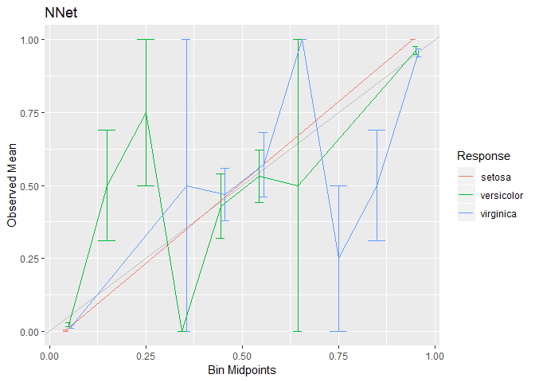

# MachineShop: Machine Learning Models and Tools

[](http://cran.r-project.org/web/packages/MachineShop)

## Overview

`MachineShop` is a meta-package for statistical and machine learning
with a common interface for model fitting, prediction, performance
assessment, and presentation of results. Support is provided for
predictive modeling of numerical, categorical, and censored
time-to-event outcomes, including those listed in the table below, and
for resample (bootstrap, cross-validation, and split training-test sets)
estimation of model
performance.

<div>

<table class="table table-striped" style="width: auto !important; margin-left: auto; margin-right: auto;">

<thead>

<tr>

<th style="border-bottom:hidden" colspan="1">

</th>

<th style="border-bottom:hidden" colspan="1">

</th>

<th style="border-bottom:hidden; padding-bottom:0; padding-left:3px;padding-right:3px;text-align: center; " colspan="3">

<div style="border-bottom: 1px solid #ddd; padding-bottom: 5px;">

Response Variable Types

</div>

</th>

</tr>

<tr>

<th style="text-align:left;">

</th>

<th style="text-align:center;">

Constructor

</th>

<th style="text-align:center;">

Categorical<sup>1</sup>

</th>

<th style="text-align:center;">

Continuous<sup>2</sup>

</th>

<th style="text-align:center;">

Survival<sup>3</sup>

</th>

</tr>

</thead>

<tbody>

<tr>

<td style="text-align:left;">

C5.0 Classification

</td>

<td style="text-align:center;">

C50Model

</td>

<td style="text-align:center;">

f

</td>

<td style="text-align:center;">

</td>

<td style="text-align:center;">

</td>

</tr>

<tr>

<td style="text-align:left;">

Conditional Random Forests

</td>

<td style="text-align:center;">

CForestModel

</td>

<td style="text-align:center;">

f

</td>

<td style="text-align:center;">

n

</td>

<td style="text-align:center;">

S

</td>

</tr>

<tr>

<td style="text-align:left;">

Cox Regression

</td>

<td style="text-align:center;">

CoxModel

</td>

<td style="text-align:center;">

</td>

<td style="text-align:center;">

</td>

<td style="text-align:center;">

S

</td>

</tr>

<tr>

<td style="text-align:left;">

Cox Regression (Stepwise)

</td>

<td style="text-align:center;">

CoxStepAICModel

</td>

<td style="text-align:center;">

</td>

<td style="text-align:center;">

</td>

<td style="text-align:center;">

S

</td>

</tr>

<tr>

<td style="text-align:left;">

Flexible Discriminant Analysis

</td>

<td style="text-align:center;">

FDAModel

</td>

<td style="text-align:center;">

f

</td>

<td style="text-align:center;">

</td>

<td style="text-align:center;">

</td>

</tr>

<tr>

<td style="text-align:left;">

Generalized Boosted Regression

</td>

<td style="text-align:center;">

GBMModel

</td>

<td style="text-align:center;">

f

</td>

<td style="text-align:center;">

n

</td>

<td style="text-align:center;">

S

</td>

</tr>

<tr>

<td style="text-align:left;">

Generalized Linear Models

</td>

<td style="text-align:center;">

GLMModel

</td>

<td style="text-align:center;">

b

</td>

<td style="text-align:center;">

n

</td>

<td style="text-align:center;">

</td>

</tr>

<tr>

<td style="text-align:left;">

Generalized Linear Models (Stepwise)

</td>

<td style="text-align:center;">

GLMStepAICModel

</td>

<td style="text-align:center;">

b

</td>

<td style="text-align:center;">

n

</td>

<td style="text-align:center;">

</td>

</tr>

<tr>

<td style="text-align:left;">

Lasso and Elastic-Net

</td>

<td style="text-align:center;">

GLMNetModel

</td>

<td style="text-align:center;">

f

</td>

<td style="text-align:center;">

m, n

</td>

<td style="text-align:center;">

S

</td>

</tr>

<tr>

<td style="text-align:left;">

K-Nearest Neighbors Model

</td>

<td style="text-align:center;">

KNNModel

</td>

<td style="text-align:center;">

f, o

</td>

<td style="text-align:center;">

n

</td>

<td style="text-align:center;">

</td>

</tr>

<tr>

<td style="text-align:left;">

Linear Discriminant Analysis

</td>

<td style="text-align:center;">

LDAModel

</td>

<td style="text-align:center;">

f

</td>

<td style="text-align:center;">

</td>

<td style="text-align:center;">

</td>

</tr>

<tr>

<td style="text-align:left;">

Linear Model

</td>

<td style="text-align:center;">

LMModel

</td>

<td style="text-align:center;">

f

</td>

<td style="text-align:center;">

m, n

</td>

<td style="text-align:center;">

</td>

</tr>

<tr>

<td style="text-align:left;">

Mixture Discriminant Analysis

</td>

<td style="text-align:center;">

MDAModel

</td>

<td style="text-align:center;">

f

</td>

<td style="text-align:center;">

</td>

<td style="text-align:center;">

</td>

</tr>

<tr>

<td style="text-align:left;">

Naive Bayes Classifier

</td>

<td style="text-align:center;">

NaiveBayesModel

</td>

<td style="text-align:center;">

f

</td>

<td style="text-align:center;">

</td>

<td style="text-align:center;">

</td>

</tr>

<tr>

<td style="text-align:left;">

Feed-Forward Neural Networks

</td>

<td style="text-align:center;">

NNetModel

</td>

<td style="text-align:center;">

f

</td>

<td style="text-align:center;">

n

</td>

<td style="text-align:center;">

</td>

</tr>

<tr>

<td style="text-align:left;">

Penalized Discriminant Analysis

</td>

<td style="text-align:center;">

PDAModel

</td>

<td style="text-align:center;">

f

</td>

<td style="text-align:center;">

</td>

<td style="text-align:center;">

</td>

</tr>

<tr>

<td style="text-align:left;">

Partial Least Squares

</td>

<td style="text-align:center;">

PLSModel

</td>

<td style="text-align:center;">

f

</td>

<td style="text-align:center;">

n

</td>

<td style="text-align:center;">

</td>

</tr>

<tr>

<td style="text-align:left;">

Ordered Logistic Regression

</td>

<td style="text-align:center;">

POLRModel

</td>

<td style="text-align:center;">

o

</td>

<td style="text-align:center;">

</td>

<td style="text-align:center;">

</td>

</tr>

<tr>

<td style="text-align:left;">

Quadratic Discriminant Analysis

</td>

<td style="text-align:center;">

QDAModel

</td>

<td style="text-align:center;">

f

</td>

<td style="text-align:center;">

</td>

<td style="text-align:center;">

</td>

</tr>

<tr>

<td style="text-align:left;">

Random Forests

</td>

<td style="text-align:center;">

RandomForestModel

</td>

<td style="text-align:center;">

f

</td>

<td style="text-align:center;">

n

</td>

<td style="text-align:center;">

</td>

</tr>

<tr>

<td style="text-align:left;">

Recursive Partitioning and Regression Trees

</td>

<td style="text-align:center;">

RPartModel

</td>

<td style="text-align:center;">

f

</td>

<td style="text-align:center;">

n

</td>

<td style="text-align:center;">

S

</td>

</tr>

<tr>

<td style="text-align:left;">

Stacked Regression

</td>

<td style="text-align:center;">

StackedModel

</td>

<td style="text-align:center;">

f, o

</td>

<td style="text-align:center;">

m, n

</td>

<td style="text-align:center;">

S

</td>

</tr>

<tr>

<td style="text-align:left;">

Super Learner

</td>

<td style="text-align:center;">

SuperModel

</td>

<td style="text-align:center;">

f, o

</td>

<td style="text-align:center;">

m, n

</td>

<td style="text-align:center;">

S

</td>

</tr>

<tr>

<td style="text-align:left;">

Parametric Survival

</td>

<td style="text-align:center;">

SurvRegModel

</td>

<td style="text-align:center;">

</td>

<td style="text-align:center;">

</td>

<td style="text-align:center;">

S

</td>

</tr>

<tr>

<td style="text-align:left;">

Parametric Survival (Stepwise)

</td>

<td style="text-align:center;">

SurvRegStepAICModel

</td>

<td style="text-align:center;">

</td>

<td style="text-align:center;">

</td>

<td style="text-align:center;">

S

</td>

</tr>

<tr>

<td style="text-align:left;">

Support Vector Machines

</td>

<td style="text-align:center;">

SVMModel

</td>

<td style="text-align:center;">

f

</td>

<td style="text-align:center;">

n

</td>

<td style="text-align:center;">

</td>

</tr>

<tr>

<td style="text-align:left;">

Support Vector Machines (ANOVA)

</td>

<td style="text-align:center;">

SVMANOVAModel

</td>

<td style="text-align:center;">

f

</td>

<td style="text-align:center;">

n

</td>

<td style="text-align:center;">

</td>

</tr>

<tr>

<td style="text-align:left;">

Suplport Vector Machines (Bessel)

</td>

<td style="text-align:center;">

SVMBesselModel

</td>

<td style="text-align:center;">

f

</td>

<td style="text-align:center;">

n

</td>

<td style="text-align:center;">

</td>

</tr>

<tr>

<td style="text-align:left;">

Support Vector Machines (Laplace)

</td>

<td style="text-align:center;">

SVMLaplaceModel

</td>

<td style="text-align:center;">

f

</td>

<td style="text-align:center;">

n

</td>

<td style="text-align:center;">

</td>

</tr>

<tr>

<td style="text-align:left;">

Support Vector Machines (Linear)

</td>

<td style="text-align:center;">

SVMLinearModel

</td>

<td style="text-align:center;">

f

</td>

<td style="text-align:center;">

n

</td>

<td style="text-align:center;">

</td>

</tr>

<tr>

<td style="text-align:left;">

Support Vector Machines (Poly)

</td>

<td style="text-align:center;">

SVMPolyModel

</td>

<td style="text-align:center;">

f

</td>

<td style="text-align:center;">

n

</td>

<td style="text-align:center;">

</td>

</tr>

<tr>

<td style="text-align:left;">

Support Vector Machines (Radial)

</td>

<td style="text-align:center;">

SVMRadialModel

</td>

<td style="text-align:center;">

f

</td>

<td style="text-align:center;">

n

</td>

<td style="text-align:center;">

</td>

</tr>

<tr>

<td style="text-align:left;">

Support Vector Machines (Spline)

</td>

<td style="text-align:center;">

SVMSplineModel

</td>

<td style="text-align:center;">

f

</td>

<td style="text-align:center;">

n

</td>

<td style="text-align:center;">

</td>

</tr>

<tr>

<td style="text-align:left;">

Support Vector Machines (Tanh)

</td>

<td style="text-align:center;">

SVMTanhModel

</td>

<td style="text-align:center;">

f

</td>

<td style="text-align:center;">

n

</td>

<td style="text-align:center;">

</td>

</tr>

<tr>

<td style="text-align:left;">

Regression and Classification Trees

</td>

<td style="text-align:center;">

TreeModel

</td>

<td style="text-align:center;">

f

</td>

<td style="text-align:center;">

n

</td>

<td style="text-align:center;">

</td>

</tr>

<tr>

<td style="text-align:left;">

Extreme Gradient Boosting

</td>

<td style="text-align:center;">

XGBModel

</td>

<td style="text-align:center;">

f

</td>

<td style="text-align:center;">

n

</td>

<td style="text-align:center;">

</td>

</tr>

<tr>

<td style="text-align:left;">

Extreme Gradient Boosting (DART)

</td>

<td style="text-align:center;">

XGBDARTModel

</td>

<td style="text-align:center;">

f

</td>

<td style="text-align:center;">

n

</td>

<td style="text-align:center;">

</td>

</tr>

<tr>

<td style="text-align:left;">

Extreme Gradient Boosting (Linear)

</td>

<td style="text-align:center;">

XGBLinearModel

</td>

<td style="text-align:center;">

f

</td>

<td style="text-align:center;">

n

</td>

<td style="text-align:center;">

</td>

</tr>

<tr>

<td style="text-align:left;">

Extreme Gradient Boosting (Tree)

</td>

<td style="text-align:center;">

XGBTreeModel

</td>

<td style="text-align:center;">

f

</td>

<td style="text-align:center;">

n

</td>

<td style="text-align:center;">

</td>

</tr>

</tbody>

<tfoot>

<tr>

<td style="padding: 0; border: 0;" colspan="100%">

<sup>1</sup> b = binary, f = factor, o = ordered

</td>

</tr>

<tr>

<td style="padding: 0; border: 0;" colspan="100%">

<sup>2</sup> m = matrix, n = numeric

</td>

</tr>

<tr>

<td style="padding: 0; border: 0;" colspan="100%">

<sup>3</sup> S = Surv

</td>

</tr>

</tfoot>

</table>

</div>

## Installation

``` r
# Current release from CRAN
install.packages("MachineShop")

# Development version from GitHub
# install.packages("devtools")
devtools::install_github("brian-j-smith/MachineShop", ref = "develop")

# Development version with vignettes
devtools::install_github("brian-j-smith/MachineShop", ref = "develop", build_vignettes = TRUE)
```

## Documentation

Once the package is installed, general documentation on its usage can be
viewed with the following console commands.

``` r
library(MachineShop)

# Package help summary
?MachineShop

# Vignette
RShowDoc("Introduction", package = "MachineShop")
```

## Parallel Computing

Resampling algorithms will be executed in parallel automatically if a
parallel backend for the `foreach` package, such as `doParallel`, is
loaded.

``` r
library(doParallel)
registerDoParallel(cores = 4)
```

## Example

The following is a brief example illustrating use of the package to
predict the species of flowers in Edgar Anderson’s iris data set.

### Training and Test Set Analysis

``` r
## Load the package
library(MachineShop)
library(magrittr)

## Iris flower species (3 level response) data set
head(iris)
#>   Sepal.Length Sepal.Width Petal.Length Petal.Width Species
#> 1          5.1         3.5          1.4         0.2  setosa
#> 2          4.9         3.0          1.4         0.2  setosa
#> 3          4.7         3.2          1.3         0.2  setosa
#> 4          4.6         3.1          1.5         0.2  setosa
#> 5          5.0         3.6          1.4         0.2  setosa
#> 6          5.4         3.9          1.7         0.4  setosa

## Training and test sets
set.seed(123)
trainindices <- sample(nrow(iris), nrow(iris) * 2 / 3)
train <- iris[trainindices, ]
test <- iris[-trainindices, ]

## Model formula
fo <- Species ~ .

## Gradient boosted mode fit to training set
gbmfit <- fit(fo, data = train, model = GBMModel)

## Variable importance
(vi <- varimp(gbmfit))
#>                  Overall
#> Petal.Length 100.0000000
#> Petal.Width   12.9638575
#> Sepal.Width    0.1409401
#> Sepal.Length   0.0000000

plot(vi)
```


``` r
## Test set predicted probabilities
predict(gbmfit, newdata = test, type = "prob") %>% head
#>         setosa   versicolor    virginica
#> [1,] 0.9999755 2.449128e-05 2.828117e-08
#> [2,] 0.9999365 6.346918e-05 6.535304e-09
#> [3,] 0.9999365 6.346918e-05 6.535304e-09
#> [4,] 0.9999755 2.449128e-05 2.828117e-08
#> [5,] 0.9998941 1.059313e-04 8.577135e-09
#> [6,] 0.9999291 7.084465e-05 5.736212e-09

## Test set predicted classifications
predict(gbmfit, newdata = test) %>% head
#> [1] setosa setosa setosa setosa setosa setosa
#> Levels: setosa versicolor virginica

## Test set performance
obs <- response(fo, data = test)
pred <- predict(gbmfit, newdata = test, type = "prob")
modelmetrics(obs, pred)
#>  Accuracy     Kappa     Brier  MLogLoss 
#> 0.9200000 0.8793727 0.1570015 0.4522663
```

### Resampling

``` r
## Resample estimation of model performance
(res <- resample(fo, data = iris, model = GBMModel, control = CVControl))
#> An object of class "Resamples"
#> 
#> Models: GBMModel
#> 
#> Stratification variable: (strata) 
#> 
#> Resamples control object of class "CVMLControl"
#> 
#> Method: K-Fold Cross-Validation
#> 
#> Folds: 10
#> 
#> Repeats: 1
#> 
#> Survival times: 
#> 
#> Omit missing responses: TRUE
#> 
#> Seed: 9279906

summary(res)
#>                Mean     Median         SD          Min       Max NA
#> Accuracy 0.93333333 0.93333333 0.06285394 8.000000e-01 1.0000000  0
#> Kappa    0.90000000 0.90000000 0.09428090 7.000000e-01 1.0000000  0
#> Brier    0.09409409 0.08887763 0.08302550 5.911564e-07 0.2260197  0
#> MLogLoss 0.22653409 0.12128540 0.23089382 3.321915e-04 0.5716866  0

plot(res)
```


### Model Tuning

``` r
## Tune over a grid of model parameters
gbmtune <- tune(fo, data = iris, model = GBMModel,
                grid = expand.grid(n.trees = c(25, 50, 100),
                                   interaction.depth = 1:3,
                                   n.minobsinnode = c(5, 10)))

plot(gbmtune, type = "line")
```


``` r
## Fit the selected model
gbmtunefit <- fit(fo, data = iris, model = gbmtune)
varimp(gbmtunefit)
#>                 Overall
#> Petal.Length 100.000000
#> Petal.Width   24.491198
#> Sepal.Width    6.611045
#> Sepal.Length   0.000000
```

### Model Comparisons

``` r
## Model comparisons
control <- CVControl(folds = 10, repeats = 5)

gbmres <- resample(fo, data = iris, model = GBMModel(n.tree = 50), control = control)
rfres <- resample(fo, data = iris, model = RandomForestModel(ntree = 50), control = control)
nnetres <- resample(fo, data = iris, model = NNetModel(size = 5), control = control)

res <- Resamples(GBM = gbmres, RF = rfres, NNet = nnetres)
summary(res)
#> , , Accuracy
#> 
#>           Mean    Median         SD       Min Max NA
#> GBM  0.9506667 0.9333333 0.04820591 0.8666667   1  0
#> NNet 0.9360000 1.0000000 0.09327501 0.6666667   1  0
#> RF   0.9506667 0.9333333 0.05183263 0.8666667   1  0
#> 
#> , , Kappa
#> 
#>       Mean Median         SD Min Max NA
#> GBM  0.926    0.9 0.07230886 0.8   1  0
#> NNet 0.904    1.0 0.13991251 0.5   1  0
#> RF   0.926    0.9 0.07774894 0.8   1  0
#> 
#> , , Brier
#> 
#>            Mean     Median         SD          Min       Max NA
#> GBM  0.08633233 0.08164734 0.08071055 7.788882e-05 0.2533900  0
#> NNet 0.09695850 0.02813474 0.12202402 1.003820e-50 0.4264032  0
#> RF   0.06795627 0.04576000 0.06165798 5.333333e-05 0.2225600  0
#> 
#> , , MLogLoss
#> 
#>           Mean     Median        SD          Min       Max NA
#> GBM  0.1791857 0.11405242 0.1776129 4.509125e-03 0.5343345  0
#> NNet 0.6703624 0.04723424 1.0673844 9.992007e-16 3.9167394  0
#> RF   0.1533812 0.07594123 0.3325370 1.346847e-03 2.3694406  0

plot(res)
```


``` r
## Pairwise model differences and t-tests
perfdiff <- diff(res)
summary(perfdiff)
#> , , Accuracy
#> 
#>                    Mean Median         SD         Min        Max NA
#> GBM - NNet  0.026666667      0 0.11586214 -0.13333333 0.46666667  0
#> GBM - RF    0.001333333      0 0.02516161 -0.06666667 0.06666667  0
#> NNet - RF  -0.025333333      0 0.11655680 -0.46666667 0.13333333  0
#> 
#> , , Kappa
#> 
#>              Mean Median         SD  Min Max NA
#> GBM - NNet  0.040      0 0.17379322 -0.2 0.7  0
#> GBM - RF    0.002      0 0.03774241 -0.1 0.1  0
#> NNet - RF  -0.038      0 0.17483520 -0.7 0.2  0
#> 
#> , , Brier
#> 
#>                   Mean        Median         SD         Min       Max NA
#> GBM - NNet -0.01062617  0.0005071675 0.10030789 -0.32229280 0.2002326  0
#> GBM - RF    0.01837606  0.0077091200 0.03163902 -0.03121109 0.1079033  0
#> NNet - RF   0.02900223 -0.0017052730 0.09930053 -0.11449491 0.3330132  0
#> 
#> , , MLogLoss
#> 
#>                   Mean       Median        SD        Min       Max NA
#> GBM - NNet -0.49117669  0.008132268 1.0076423 -3.5093350 0.4710507  0
#> GBM - RF    0.02580453  0.013871932 0.2855401 -1.8351061 0.3503341  0
#> NNet - RF   0.51698121 -0.008865794 1.0520861 -0.9887148 3.6464266  0

t.test(perfdiff)
#> An object of class "HTestResamples"
#> 
#> Upper diagonal: mean differences (row - column)
#> Lower diagonal: p-values
#> P-value adjustment method: holm
#> 
#> , , Accuracy
#> 
#>            GBM       NNet           RF
#> GBM         NA 0.02666667  0.001333333
#> NNet 0.3301565         NA -0.025333333
#> RF   0.7094994 0.33015647           NA
#> 
#> , , Kappa
#> 
#>            GBM      NNet     RF
#> GBM         NA 0.0400000  0.002
#> NNet 0.3301565        NA -0.038
#> RF   0.7094994 0.3301565     NA
#> 
#> , , Brier
#> 
#>               GBM        NNet         RF
#> GBM            NA -0.01062617 0.01837606
#> NNet 0.4573914366          NA 0.02900223
#> RF   0.0004550289  0.08842802         NA
#> 
#> , , MLogLoss
#> 
#>              GBM         NNet         RF
#> GBM           NA -0.491176686 0.02580453
#> NNet 0.003240706           NA 0.51698121
#> RF   0.525786570  0.003240706         NA

plot(perfdiff)
```


### Ensemble Models

``` r
## Stacked regression
stackedres <- resample(fo, data = iris, model = StackedModel(GBMModel, RandomForestModel, NNetModel))
summary(stackedres)
#>                Mean     Median         SD         Min       Max NA
#> Accuracy 0.95333333 0.96666667 0.05488484 0.866666667 1.0000000  0
#> Kappa    0.93000000 0.95000000 0.08232726 0.800000000 1.0000000  0
#> Brier    0.08351143 0.09949934 0.06248802 0.000483219 0.1960869  0
#> MLogLoss 0.16998007 0.17696157 0.11133561 0.011852496 0.3329822  0

## Super learners
superres <- resample(fo, data = iris, model = SuperModel(GBMModel, RandomForestModel, NNetModel))
summary(superres)
#>               Mean    Median         SD          Min       Max NA
#> Accuracy 0.9400000 0.9333333 0.04919099 8.666667e-01 1.0000000  0
#> Kappa    0.9100000 0.9000000 0.07378648 8.000000e-01 1.0000000  0
#> Brier    0.1068011 0.1251640 0.08433888 3.396983e-05 0.2624318  0
#> MLogLoss 0.2694905 0.2093464 0.25295201 2.767420e-03 0.6814850  0
```

### Calibration Curves

``` r
cal <- calibration(res)
plot(cal, se = TRUE)
```



### Confusion Matrices

``` r
(conf <- confusion(gbmres))
#> GBMModel :
#>             Observed
#> Predicted          setosa   versicolor    virginica
#>   setosa     249.29430444   0.26443215   0.09000630
#>   versicolor   0.68935069 228.88780694  24.55329659
#>   virginica    0.01634487  20.84776090 225.35669712

summary(conf)
#> GBMModel :
#> Resampled cases: 750
#> Accuracy (SE): 0.9380517 (0.008802323)
#> Majority class: 0.3333333
#> Kappa: 0.9070776
#> 
#>                setosa versicolor virginica
#> Observed    0.3333333  0.3333333 0.3333333
#> Predicted   0.3328650  0.3388406 0.3282944
#> Agreement   0.3323924  0.3051837 0.3004756
#> Sensitivity 0.9971772  0.9155512 0.9014268
#> Specificity 0.9992911  0.9495147 0.9582718
#> PPV         0.9985803  0.9006705 0.9152626
#> NPV         0.9985896  0.9574239 0.9510831
```

``` r
plot(conf)
```


### Partial Dependence Plots

``` r
pd <- dependence(gbmfit, select = c(Petal.Length, Petal.Width))
plot(pd)
```


### Lift Curves

``` r
## Requires a binary outcome
fo_versicolor <- factor(Species == "versicolor") ~ .
control = CVControl()

gbmres_versicolor <- resample(fo_versicolor, data = iris,  model = GBMModel, control = control)
lf <- lift(gbmres_versicolor)
plot(lf)
```


``` r
rfres_versicolor <- resample(fo_versicolor, data = iris,  model = RandomForestModel, control = control)
nnetres_versicolor <- resample(fo_versicolor, data = iris,  model = NNetModel, control = control)

res_versicolor <- Resamples(gbmres_versicolor, rfres_versicolor, nnetres_versicolor)
lf <- lift(res_versicolor)
plot(lf, find = 75)
```


### Preprocessing Recipes

``` r
library(recipes)

rec <- recipe(fo, data = iris) %>%
  add_role(Species, new_role = "case_strata") %>%
  step_center(all_predictors()) %>%
  step_scale(all_predictors()) %>%
  step_pca(all_predictors())

fit_rec <- fit(rec, model = GBMModel)
varimp(fit_rec)
#>        Overall
#> PC1 100.000000
#> PC3   5.215852
#> PC2   3.634984
#> PC4   0.000000

res_rec <- resample(rec, model = GBMModel, control = CVControl)
summary(res_rec)
#>                Mean     Median         SD          Min       Max NA
#> Accuracy 0.94666667 0.93333333 0.04216370 8.666667e-01 1.0000000  0
#> Kappa    0.92000000 0.90000000 0.06324555 8.000000e-01 1.0000000  0
#> Brier    0.08132181 0.07214497 0.06754443 5.820641e-05 0.2027034  0
#> MLogLoss 0.14319508 0.10262112 0.12204390 2.373887e-03 0.3339691  0
```
