<!-- README.md is generated from README.Rmd. Please edit that file -->

# MachineShop: Machine Learning Models and Tools

## Overview

`MachineShop` is a meta-package for statistical and machine learning
with a common interface for model fitting, prediction, performance
assessment, and presentation of results. Support is provided for
predictive modeling of numerical, categorical, and censored
time-to-event outcomes, including those listed in the table below, and
for resample (bootstrap, cross-validation, and split training-test sets)
estimation of model
performance.

<div>

<table class="table table-striped" style="width: auto !important; margin-left: auto; margin-right: auto;">

<thead>

<tr>

<th style="border-bottom:hidden" colspan="1">

</th>

<th style="border-bottom:hidden" colspan="1">

</th>

<th style="border-bottom:hidden; padding-bottom:0; padding-left:3px;padding-right:3px;text-align: center; " colspan="4">

<div style="border-bottom: 1px solid #ddd; padding-bottom: 5px;">

Response Variable Types

</div>

</th>

</tr>

<tr>

<th style="text-align:left;">

</th>

<th style="text-align:center;">

Constructor

</th>

<th style="text-align:center;">

factor

</th>

<th style="text-align:center;">

numeric

</th>

<th style="text-align:center;">

ordered

</th>

<th style="text-align:center;">

Surv

</th>

</tr>

</thead>

<tbody>

<tr>

<td style="text-align:left;">

C5.0 Classification

</td>

<td style="text-align:center;">

C50Model

</td>

<td style="text-align:center;">

x

</td>

<td style="text-align:center;">

</td>

<td style="text-align:center;">

</td>

<td style="text-align:center;">

</td>

</tr>

<tr>

<td style="text-align:left;">

Conditional Inference Trees

</td>

<td style="text-align:center;">

CForestModel

</td>

<td style="text-align:center;">

x

</td>

<td style="text-align:center;">

x

</td>

<td style="text-align:center;">

</td>

<td style="text-align:center;">

x

</td>

</tr>

<tr>

<td style="text-align:left;">

Cox Regression

</td>

<td style="text-align:center;">

CoxModel

</td>

<td style="text-align:center;">

</td>

<td style="text-align:center;">

</td>

<td style="text-align:center;">

</td>

<td style="text-align:center;">

x

</td>

</tr>

<tr>

<td style="text-align:left;">

Generalized Linear Models

</td>

<td style="text-align:center;">

GLMModel

</td>

<td style="text-align:center;">

2

</td>

<td style="text-align:center;">

x

</td>

<td style="text-align:center;">

</td>

<td style="text-align:center;">

</td>

</tr>

<tr>

<td style="text-align:left;">

Gradient Boosted Models

</td>

<td style="text-align:center;">

GBMModel

</td>

<td style="text-align:center;">

x

</td>

<td style="text-align:center;">

x

</td>

<td style="text-align:center;">

</td>

<td style="text-align:center;">

x

</td>

</tr>

<tr>

<td style="text-align:left;">

Lasso and Elastic-Net

</td>

<td style="text-align:center;">

GLMNetModel

</td>

<td style="text-align:center;">

x

</td>

<td style="text-align:center;">

x

</td>

<td style="text-align:center;">

</td>

<td style="text-align:center;">

x

</td>

</tr>

<tr>

<td style="text-align:left;">

K-Nearest Neighbors Model

</td>

<td style="text-align:center;">

KNNModel

</td>

<td style="text-align:center;">

x

</td>

<td style="text-align:center;">

x

</td>

<td style="text-align:center;">

x

</td>

<td style="text-align:center;">

</td>

</tr>

<tr>

<td style="text-align:left;">

Feed-Forward Neural Networks

</td>

<td style="text-align:center;">

NNetModel

</td>

<td style="text-align:center;">

x

</td>

<td style="text-align:center;">

x

</td>

<td style="text-align:center;">

</td>

<td style="text-align:center;">

</td>

</tr>

<tr>

<td style="text-align:left;">

Partial Least Squares

</td>

<td style="text-align:center;">

PLSModel

</td>

<td style="text-align:center;">

x

</td>

<td style="text-align:center;">

x

</td>

<td style="text-align:center;">

</td>

<td style="text-align:center;">

</td>

</tr>

<tr>

<td style="text-align:left;">

Ordered Logistic Regression

</td>

<td style="text-align:center;">

POLRModel

</td>

<td style="text-align:center;">

</td>

<td style="text-align:center;">

</td>

<td style="text-align:center;">

x

</td>

<td style="text-align:center;">

</td>

</tr>

<tr>

<td style="text-align:left;">

Random Forests

</td>

<td style="text-align:center;">

RandomForestModel

</td>

<td style="text-align:center;">

x

</td>

<td style="text-align:center;">

x

</td>

<td style="text-align:center;">

</td>

<td style="text-align:center;">

</td>

</tr>

<tr>

<td style="text-align:left;">

Stacked Regression

</td>

<td style="text-align:center;">

StackedModel

</td>

<td style="text-align:center;">

x

</td>

<td style="text-align:center;">

x

</td>

<td style="text-align:center;">

x

</td>

<td style="text-align:center;">

x

</td>

</tr>

<tr>

<td style="text-align:left;">

Super Learner

</td>

<td style="text-align:center;">

SuperModel

</td>

<td style="text-align:center;">

x

</td>

<td style="text-align:center;">

x

</td>

<td style="text-align:center;">

x

</td>

<td style="text-align:center;">

x

</td>

</tr>

<tr>

<td style="text-align:left;">

Survival Regression

</td>

<td style="text-align:center;">

SurvRegModel

</td>

<td style="text-align:center;">

</td>

<td style="text-align:center;">

</td>

<td style="text-align:center;">

</td>

<td style="text-align:center;">

x

</td>

</tr>

<tr>

<td style="text-align:left;">

Support Vector Machines

</td>

<td style="text-align:center;">

SVMModel

</td>

<td style="text-align:center;">

x

</td>

<td style="text-align:center;">

x

</td>

<td style="text-align:center;">

</td>

<td style="text-align:center;">

</td>

</tr>

<tr>

<td style="text-align:left;">

Extreme Gradient Boosting

</td>

<td style="text-align:center;">

XGBModel

</td>

<td style="text-align:center;">

x

</td>

<td style="text-align:center;">

x

</td>

<td style="text-align:center;">

</td>

<td style="text-align:center;">

</td>

</tr>

</tbody>

</table>

</div>

## Installation

``` r
# Current release from CRAN
install.packages("MachineShop")

# Development version from GitHub
# install.packages("devtools")
devtools::install_github("brian-j-smith/MachineShop")

# Development version with vignettes
devtools::install_github("brian-j-smith/MachineShop", build_vignettes = TRUE)
```

## Documentation

Once the package is installed, general documentation on its usage can be
viewed with the following console commands.

``` r
library(MachineShop)

# Package help summary
?MachineShop

# Vignette
RShowDoc("Introduction", package = "MachineShop")
```

## Parallel Computing

Resampling algorithms will be executed in parallel automatically if a
parallel backend for the `foreach` package, such as `doParallel`, is
loaded.

``` r
library(doParallel)
registerDoParallel(cores = 4)
```

## Example

The following is a brief example illustrating use of the package to
predict the species of flowers in Edgar Anderson’s iris data set.

### Training and Test Set Analysis

``` r
## Load the package
library(MachineShop)
library(magrittr)

## Iris flower species (3 level response) data set
head(iris)
#>   Sepal.Length Sepal.Width Petal.Length Petal.Width Species
#> 1          5.1         3.5          1.4         0.2  setosa
#> 2          4.9         3.0          1.4         0.2  setosa
#> 3          4.7         3.2          1.3         0.2  setosa
#> 4          4.6         3.1          1.5         0.2  setosa
#> 5          5.0         3.6          1.4         0.2  setosa
#> 6          5.4         3.9          1.7         0.4  setosa

## Training and test sets
set.seed(123)
trainindices <- sample(nrow(iris), nrow(iris) * 2 / 3)
train <- iris[trainindices, ]
test <- iris[-trainindices, ]

## Model formula
fo <- Species ~ .

## Gradient boosted mode fit to training set
gbmfit <- fit(fo, data = train, model = GBMModel)

## Variable importance
(vi <- varimp(gbmfit))
#>                  Overall
#> Petal.Length 100.0000000
#> Petal.Width   12.9638575
#> Sepal.Width    0.1409401
#> Sepal.Length   0.0000000

plot(vi)
```

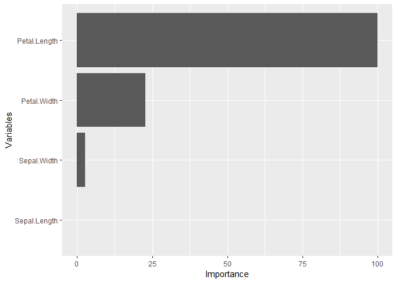

``` r
## Test set predicted probabilities
predict(gbmfit, newdata = test, type = "prob") %>% head
#>         setosa   versicolor    virginica
#> [1,] 0.9999755 2.449128e-05 2.828117e-08
#> [2,] 0.9999365 6.346918e-05 6.535304e-09
#> [3,] 0.9999365 6.346918e-05 6.535304e-09
#> [4,] 0.9999755 2.449128e-05 2.828117e-08
#> [5,] 0.9998941 1.059313e-04 8.577135e-09
#> [6,] 0.9999291 7.084465e-05 5.736212e-09

## Test set predicted classifications
predict(gbmfit, newdata = test) %>% head
#> [1] setosa setosa setosa setosa setosa setosa
#> Levels: setosa versicolor virginica

## Test set performance
obs <- response(fo, data = test)
pred <- predict(gbmfit, newdata = test, type = "prob")
modelmetrics(obs, pred)
#>  Accuracy     Kappa     Brier  MLogLoss 
#> 0.9200000 0.8793727 0.1570015 0.4522663
```

### Resampling

``` r
## Resample estimation of model performance
(perf <- resample(fo, data = iris, model = GBMModel, control = CVControl))
#> An object of class "Resamples"
#> 
#> Metrics: Accuracy, Kappa, Brier, MLogLoss 
#> 
#> Resamples control object of class "CVMLControl"
#> 
#> Method: K-Fold Cross-Validation
#> 
#> Folds: 10
#> 
#> Repeats: 1
#> 
#> Class cutoff probability: 0.5 
#> 
#> Omit missing responses: TRUE
#> 
#> Seed: 9279906

summary(perf)
#>                Mean     Median         SD          Min       Max NA
#> Accuracy 0.93333333 0.93333333 0.06285394 8.000000e-01 1.0000000  0
#> Kappa    0.90000000 0.90000000 0.09428090 7.000000e-01 1.0000000  0
#> Brier    0.09409409 0.08887763 0.08302550 5.911564e-07 0.2260197  0
#> MLogLoss 0.22653409 0.12128540 0.23089382 3.321915e-04 0.5716866  0

plot(perf)
```

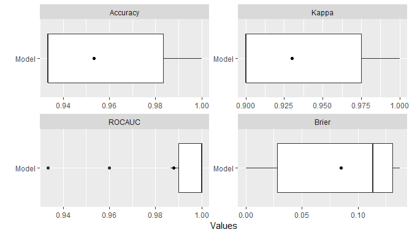

### Model Tuning

``` r
## Tune over a grid of model parameters
gbmtune <- tune(fo, data = iris, model = GBMModel,
                grid = expand.grid(n.trees = c(25, 50, 100),
                                   interaction.depth = 1:3,
                                   n.minobsinnode = c(5, 10)))

plot(gbmtune, type = "line")
```

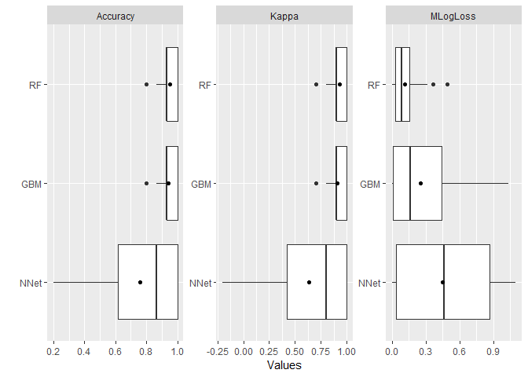

``` r
## Fit the selected model
gbmtunefit <- fit(fo, data = iris, model = gbmtune)
varimp(gbmtunefit)
#>                 Overall
#> Petal.Length 100.000000
#> Petal.Width   10.554867
#> Sepal.Width    5.085895
#> Sepal.Length   0.000000
```

### Model Comparisons

``` r
## Model comparisons
control <- CVControl(folds = 10, repeats = 5)

gbmperf <- resample(fo, data = iris, model = GBMModel(n.tree = 50), control = control)
rfperf <- resample(fo, data = iris, model = RandomForestModel(ntree = 50), control = control)
nnetperf <- resample(fo, data = iris, model = NNetModel(size = 5), control = control)

perf <- Resamples(GBM = gbmperf, RF = rfperf, NNet = nnetperf)
summary(perf)
#> , , Accuracy
#> 
#>           Mean    Median         SD       Min Max NA
#> GBM  0.9453333 0.9333333 0.04983419 0.8666667   1  0
#> RF   0.9546667 0.9333333 0.04750462 0.8666667   1  0
#> NNet 0.9520000 1.0000000 0.06603785 0.7333333   1  0
#> 
#> , , Kappa
#> 
#>       Mean Median         SD Min Max NA
#> GBM  0.918    0.9 0.07475129 0.8   1  0
#> RF   0.932    0.9 0.07125694 0.8   1  0
#> NNet 0.928    1.0 0.09905678 0.6   1  0
#> 
#> , , Brier
#> 
#>            Mean     Median         SD          Min       Max NA
#> GBM  0.09073933 0.10303711 0.08115937 4.370886e-05 0.2604297  0
#> RF   0.06810880 0.07125333 0.06498583 5.333333e-05 0.2156800  0
#> NNet 0.09106581 0.02038736 0.11696756 1.213283e-14 0.5333263  0
#> 
#> , , MLogLoss
#> 
#>           Mean     Median        SD          Min       Max NA
#> GBM  0.1814048 0.14354488 0.1766924 4.334678e-03 0.6157033  0
#> RF   0.1524887 0.10297314 0.3305382 1.346847e-03 2.3429408  0
#> NNet 0.9542160 0.04028668 1.5209841 4.496824e-08 7.6104295  0

plot(perf)
```

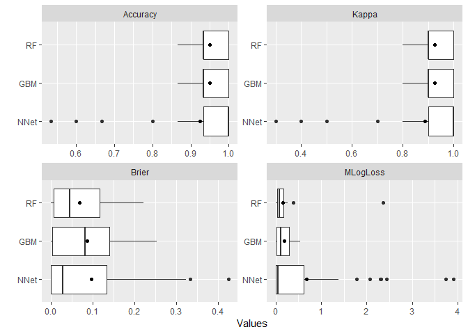

``` r
## Pairwise model differences and t-tests
perfdiff <- diff(perf)
summary(perfdiff)
#> , , Accuracy
#> 
#>                    Mean Median         SD         Min        Max NA
#> GBM - RF   -0.009333333      0 0.02697105 -0.06666667 0.06666667  0
#> GBM - NNet -0.006666667      0 0.05593971 -0.13333333 0.13333333  0
#> RF - NNet   0.002666667      0 0.05864687 -0.06666667 0.20000000  0
#> 
#> , , Kappa
#> 
#>              Mean Median         SD  Min Max NA
#> GBM - RF   -0.014      0 0.04045658 -0.1 0.1  0
#> GBM - NNet -0.010      0 0.08390957 -0.2 0.2  0
#> RF - NNet   0.004      0 0.08797031 -0.1 0.3  0
#> 
#> , , Brier
#> 
#>                     Mean       Median         SD         Min        Max NA
#> GBM - RF    0.0226305284 0.0142031310 0.02713561 -0.01075742 0.09528808  0
#> GBM - NNet -0.0003264774 0.0002175011 0.09612968 -0.34598574 0.19728427  0
#> RF - NNet  -0.0229570059 0.0003485859 0.09467972 -0.35551295 0.15531160  0
#> 
#> , , MLogLoss
#> 
#>                   Mean       Median        SD       Min       Max NA
#> GBM - RF    0.02891612  0.037313518 0.2841834 -1.846568 0.3069631  0
#> GBM - NNet -0.77281119 -0.001118006 1.4439392 -7.336055 0.4442420  0
#> RF - NNet  -0.80172731 -0.006653868 1.5157124 -7.340321 1.9439951  0

t.test(perfdiff)
#> An object of class "ResamplesHTest"
#> 
#> Upper diagonal: mean differences (row - column)
#> Lower diagonal: p-values
#> P-value adjustment method: holm
#> 
#> , , Accuracy
#> 
#>             GBM           RF         NNet
#> GBM          NA -0.009333333 -0.006666667
#> RF   0.05412097           NA  0.002666667
#> NNet 0.80698081  0.806980811           NA
#> 
#> , , Kappa
#> 
#>             GBM         RF   NNet
#> GBM          NA -0.0140000 -0.010
#> RF   0.05412097         NA  0.004
#> NNet 0.80698081  0.8069808     NA
#> 
#> , , Brier
#> 
#>               GBM         RF          NNet
#> GBM            NA 0.02263053 -0.0003264774
#> RF   1.010983e-06         NA -0.0229570059
#> NNet 9.809383e-01 0.18550403            NA
#> 
#> , , MLogLoss
#> 
#>              GBM          RF       NNet
#> GBM           NA 0.028916124 -0.7728112
#> RF   0.475255100          NA -0.8017273
#> NNet 0.001260848 0.001260848         NA

plot(perfdiff)
```

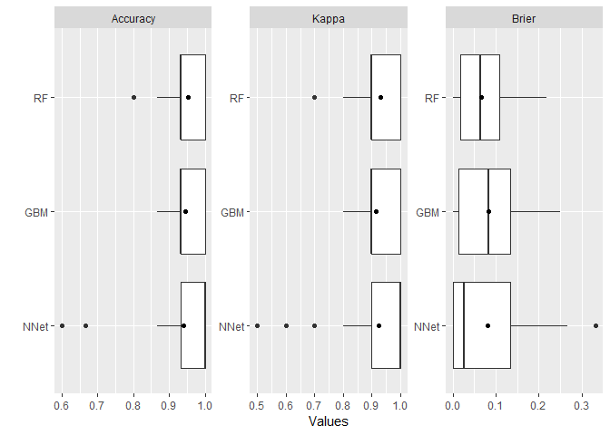

### Ensemble Models

``` r
## Stacked regression
stackedperf <- resample(fo, data = iris, model = StackedModel(GBMModel, RandomForestModel, NNetModel))
summary(stackedperf)
#>               Mean     Median         SD         Min       Max NA
#> Accuracy 0.9600000 0.96666667 0.04661373 0.866666667 1.0000000  0
#> Kappa    0.9400000 0.95000000 0.06992059 0.800000000 1.0000000  0
#> Brier    0.0709056 0.05046164 0.06515608 0.003672906 0.1853143  0
#> MLogLoss 0.1278275 0.07681125 0.10899642 0.023605272 0.2990448  0

## Super learners
superperf <- resample(fo, data = iris, model = SuperModel(GBMModel, RandomForestModel, NNetModel))
summary(superperf)
#>               Mean    Median         SD          Min       Max NA
#> Accuracy 0.9400000 0.9333333 0.05837300 8.666667e-01 1.0000000  0
#> Kappa    0.9100000 0.9000000 0.08755950 8.000000e-01 1.0000000  0
#> Brier    0.1040008 0.1262466 0.09710084 5.318730e-07 0.2576437  0
#> MLogLoss 0.2562282 0.2518920 0.29874624 2.488601e-04 0.9773889  0
```

### Partial Dependence Plots

``` r
pd <- dependence(gbmfit, select = c(Petal.Length, Petal.Width))
plot(pd)
```

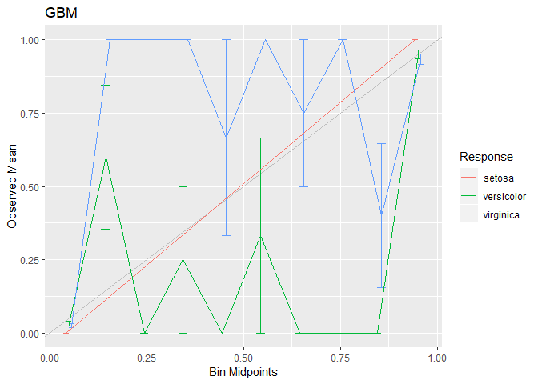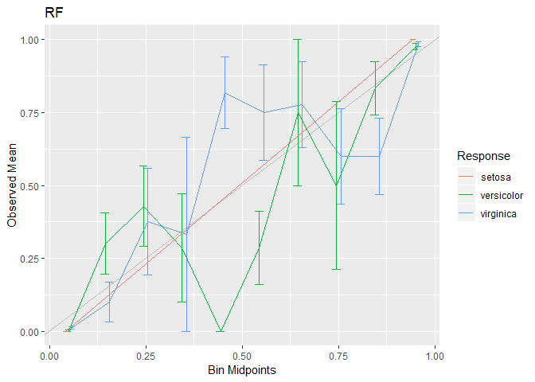

### Calibration Curves

``` r
cal <- calibration(perf)
plot(cal, se = TRUE)
```

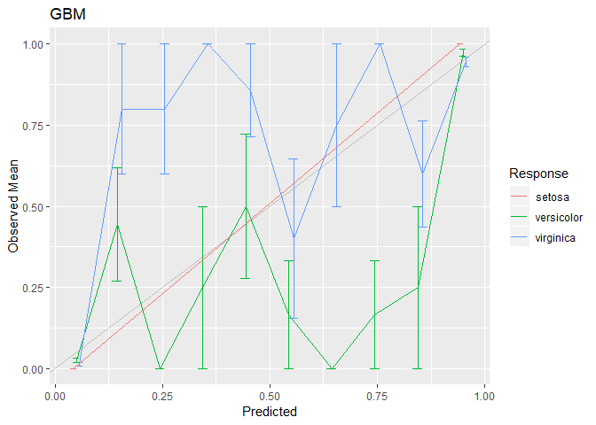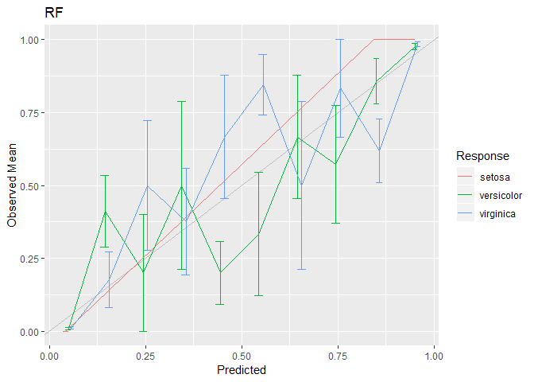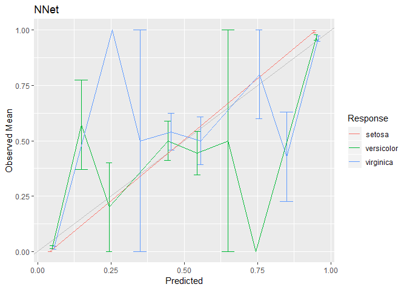

### Lift Curves

``` r
## Requires a binary outcome
fo_versicolor <- factor(Species == "versicolor") ~ .
control = CVControl()

gbmperf_versicolor <- resample(fo_versicolor, data = iris,  model = GBMModel, control = control)
lf <- lift(gbmperf_versicolor)
plot(lf)
```

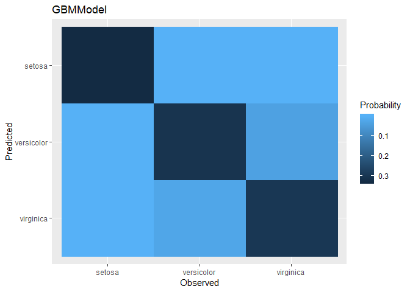

``` r
rfperf_versicolor <- resample(fo_versicolor, data = iris,  model = RandomForestModel, control = control)
nnetperf_versicolor <- resample(fo_versicolor, data = iris,  model = NNetModel, control = control)

perf_versicolor <- Resamples(gbmperf_versicolor, rfperf_versicolor, nnetperf_versicolor)
lf <- lift(perf_versicolor)
plot(lf, find = 75)
```

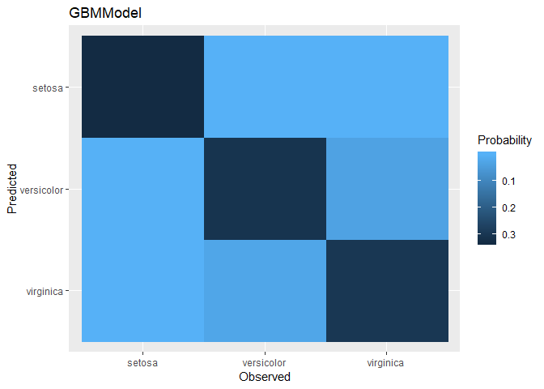

### Preprocessing Recipes

``` r
library(recipes)

rec <- recipe(fo, data = iris) %>%
  step_center(all_predictors()) %>%
  step_scale(all_predictors()) %>%
  step_pca(all_predictors())

fit_rec <- fit(rec, model = GBMModel)
varimp(fit_rec)
#>         Overall
#> PC1 100.0000000
#> PC3   6.7921320
#> PC2   0.1893519
#> PC4   0.0000000

perf_rec <- resample(rec, model = GBMModel, control = CVControl)
summary(perf_rec)
#>                Mean     Median         SD          Min       Max NA
#> Accuracy 0.95333333 0.93333333 0.04499657 0.8666666667 1.0000000  0
#> Kappa    0.93000000 0.90000000 0.06749486 0.8000000000 1.0000000  0
#> Brier    0.07592095 0.07200186 0.07031134 0.0004323901 0.2216471  0
#> MLogLoss 0.14479072 0.10803409 0.14811310 0.0058538632 0.4851647  0
```
