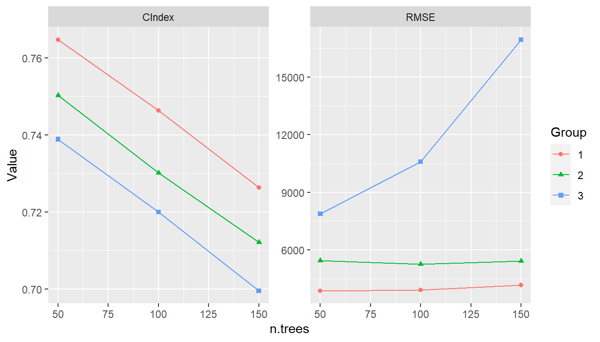

# Modeling Strategies

Model development often involves the comparison of multiple models from a candidate set for the purpose of selecting a final one.  Models in the set may differ with respect to their predictor variables, preprocessing steps and parameters, and model types and parameters.  Complex model selection strategies for sets that involve one or more of these differences can be implemented with the **MachineShop** package.  Implementation is achieved with a straightforward syntax based on the meta-input and meta-model functions listed in the table below and with resampling, including nested resampling, conducted automatically for model selection and predictive performance evaluation.

| Parameter Grid Tuning        | Candidate Set Selection         | Ensemble Learning
|:-----------------------------|:--------------------------------|:------------------------------
| `r rdoc_url("TunedInput()")` | `r rdoc_url("SelectedInput()")` | `r rdoc_url("StackedModel()")`
| `r rdoc_url("TunedModel()")` | `r rdoc_url("SelectedModel()")` | `r rdoc_url("SuperModel()")`

These meta-functions fall into three main categories: 1) tuning of a given input or model over a grid of parameter values, 2) selection from an arbitrary set of different inputs or models, or 3) combining multiple models into an ensemble learner.  In the context of these strategies, an input may be a formula, design matrix, model frame, or preprocessing recipe.  The meta-input and meta-model functions themselves return input and model class objects, respectively.  Combinations and multiple levels of nesting of meta-functions, inputs, and models are allowed.  For example, `r rdoc_url("StackedModel()")` and `r rdoc_url("SuperModel()")` may consist of `r rdoc_url("TunedModel")` and other model objects.  `r rdoc_url("SelectedModel()")` can select among mixes of `r rdoc_url("TunedModel")`, ensemble model, and other model objects.  Likewise, `r rdoc_url("TunedInput")` objects, along with other inputs, may be nested within `r rdoc_url("SelectedInput()")`.  Furthermore, selection and tuning of both inputs and models can be performed simultaneously.  These and other possibilities are illustrated in the following sections.


## Inputs

Inputs to model fitting functions define the predictor and response variables and the dataset containing their values.  These can be specified with traditional formula and dataset pairs, design matrix and response variable pairs, model frames, and preprocessing recipes.  The package supports (1) tuning of an input over a grid of parameter values and (2) selection of inputs from candidate sets that differ with respect to their predictors or their preprocessing steps and parameters.


### Input Tuning

Preprocessing recipes may have step with parameters that affect predictive performance.  Steps can be tuned over a grid of parameter values with `r rdoc_url("TunedInput()")` to select the best performing values.  Calls to `r rdoc_url("TunedInput()")` return an input object that may be trained on data with the `r rdoc_url("fit()")` function or evaluated for predictive performance with `r rdoc_url("resample()")`.  As an example, a principal components analysis (PCA) step could be included in a preprocessing recipe for tuning over the number of components to retain in the final model.  Such a recipe is shown below accompanied by a call to `r rdoc_url("expand_steps()")` to construct a tuning grid.  The grid parameter `num_comp` and name `PCA` correspond to the argument and id of the `r rdoc_url("step_pca()")` function to which the values `1:3` apply.  The recipe and grid may then be passed to `r rdoc_url("TunedInput()")` for model fitting.

```{r using_stategies_TunedInput1, eval=FALSE}
## Preprocessing recipe with PCA steps
pca_rec <- recipe(y ~ ., data = surv_train) %>%
  step_center(all_predictors()) %>%
  step_scale(all_predictors()) %>%
  step_pca(all_predictors(), id = "PCA")

## Tuning grid of number of PCA components
pca_grid <- expand_steps(
  PCA = list(num_comp = 1:3)
)

## Tuning specification
tun_rec <- TunedInput(pca_rec, grid = pca_grid)
```

From the fit, the resulting model can be extracted with `r rdoc_url("as.MLModel()")`.  The output shows that one principal component was selected.  Resample estimation of predictive performance is applied to a `r rdoc_url("TunedInput")` specification for the selection.  The default resampling method is cross-validation.  Other methods, performance metrics, and selection statistics can be supplied to the `r rdoc_url("TunedInput()")` arguments.

```{r using_stategies_TunedInput2, eval=FALSE}
## Input-tuned model fit and final trained model
model_fit <- fit(tun_rec, model = GBMModel)
as.MLModel(model_fit)
#> Object of class "MLModel"
#> 
#> Model name: GBMModel
#> Label: Trained Generalized Boosted Regression
#> Package: gbm
#> Response types: factor, numeric, PoissonVariate, Surv
#> Tuning grid: TRUE
#> Variable importance: TRUE
#> 
#> Parameters:
#> List of 5
#>  $ n.trees          : num 100
#>  $ interaction.depth: num 1
#>  $ n.minobsinnode   : num 10
#>  $ shrinkage        : num 0.1
#>  $ bag.fraction     : num 0.5
#> 
#> TrainStep1 :
#> Object of class "TrainStep"
#> 
#> Grid (selected = 1):
#> # A tibble: 3 x 1
#>   ModelRecipe$PCA$num_comp
#>                      <int>
#> 1                        1
#> 2                        2
#> 3                        3
#> 
#> Object of class "Performance"
#> 
#> Metrics: C-Index 
#> Models: 1, 2, 3
#> 
#> Selected model: 1 
#> C-Index value: 0.734361
```


### Input Selection

Selection of recipes with different steps or predictors can be conducted with `r rdoc_url("SelectedInput()")`.

```{r using_strategies_SelectedInput1, eval=FALSE}
## Preprocessing recipe without PCA steps
rec1 <- recipe(y ~ sex + age + year + thickness + ulcer, data = surv_train)
rec2 <- recipe(y ~ sex + age + year, data = surv_train)

## Selection among recipes with and without PCA steps
sel_rec <- SelectedInput(
  rec1,
  rec2,
  TunedInput(pca_rec, grid = pca_grid)
)
```

In this case, the tuned recipe with one principal component is selected.

```{r using_strategies_SelectedInput2, eval=FALSE}
## Input-selected model fit and model
model_fit <- fit(sel_rec, model = GBMModel)
as.MLModel(model_fit)
#> Object of class "MLModel"
#> 
#> Model name: GBMModel
#> Label: Trained Generalized Boosted Regression
#> Package: gbm
#> Response types: factor, numeric, PoissonVariate, Surv
#> Tuning grid: TRUE
#> Variable importance: TRUE
#> 
#> Parameters:
#> List of 5
#>  $ n.trees          : num 100
#>  $ interaction.depth: num 1
#>  $ n.minobsinnode   : num 10
#>  $ shrinkage        : num 0.1
#>  $ bag.fraction     : num 0.5
#> 
#> TrainStep1 :
#> Object of class "TrainStep"
#> 
#> Grid (selected = 3):
#> # A tibble: 3 x 1
#>   ModelRecipe
#>   <fct>      
#> 1 1          
#> 2 2          
#> 3 3          
#> 
#> Object of class "Performance"
#> 
#> Metrics: C-Index 
#> Models: Recipe.1, Recipe.2, Recipe.3
#> 
#> Selected model: Recipe.3 
#> C-Index value: 0.7487572 
#> ------------------------------------------------------------ 
#> TrainStep2 :
#> Object of class "TrainStep"
#> 
#> Grid (selected = 1):
#> # A tibble: 3 x 1
#>   ModelRecipe$PCA$num_comp
#>                      <int>
#> 1                        1
#> 2                        2
#> 3                        3
#> 
#> Object of class "Performance"
#> 
#> Metrics: C-Index 
#> Models: 1, 2, 3
#> 
#> Selected model: 1 
#> C-Index value: 0.7474176
```

Selection can also be performed among traditional formulas, design matrices, or model frames.

```{r using_strategies_SelectedInput3, eval=FALSE}
## Traditional formulas
fo1 <- y ~ sex + age + year + thickness + ulcer
fo2 <- y ~ sex + age + year

## Selection among formulas
sel_fo <- SelectedInput(fo1, fo2, data = surv_train)

## Input-selected model fit and final trained model
model_fit <- fit(sel_fo, model = GBMModel)
as.MLModel(model_fit)
```

In the previous examples, selection of different inputs was performed with the same model (`r rdoc_url("GBMModel")`).  Selection among different combinations of inputs and models is supported with the `r rdoc_url("ModeledInput()")` constructor.

```{r using_strategies_SelectedInput4, eval=FALSE}
## Different combinations of inputs and models
sel_mfo <- SelectedInput(
  ModeledInput(fo1, data = surv_train, model = CoxModel),
  ModeledInput(fo2, data = surv_train, model = GBMModel)
)

## Input-selected model fit and final trained model
model_fit <- fit(sel_mfo)
as.MLModel(model_fit)
```


## Models

Models define the functional relationships between predictor and response variables from a given set of inputs.


### Model Tuning

Many of the package-supplied modeling functions have arguments, or tuning parameters, that control aspects of their model fitting algorithms.  For example, `r rdoc_url("GBMModel")` parameters `n.trees` and `interaction.depth` control the number of decision trees to fit and the maximum tree depths.  When called with a `r rdoc_url("TunedModel")`, the `r rdoc_url("fit()")` function performs model fitting over a grid of parameter values and returns the model with the optimal values.  Optimality is determined based on the first performance metric of the `metrics` argument to `r rdoc_url("TunedModel()")` if given or the first default metric of the `r rdoc_url("performance()")` function otherwise.  Argument `grid` additionally controls the construction of grid values and can be a single integer or vector of integers whose positions or names match the parameters in a model's pre-defined tuning grid if one exists and which specify the number of values used to construct the grid.  Pre-defined `r rdoc_url("TunedModel")` grids can be extract and viewed apart from model fitting with `r rdoc_url("expand_modelgrid()")`.  As shown in the output below, `r rdoc_url("as.MLModel()")` will extract a tuned model from fit results for viewing of the tuning parameter grid values, the names of models fit to each, all calculated metrics, the final model selected, the metric upon which its selection was based, and its parameters.

```{r using_strategies_tune, eval=FALSE}
## Tune over automatic grid of model parameters
model_fit <- fit(surv_fo, data = surv_train,
                 model = TunedModel(
                   GBMModel,
                   grid = 3,
                   control = surv_means_control,
                   metrics = c("CIndex" = cindex, "RMSE" = rmse)
                 ))
(trained_model <- as.MLModel(model_fit))
#> Object of class "MLModel"
#> 
#> Model name: GBMModel
#> Label: Trained Generalized Boosted Regression
#> Package: gbm
#> Response types: factor, numeric, PoissonVariate, Surv
#> Tuning grid: TRUE
#> Variable importance: TRUE
#> 
#> Parameters:
#> List of 5
#>  $ n.trees          : num 50
#>  $ interaction.depth: int 1
#>  $ n.minobsinnode   : num 10
#>  $ shrinkage        : num 0.1
#>  $ bag.fraction     : num 0.5
#> 
#> TrainStep1 :
#> Object of class "TrainStep"
#> 
#> Grid (selected = 1):
#> # A tibble: 9 x 1
#>   Model$n.trees $interaction.depth
#>           <dbl>              <int>
#> 1            50                  1
#> 2           100                  1
#> 3           150                  1
#> 4            50                  2
#> 5           100                  2
#> 6           150                  2
#> 7            50                  3
#> 8           100                  3
#> 9           150                  3
#> 
#> Object of class "Performance"
#> 
#> Metrics: CIndex, RMSE 
#> Models: GBMModel.1, GBMModel.2, GBMModel.3, GBMModel.4, GBMModel.5, GBMModel.6,
#>   GBMModel.7, GBMModel.8, GBMModel.9
#> 
#> Selected model: GBMModel.1 
#> CIndex value: 0.7513153
```

Grid values may also be given as a `r rdoc_url("Grid")` function, function name, or object; `r rdoc_url("ParameterGrid")` object; or data frame containing parameter values at which to evaluate the model, such as that returned by `r rdoc_url("expand_params()")`.

```{r using_strategies_tune_grid, eval=FALSE}
## Tune over randomly sampled grid points
fit(surv_fo, data = surv_train,
    model = TunedModel(
      GBMModel,
      grid = Grid(size = 100, random = 10),
      control = surv_means_control
    ))

## Tune over user-specified grid points
fit(surv_fo, data = surv_train,
    model = TunedModel(
      GBMModel,
      grid = expand_params(n.trees = c(25, 50, 100),
                           interaction.depth = 1:3),
      control = surv_means_control
    ))
```

Statistics summarizing the resampled performance metrics across all tuning parameter combinations can be obtained with the `r rdoc_url("summary()")` function.
  
```{r using_strategies_tune_summary, eval=FALSE}
summary(trained_model)
#> $TrainStep1
#> , , Metric = CIndex
#> 
#>             Statistic
#> Model             Mean    Median         SD       Min       Max NA
#>   GBMModel.1 0.7513153 0.7548387 0.05260501 0.6486486 0.8261803  0
#>   GBMModel.2 0.7299930 0.7222222 0.05449760 0.6283784 0.8207547  0
#>   GBMModel.3 0.7313907 0.7300885 0.04459823 0.6541850 0.7863636  0
#>   GBMModel.4 0.7396956 0.7548387 0.05221877 0.6148649 0.8025751  0
#>   GBMModel.5 0.7187003 0.7288732 0.04911338 0.6289593 0.7843137  0
#>   GBMModel.6 0.7107110 0.7181818 0.04722521 0.6148649 0.7745098  0
#>   GBMModel.7 0.7329099 0.7477876 0.05461139 0.6013514 0.7896996  0
#>   GBMModel.8 0.7151567 0.7318182 0.05737671 0.5894040 0.7870968  0
#>   GBMModel.9 0.7003070 0.7061611 0.05647950 0.5945946 0.7889908  0
#> 
#> , , Metric = RMSE
#> 
#>             Statistic
#> Model             Mean   Median       SD      Min       Max NA
#>   GBMModel.1  3820.101 3922.004 1114.457 2067.702  5634.290  0
#>   GBMModel.2  3983.721 3819.946 1046.342 2132.840  5731.912  0
#>   GBMModel.3  4927.169 4607.758 1648.306 2913.023  8981.286  0
#>   GBMModel.4  5577.329 4754.214 2760.113 1952.892 12794.955  0
#>   GBMModel.5  5155.270 4156.921 2543.658 1761.762 10932.087  0
#>   GBMModel.6  5659.614 4696.612 2813.594 2045.974 11673.612  0
#>   GBMModel.7  7699.418 6963.495 3820.770 3525.290 19525.003  0
#>   GBMModel.8  9112.486 8183.500 4469.315 4290.710 20736.130  0
#>   GBMModel.9 12906.024 9741.308 8188.991 4937.101 32771.044  0
```

Line plots of tuning results display the resampled metric means, or another statistic specified with the `stat` argument, versus the first tuning parameter values and with lines grouped according to the remaining parameters, if any.

```{r using_strategies_tune_plot, eval=FALSE}
plot(trained_model, type = "line")
#> $TrainStep1
```

```{r using_strategies_tune_png, echo=FALSE}

```


### Model Selection

Model selection can be conducted by calling `r rdoc_url("fit()")` with a `r rdoc_url("SelectedModel")` to automatically choose from any combination of models and model parameters.  Selection has as a special case the just-discussed tuning of a single model over a grid of parameter values.  Combinations of model functions, function names, or objects can be supplied to `r rdoc_url("SelectedModel()")` in order to define sets of candidate models from which to select.  An `r rdoc_url("expand_model()")` helper function is additionally available to expand a model over a grid of tuning parameters for inclusion in the candidate set if so desired.

```{r using_strategies_select, results="hide", eval=FALSE}
## Model interface for model selection
sel_model <- SelectedModel(
  expand_model(GBMModel, n.trees = c(50, 100), interaction.depth = 1:2),
  GLMNetModel(lambda = 0.01),
  CoxModel,
  SurvRegModel
)

## Fit the selected model
fit(surv_fo, data = surv_train, model = sel_model)
```

Selection may also be performed over candidate sets that include tuned models.  For instance, the `r rdoc_url("SelectedModel()")` function is applicable to sets containing different classes of models each individually tuned over a grid of parameters.

```{r using_strategies_select_tune, results="hide", eval=FALSE}
## Model interface for selection among tuned models
sel_tun_model <- SelectedModel(
  TunedModel(GBMModel, control = surv_means_control),
  TunedModel(GLMNetModel, control = surv_means_control),
  TunedModel(CoxModel, control = surv_means_control)
)

## Fit the selected tuned model
fit(surv_fo, data = surv_train, model = sel_tun_model)
```


## Ensemble Learning

Ensemble learning models combine $m = 1, \ldots, M$ base models as a strategy to improve predictive performance.  Two methods implemented in **MachineShop** are *stacked regression* [@breiman:1996:SR] and *super learners* [@vanderLaan:2007:SL].  Stacked regression fits a linear combination of predictions from specified base learners to produce a prediction function of the form
$$
\hat{f}(x) = \sum_{m=1}^M \hat{w}_m \hat{f}_m(x).
$$
Stacking weights $w$ are estimated by (constrained) least squares regression of case responses $y_i$ on predictions $\hat{f}^{-\kappa(i)}(x_i)$ from learners fit to data subsamples $-\kappa(i)$ not containing the corresponding cases. In particular, they are obtained as the solution
$$
\hat{w} = \underset{w}{\operatorname{argmin}} \sum_{i=1}^{N}\left(y_i - \sum_{m=1}^{M} w_m \hat{f}^{-\kappa(i)}(x_i) \right)^2
$$
subject to the constraints that all $w_m \ge 0$ and $\sum_m w_m = 1$.  K-fold cross-validation is the default subsampling method employed in the estimation, with the other resampling methods provided by the package available as options.  Survival outcomes are handled with a modified version of the stacked regression algorithm in which

* minimization of least squares is replaced by maximization of Harrell's concordance index [-@harrell:1982:EYM] to accommodate censoring, and
* prediction can only be performed on the same response type used for the model fit; i.e., either survival means or survival probabilities at given follow-up times.

Super learners are a generalization of stacked regression that fit a specified model, such as `r rdoc_url("GBMModel")`, to case responses $y_i$, base learner predictions $\hat{f}^{-\kappa(i)}(x_i)$, and optionally also to the original predictor variables $x_i$.  Given below are examples of a stacked regression and super learner each fit with gradient boosted, random forest, and Cox regression base learners.  A separate gradient boosted model is used as the super learner in the latter.

```{r using_strategies_ensembles, eval=FALSE}
## Stacked regression
stackedmodel <- StackedModel(GLMBoostModel, CForestModel, CoxModel)
res_stacked <- resample(surv_fo, data = surv_train, model = stackedmodel)
summary(res_stacked)
#>          Statistic
#> Metric         Mean    Median        SD      Min       Max NA
#>   C-Index 0.7098798 0.7111111 0.1482607 0.484375 0.9285714  0

## Super learner
supermodel <- SuperModel(GLMBoostModel, CForestModel, CoxModel,
                         model = GBMModel)
res_super <- resample(surv_fo, data = surv_train, model = supermodel)
summary(res_super)
#>          Statistic
#> Metric         Mean    Median        SD    Min       Max NA
#>   C-Index 0.6572016 0.6985294 0.1459938 0.4375 0.8488372  0
```


## Methodology

Combinations and multiple levels of nested meta-functions, inputs, and models are allowed.  If model fitting involves a single meta-function, performances of the inputs or models under consideration are estimated with standard resampling, and the best performing model is returned.  Nestings of meta-functions are trained with nested resampling.  Consider the example below in which training involves input tuning and model selection.  In particular, a preprocessing recipe is tuned over the number of predictor-derived principal components and model selection is of an untuned `r rdoc_url("GBMModel")`, a tuned `r rdoc_url("GBMModel")`, and a `r rdoc_url("SuperModel")`.

```{r using_strategies_methods, eval=FALSE}
## Preprocessing recipe with PCA steps
pca_rec <- recipe(y ~ ., data = surv_train) %>%
  step_center(all_predictors()) %>%
  step_scale(all_predictors()) %>%
  step_pca(all_predictors(), id = "PCA")

## Tuning grid of number of PCA components
pca_grid <- expand_steps(
  PCA = list(num_comp = 1:3)
)

## Input specification
tun_rec <- TunedInput(pca_rec, grid = pca_grid)

## Model specification
sel_model <- SelectedModel(
  GBMModel,
  TunedModel(GBMModel),
  SuperModel(CoxModel, TunedModel(CForestModel), TunedModel(GLMBoostModel))
)

## Model fit and final trained model
model_fit <- fit(tun_rec, model = sel_model)
as.MLModel(model_fit)
```

Model fitting proceeds with instances of the specified model selection nested within each of the input tuning grid parameter values.  Tuning of `r rdoc_url("GBMModel")` and construction of `r rdoc_url("SuperModel")` are further nested within the model selection, with tuning of `r rdoc_url("CForestModel")` and `r rdoc_url("GLMBoostModel")` nested within `r rdoc_url("SuperModel")`.  Altogether, there are four levels of meta-input and meta-model functions in the hierarchy.

```{r using_strategies_dag, echo = FALSE, out.width = "100%"}
knitr::include_graphics("img/FigModelDAG.png")
```

Each meta-function is fit based on resample estimation (default: cross-validation) of predictive performance.  When one meta-function is nested within another, nested resampling is employed, as illustrated in the figure below.

```{r using_strategies_nestedcv, echo = FALSE, out.width = "100%"}
knitr::include_graphics("img/FigNestedCV.png")
```

Nesting of resampling routines is repeated recursively when a fit involves multiple levels of nested meta-functions.  For example, predictive performance estimation for the training of `r rdoc_url("TunedInput(pca_rec, grid = pca_grid)")` involves up to three nested meta functions: `r rdoc_url("SelectedModel(...)")` &rarr; `r rdoc_url("SuperModel(...)")` &rarr; `r rdoc_url("TunedModel(CForestModel)")`.  For this relationship, an outer and three nested inner resampling loops are executed as follows.  First, `r rdoc_url("CForestModel")` is tuned at the third inner resampling loop.  Second, the tuned model is passed to the second inner loop for construction of `r rdoc_url("SuperModel")`.  Third, the constructed model is passed to the first inner loop for model selection from the candidate set.  Finally, the selected model is passed to the outer loop for tuning of the preprocessing recipe.  Based on resample performance estimation of the entire input/model specification, one principal component is selected.

```{r using_strategies_methods1, echo=FALSE}
cat('TrainStep1 :
Object of class "TrainStep"

Grid (selected = 1):
# A tibble: 3 x 1
  ModelRecipe$PCA$num_comp
                     <int>
1                        1
2                        2
3                        3

Object of class "Performance"

Metrics: C-Index
Models: 1, 2, 3

Selected model: 1
C-Index value: 0.7133325')
```

In order to identify and return a final model fitted to the entire input data, the hierarchy is traversed from top to bottom along the path determined by the choice at each node.  Steps along the path are labeled `TrainStep1` and `TrainStep2` in the output.  As seen above in `TrainStep1`, one principal component is first selected for the tuned input.  Using an input recipe with one principal component, the entire dataset is refit at `TrainStep2` to finally select `r rdoc_url("GBMModel")`.

```{r using_strategies_methods2, echo=FALSE}
cat('TrainStep2 :
Object of class "TrainStep"

Grid (selected = 1):
# A tibble: 3 x 1
  Model
  <fct>
1 1    
2 2    
3 3    

Object of class "Performance"

Metrics: C-Index 
Models: GBMModel, TunedModel, SuperModel

Selected model: GBMModel 
C-Index value: 0.7712238')
```

After the series of training steps reaches the bottom of its hierarchy, the final model is fitted to the entire dataset and returned.

```{r using_strategies_methods0, echo=FALSE}
cat('Object of class "MLModel"

Model name: GBMModel
Label: Trained Generalized Boosted Regression
Package: gbm
Response types: factor, numeric, PoissonVariate, Surv
Tuning grid: TRUE
Variable importance: TRUE

Parameters:
List of 5
 $ n.trees          : num 100
 $ interaction.depth: num 1
 $ n.minobsinnode   : num 10
 $ shrinkage        : num 0.1
 $ bag.fraction     : num 0.5')
```

Generalization performance of the entire process can be estimated with a call to `r rdoc_url("resample()")`.

```{r eval=FALSE}
## Generalization performance of the modeling strategy
resample(tun_rec, model = sel_model)
```

There is no conceptual limit to the number of nested inputs and models that can be specified with the package.  However, there are some practical issues to consider.

Computational Expense
  : Computational expense of nested resampling increases exponentially.  For instance, execution of *r* levels of a nested 10-fold cross-validation algorithm is an O(10^*r*^) operation.  Runtimes can be decreased by registering multiple cores to run the resampling algorithms in parallel.  However, the exponential increase in computational complexity quickly outpaces the number of available cores.

Data Reduction
  : Training data is reduced at each subsequent resampling level.  For 10-fold cross-validation and a training set of *N* total cases, there will be 0.9^*r*^ cases available at each fold of the *r*^th^ resampling algorithm.  Bootstrapping could be used, as an alternative to cross-validation, to ensure *N* cases at each resampling level.  However, the number of unique cases at level *r* will be decreased to approximately *N*(2/3)^*r*^.
