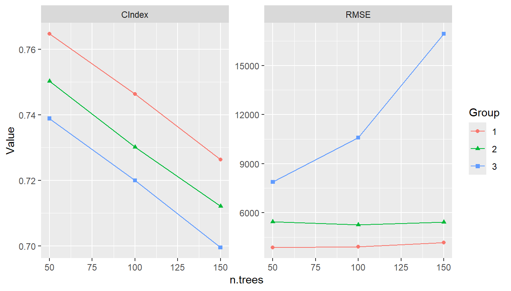

```{r setup, include=FALSE}
source("setup.R")
rdoc_url <- function(names, ...) names
```


# Description

**MachineShop** is a meta-package for statistical and machine learning with a unified interface for model fitting, prediction, performance assessment, and presentation of results.  Support is provided for predictive modeling of numerical, categorical, and censored time-to-event outcomes and for resample (bootstrap, cross-validation, and split training-test sets) estimation of model performance.  This vignette introduces the package interface with a survival data analysis example, followed by supported methods of variable specification; applications to other response variable types; available performance metrics, resampling techniques, and graphical and tabular summaries; and modeling strategies.


# Features

```{r overview_modelinfo, echo=FALSE}
library(MachineShop)
info <- modelinfo()
```

* Unified and concise interface for model fitting, prediction, and performance assessment.
* Support for `r length(info)`+ models from `r length(unique(sapply(info, function(x) x$packages[1])))` **R** packages, including model specifications from the [**parsnip**](https://parsnip.tidymodels.org/) package.
* Dynamic model parameters.
* Ensemble modeling with stacked regression and super learners.
* Modeling of response variables types: binary factors, multi-class nominal and ordinal factors, numeric vectors and matrices, and censored time-to-event survival.
* Model specification with traditional formulas, design matrices, and flexible pre-processing [recipes](https://recipes.tidymodels.org/).
* Resample estimation of predictive performance, including cross-validation, bootstrap resampling, and split training-test set validation.
* Parallel execution of resampling algorithms.
* Choices of performance metrics: accuracy, areas under ROC and precision recall curves, Brier score, coefficient of determination (R^2^), concordance index, cross entropy, F score, Gini coefficient, unweighted and weighted Cohen's kappa, mean absolute error, mean squared error, mean squared log error, positive and negative predictive values, precision and recall, and sensitivity and specificity.
* Graphical and tabular performance summaries: calibration curves, confusion matrices, partial dependence plots, performance curves, lift curves, and model-specific and permutation-based variable importance.
* Model tuning over automatically generated grids of parameter values and randomly sampled grid points.
* Model selection and comparisons for any combination of models and model parameter values.
* Recursive feature elimination.
* User-definable models and performance metrics.


# Getting Started


## Installation

```{r overview_install, eval = FALSE}
# Current release from CRAN
install.packages("MachineShop")

# Development version from GitHub
# install.packages("devtools")
devtools::install_github("brian-j-smith/MachineShop")

# Development version with vignettes
devtools::install_github("brian-j-smith/MachineShop", build_vignettes = TRUE)
```


## Documentation

Once installed, the following **R** commands will load the package and display its help system documentation.  Online documentation and examples are available at the [MachineShop website](https://brian-j-smith.github.io/MachineShop/).

```{r overview_docs, eval = FALSE, message = FALSE}
library(MachineShop)

# Package help summary
?MachineShop

# Vignette
RShowDoc("UserGuide", package = "MachineShop")
```


# Melanoma Example

Use of the **MachineShop** package is demonstrated with a survival analysis example in which the response variable is a censored time to event outcome.  Since survival outcomes are a combination of numerical (time to event) and categorical (event) variables, package features for both variable types are illustrated with the example.  Support for outcomes other than survival, including nominal and ordinal factors as well as numeric vectors and matrices, is also discussed.

Survival analysis is performed with the `Melanoma` dataset from the **MASS** package [@andersen:1993:SMB].  This dataset provides survival time, in days, from disease treatment to (1) death from disease, (2) alive at study termination, or (3) death from other causes for 205 Denmark patients with malignant melanomas.  Also provided are potential predictors of the survival outcomes.  The analysis begins by loading required packages **MachineShop**, **survival** [@therneau:2020:SA], and **MASS**.  For the analysis, a binary overall survival outcome is created by combining the two death categories (1 and 3) into one. 

```{r using_example_melanoma}
## Analysis libraries and dataset
library(MachineShop)
library(survival)
data(Melanoma, package = "MASS")

## Malignant melanoma analysis dataset
surv_df <- within(Melanoma, {
  y <- Surv(time, status != 2)
  remove(time, status)
})
```

Descriptive summaries of the study variables are given below in Table 1, followed by a plot of estimated overall survival probabilities and 95% confidence intervals.

<center>
Table 1. Variable summaries for the Melanoma survival analysis example.
</center>

```{r using_example_summary, echo=FALSE}
surv_stats <- list(
  list("Number of subjects" = ~ length(y)),
  "time" = list("Median (Range)" = ~ median_range(y[, "time"])),
  "status" = list("1 = Dead" = ~ n_perc(y[, "status"] == 1),
                  "0 = Alive" = ~ n_perc(y[, "status"] == 0)),
  "sex" = list("1 = Male" = ~ n_perc(sex == 1),
               "0 = Female" = ~ n_perc(sex == 0)),
  "age" = list("Median (Range)" = ~ median_range(age)),
  "year" = list("Median (Range)" = ~ median_range(year)),
  "thickness" = list("Median (Range)" = ~ median_range(thickness)),
  "ulcer" = list("1 = Presence" = ~ n_perc(ulcer == 1),
                 "0 = Absence" = ~ n_perc(ulcer == 0))
)

summary_kbl(surv_stats, surv_df)
```

```{r using_example_survfit, echo=FALSE}
library(ggplot2)

col <- "#F8766D"
survfit(y ~ 1, data = surv_df) %>%
  with(data.frame(time, surv, lower, upper, censor = ifelse(n.censor > 0, time, NA))) %>%
  ggplot(aes(x = time, y = surv)) +
  geom_ribbon(aes(ymin = lower, ymax = upper), fill = col, alpha = 0.2) +
  geom_step(color = col) +
  geom_point(aes(x = censor), shape = 3, color = col) +
  coord_cartesian(ylim = c(0, 1)) +
  labs(x = "Follow-Up Time (Days)", y = "Overall Survival Probability",
       title = "Kaplan-Meier survival plot")
```

For the analyses, the dataset is split into a training set on which survival models will be fit and a test set on which predictions will be made and performance evaluated.  A global formula `surv_fo` is defined to relate the predictors on the right hand side to the overall survival outcome on the left and will be used for all subsequent survival models.

```{r using_example_datasets}
## Training and test sets
set.seed(123)
train_indices <- sample(nrow(surv_df), nrow(surv_df) * 2 / 3)
surv_train <- surv_df[train_indices, ]
surv_test <- surv_df[-train_indices, ]

## Global formula for the analysis
surv_fo <- y ~ sex + age + year + thickness + ulcer
```


# Model Fit and Prediction


## Model Information

Model fitting requires user specification of a **MachineShop** compatible model.  A named list of package-supplied models can be obtained interactively with the `r rdoc_url("modelinfo()")` function, and includes the following components for each.

`label`
  : Character descriptor for the model.
  
`packages`
  : Character vector of source packages required to use the model.  These need only be installed with the `install.packages()` function or by equivalent means; but need not be loaded with, for example, the `library()` function.
  
`response_types`
  : Character vector of response variable types supported by the model.
  
`weights`
  : Logical value or vector of the same length as `response_types` indicating whether case weights are supported for the responses.
  
`arguments`
  : Closure with the argument names and corresponding default values of the model function.
  
`grid`
  : Logical indicating whether automatic generation of tuning parameter grids is implemented for the model.
  
`varimp`
  : Logical indicating whether model-specific variable importance is defined.

Function `r rdoc_url("modelinfo()")` may be called without arguments, with one or more model functions, observed response variables, or vectors representing response variable types; and will return information on all matching models.

```{r using_fit_modelinfo}
## All available models
modelinfo() %>% names
```

Information is displayed below for the `r rdoc_url("GBMModel()")` function corresponding to a generalized boosted regression model, which is applicable to survival outcomes.

```{r using_fit_modelinfo_gbmmodel}
## Model-specific information
modelinfo(GBMModel)
```

Submitting the model function at the console will result in similar information being displayed as formatted text.

```{r using_fit_gbmmodel}
GBMModel
```


### Type-Specific Models

When data objects are supplied as arguments to `r rdoc_url("modelinfo()")`, information is returned on all models applicable to response variables of the same data types.  If model functions are additionally supplied as arguments, information on the subset matching the data types is returned. 

```{r using_fit_modelinfo_type}
## All survival response-specific models
modelinfo(Surv(0)) %>% names

## Identify survival response-specific models
modelinfo(Surv(0), CoxModel, GBMModel, SVMModel) %>% names
```


### Response Variable-Specific Models

As a special case of type-specific arguments, existing response variables to be used in analyses may be given as arguments to identify applicable models.

```{r using_fit_modelinfo_response}
## Models for a responses variable
modelinfo(surv_df$y) %>% names
```


## Fit Function

Package models, such as `r rdoc_url("GBMModel")`, can be specified in the `model` argument of the `r rdoc_url("fit()")` function to estimate a relationship (`surv_fo`) between predictors and an outcome based on a set of data (`surv_train`).  Argument specifications may be in terms of a model function, function name, or object.

```{r using_fit_function, results="hide"}
## Generalized boosted regression fit

## Model function
surv_fit <- fit(surv_fo, data = surv_train, model = GBMModel)

## Model function name
fit(surv_fo, data = surv_train, model = "GBMModel")

## Model object
fit(surv_fo, data = surv_train, model = GBMModel(n.trees = 100, interaction.depth = 1))
```

Model function arguments will assume their default values unless otherwise changed in a function call.


## Dynamic Model Parameters

*Dynamic model parameters* are model function arguments defined as expressions to be evaluated at the time of model fitting.  As such, their values can change based on characteristics of the analytic dataset, including the number of observations or predictor variables.  Expressions to dynamic parameters are specified within the package-supplied quote operator `r rdoc_url(".()", "quote")` and can include the following objects:

`nobs`
  : number of observations in `data`.
   
`nvars`
  : number of predictor variables in `data`.

`y`
  : response variable.
  
In the example below, Bayesian information criterion (BIC) based stepwise variable selection is performed by creating a `r rdoc_url("CoxStepAICModel", "CoxModel")` with dynamic parameter `k` to be calculated as the log number of observations in the fitted dataset.

```{r using_fit_dynamic, results="hide"}
## Dynamic model parameter k = log number of observations

## Number of observations: nobs
fit(surv_fo, data = surv_train, model = CoxStepAICModel(k = .(log(nobs))))

## Response variable: y
fit(surv_fo, data = surv_train, model = CoxStepAICModel(k = .(log(length(y)))))
```


## Predict Function

A `r rdoc_url("predict()")` function is supplied for application to model fit results to obtain predicted values on a dataset specified with its `newdata` argument or on the original dataset if not specified.  Survival means are predicted for survival outcomes by default.  Estimates of the associated survival distributions are needed to calculate the means.  For models, like `r rdoc_url("GBMModel")`, that perform semi- or non-parametric survival analysis, Weibull approximations to the survival distributions are the default for mean estimation.  Other choices of distributional approximations are exponential, Rayleigh, and empirical.  Empirical distributions are applicable to Cox proportional hazards-based models and can be calculated with the method of Breslow [-@breslow:1972:DPC] or Efron [-@efron:1977:ECL, default].  Note, however, that empirical survival means are undefined mathematically if an event does not occur at the longest follow-up time.  In such situations, a restricted survival mean is calculated by changing the longest follow-up time to an event, as suggested by Efron [-@efron:1967:PFB], which will be negatively biased.  

```{r using_predict_function}
## Predicted survival means (default: Weibull distribution)
predict(surv_fit, newdata = surv_test)

## Predicted survival means (empirical distribution)
predict(surv_fit, newdata = surv_test, distr = "empirical")
```

In addition to survival means, predicted survival probabilities (`type = "prob"`) or 0-1 survival events (default: `type = "response"`) can be obtained with the follow-up `times` argument.  The cutoff probability for classification of survival events (or other binary responses) can be set optionally with the `cutoff` argument (default: `cutoff = 0.5`).  As with mean estimation, distributional approximations to the survival functions may be specified for the predictions, with the default for survival probabilities being the empirical distribution.

```{r using_predict_function_times}
## Predict survival probabilities and events at specified follow-up times
surv_times <- 365 * c(5, 10)

predict(surv_fit, newdata = surv_test, times = surv_times, type = "prob")

predict(surv_fit, newdata = surv_test, times = surv_times, cutoff = 0.7)
```

Prediction of other outcome types is more straightforward.  Predicted numeric and factor responses are of the same class as the observed values at the default `type = "response"`; whereas, double (decimal) numeric values and factor level probabilities result when `type = "prob"`.


# Variable Specifications

Variable specification defines the relationship between response and predictor variables as well as the data used to estimate the relationship.  Four main types of specifications are supported by the package's `r rdoc_url("fit()")` and `r rdoc_url("resample()")` functions: traditional formula, design matrix, model frame, and recipe.


## Traditional Formula

Variables may be specified with a traditional formula and data frame pair, as was done at the start of the survival example.  This specification allows for crossing (`*`), interaction (`:`), and removal (`-`) of predictors in the formula; `.` substitution of variables not already appearing in the formula; in-line functions of response variables; and in-lining of operators and functions of predictors.

```{r using_variables_formula}
## Datasets
data(Pima.te, package = "MASS")
data(Pima.tr, package = "MASS")

## Formula specification
model_fit <- fit(type ~ ., data = Pima.tr, model = GBMModel)
predict(model_fit, newdata = Pima.te) %>% head
```

The syntax for traditional formulas is detailed in the **R** help documentation on the `formula()` function.  However, some constraints are placed on the syntax by the **MachineShop** package.  Specifically, in-lining on the right-hand side of formulas is limited to the operators and functions listed in the `"RHS.formula"` package setting.

```{r using_variables_formula_RHS}
settings("RHS.formula")
```

This setting is intended to help avoid the definition of predictor variable encodings that involve dataset-specific parameter calculations.  Such parameters would be calculated separated on training and test sets, and could lead to failed calculations or improper estimates of predictive performance.  For example, the `factor()` function is not allowed because consistency of its (default) encoding requires that all levels be present in every dataset.  Resampled datasets subset the original cases and are thus prone to missing factor levels.  For users wishing to apply factor encodings or other encodings not available with traditional formulas, a more flexible preprocessing recipe syntax is supported, as described later.


## Design Matrix

Variables stored separately in a design matrix of predictors and object of responses can be supplied to the fit functions directly.  Fitting with design matrices has less computational overhead than traditional formulas and allows for greater numbers of predictor variables in some models, including `r rdoc_url("GBMModel")`, `r rdoc_url("GLMNetModel")`, and `r rdoc_url("RandomForestModel")`.

```{r using_variables_matrix}
## Example design matrix and response object
x <- model.matrix(type ~ . - 1, data = Pima.tr)
y <- Pima.tr$type

## Design matrix specification
model_fit <- fit(x, y, model = GBMModel)
predict(model_fit, newdata = Pima.te) %>% head
```


## Model Frame

A `r rdoc_url("ModelFrame")` class is defined by the package for specification of predictor and response variables along with other attributes to control model fitting.  Model frames can be created with calls to the `r rdoc_url("ModelFrame()")` constructor function using a syntax similar to the traditional formula or design matrix.

```{r using_variables_modelframe}
## Model frame specification

## Formula
mf <- ModelFrame(type ~ ., data = Pima.tr)
model_fit <- fit(mf, model = GBMModel)
predict(model_fit, newdata = Pima.te) %>% head

## Design matrix
mf <- ModelFrame(x, y)
model_fit <- fit(mf, model = GBMModel)
predict(model_fit, newdata = Pima.te) %>% head
```

The model frame approach has a few advantages over model fitting directly with a traditional formula.  One is that cases with missing values on any of the response or predictor variables are excluded from the model frame by default.  This is often desirable for models that do not handle missing values.  Conversely, missing values can be retained in the model frame by setting its argument `na.rm = FALSE` for models, like `r rdoc_url("GBMModel")`, that do handle them.  A second advantage is that case weights can be included in the model frame to be passed on to the model fitting functions.

```{r using_variables_modelframe_weights, results="hide"}
## Model frame specification with case weights
mf <- ModelFrame(ncases / (ncases + ncontrols) ~ agegp + tobgp + alcgp, data = esoph,
                 weights = ncases + ncontrols)
fit(mf, model = GBMModel)
```

A third, which will be illustrated later, is user-specification of a variable for stratified resampling via the constructor's `strata` argument.


## Preprocessing Recipe

The **recipes** package [@kuhn:2020:RPT] provides a flexible framework for defining predictor and response variables as well as preprocessing steps to be applied to them prior to model fitting.  Using recipes helps ensure that estimation of predictive performance accounts for all modeling step.  They are also a convenient way of consistently applying preprocessing to new data.  A basic recipe is given below in terms of the formula and data frame ingredients needed for the analysis.

```{r using_variables_recipe}
## Recipe specification
library(recipes)

rec <- recipe(type ~ ., data = Pima.tr)
model_fit <- fit(rec, model = GBMModel)
predict(model_fit, newdata = Pima.te) %>% head
```

As shown, prediction on new data with a model fit to a recipe is done on an unprocessed dataset.  Recipe case weights and stratified resampling are supported with the `r rdoc_url("role_case()", "recipe_roles")` function.  As an example, an initial step is included in the recipe below to replace the original role of variable `weights` with a designation of case weights.  That is followed by a step to convert three ordinal factors to integer scores.

```{r using_variables_recipe_weights, results="hide"}
## Recipe specification with case weights
df <- within(esoph, {
  y <- ncases / (ncases + ncontrols)
  weights <- ncases + ncontrols
  remove(ncases, ncontrols)
})

rec <- recipe(y ~ agegp + tobgp + alcgp + weights, data = df) %>%
  role_case(weight = weights, replace = TRUE) %>%
  step_ordinalscore(agegp, tobgp, alcgp)
fit(rec, model = GBMModel)
```


## Summary

The variable specification approaches differ with respect to support for preprocessing, in-line functions, case weights, resampling strata, and computational overhead, as summarized in the table below.  Only recipes apply preprocessing steps automatically during model fitting and should be used when it is important to account for such steps in the estimation of model predictive performance.  Preprocessing would need to be done manually and separately otherwise.  Design matrices have the lowest computational overhead and can enable analyses involving larger numbers of predictors than the other approaches.  Both recipes and model frames allow for user-defined case weights (default: equal) and resampling strata (default: none).  The remaining approaches are fixed to have equal weights and strata defined by the response variable.  Syntax ranges from simplest to most complex for design matrices, traditional formulas, model frames, and recipes, respectively.  The relative strengths of each approach should be considered within the context of a given analysis when deciding upon which one to use.

```{r using_variables_summary, echo=FALSE}
df <- data.frame(
  "Specification" = c("Traditional Formula", "Design Matrix",
                      "Traditional Formula", "Design Matrix", "Recipe"),
  "Preprocessing" = factor(c("manual", "manual", "manual", "manual",
                             "automatic"), levels = c("manual", "automatic")),
  "In-line Functions" = factor(c("yes", "no", "yes", "no", "no"),
                               levels = c("no", "yes")),
  "Case Weights" = factor(c("equal", "equal", "user", "user", "user"),
                          levels = c("equal", "user")),
  "Resampling Strata" = factor(c("response", "response", "user", "user",
                                 "user"), levels = c("response", "user")),
  "Computational Overhead" = factor(c("medium", "low", "medium", "low", "high"),
                                    levels = c("high", "medium", "low")),
  check.names = FALSE
)

bg_colors <- c("orange", "blue", "green")
df[-1] <- lapply(df[-1], function(x) {
  bg_colors <- if (nlevels(x) == 2) bg_colors[c(1, 3)] else bg_colors
  cell_spec(x, color = "white", background = bg_colors[x])
})

kable(df, align = c("l", rep("c", ncol(df) - 1)), escape = FALSE,
      caption = "Table 2. Characteristics of available variable specification approaches.") %>%
  kable_styling(c("striped", "condensed"), full_width = FALSE,
                position = "center") %>%
  column_spec(1, bold = TRUE) %>%
  kableExtra::group_rows("Model Frame", 3, 4)
```


# Response Variable Types

The **R** class types of response variables play a central role in their analysis with the package.  They determine, for example, the specific models that can be fit, fitting algorithms employed, predicted values produced, and applicable performance metrics and analyses.  As described in the following sections, factors, ordered factors, numeric vectors and matrices, and survival objects are supported by the package.


## Factor

Categorical responses with two or more levels should be coded as a `factor` variable for analysis.  Prediction is of factor levels by default and of level-specific probabilities if `type = "prob"`.

```{r using_responses_factor}
## Iris flowers species (3-level factor)
model_fit <- fit(Species ~ ., data = iris, model = GBMModel)
predict(model_fit) %>% head
predict(model_fit, type = "prob") %>% head
```

In the case of a binary factor, the second factor level is treated as the event and the level for which predicted probabilities are computed. 

```{r using_responses_factor_binary}
## Pima Indians diabetes statuses (binary factor)
data(Pima.te, package = "MASS")
data(Pima.tr, package = "MASS")

model_fit <- fit(type ~ ., data = Pima.tr, model = GBMModel)
predict(model_fit, newdata = Pima.te) %>% head
predict(model_fit, newdata = Pima.te, type = "prob") %>% head
```


## Ordered Factor

Categorical responses can be designated as having ordered levels by storing them as an `ordered` factor variable.  For categorical vectors, this can be accomplished with the `factor()` function and its argument `ordered = TRUE` or more simply with the `ordered()` function.  Numeric vectors can be converted to ordered factors with the `cut()` function.

```{r using_responses_ordered}
## Iowa City housing prices (ordered factor)
df <- within(ICHomes, {
  sale_amount <- cut(sale_amount, breaks = 3,
                     labels = c("Low", "Medium", "High"),
                     ordered_result = TRUE)
})

model_fit <- fit(sale_amount ~ ., data = df, model = GBMModel)
predict(model_fit) %>% head
predict(model_fit, type = "prob") %>% head
```


## Numeric Vector

Code univariate numerical responses as a `numeric` variable.  Predicted numeric values are of the original storage mode (integer or double) by default, and doubles if `type = "prob"`.

```{r using_responses_numeric}
## Iowa City housing prices
model_fit <- fit(sale_amount ~ ., data = ICHomes, model = GBMModel)
predict(model_fit) %>% head
predict(model_fit, type = "prob") %>% head
```


## Numeric Matrix

Store multivariate numerical responses as a numeric `matrix` variable for model fitting with traditional formulas and model frames.

```{r using_responses_matrix}
## Anscombe's multiple regression models dataset

## Numeric matrix response formula
model_fit <- fit(cbind(y1, y2, y3) ~ x1, data = anscombe, model = LMModel)
predict(model_fit) %>% head
```

For recipes, the multiple response may be defined on the left hand side of a recipe formula or as a single variable within a data frame.

```{r using_responses_matrix_recipe}
## Numeric matrix response recipe
## Defined in a recipe formula
rec <- recipe(y1 + y2 + y3 ~ x1, data = anscombe)

## Defined within a data frame
df <- within(anscombe, {
  y <- cbind(y1, y2, y3)
  remove(y1, y2, y3)
})
rec <- recipe(y ~ x1, data = df)
model_fit <- fit(rec, model = LMModel)
predict(model_fit) %>% head
```


## Survival Objects

Censored time-to-event survival responses should be stored as a `Surv` variable for model fitting with traditional formulas and model frames.

```{r using_responses_surv, results="hide"}
## Survival response formula
library(survival)

fit(Surv(time, status) ~ ., data = veteran, model = GBMModel)
```

For recipes, survival responses may be defined with the individual survival time and event variables given on the left hand side of a recipe formula and their roles designated with the `r rdoc_url("role_surv()", "recipe_roles")` function or as a single `Surv` variable within a data frame.

```{r using_responses_surv_recipe, results="hide"}
## Survival response recipe
## Defined in a recipe formula
rec <- recipe(time + status ~ ., data = veteran) %>%
  role_surv(time = time, event = status)

## Defined within a data frame
df <- within(veteran, {
  y <- Surv(time, status)
  remove(time, status)
})
rec <- recipe(y ~ ., data = df)
fit(rec, model = GBMModel)
```


# Model Performance Metrics

Performance metrics quantify associations between observed and predicted responses and provide a means of evaluating the predictive performances of models.


## Performance Function

Metrics can be computed with the `r rdoc_url("performance()")` function applied to observed responses and responses predicted with the `r rdoc_url("predict()")` function.  In the case of observed versus predicted survival probabilities or events, metrics will be calculated at user-specified survival times and returned along with their time-integrated mean.

```{r using_performance_function}
## Survival performance metrics

## Observed responses
obs <- response(surv_fit, newdata = surv_test)

## Predicted survival means
pred_means <- predict(surv_fit, newdata = surv_test)
performance(obs, pred_means)

## Predicted survival probabilities
pred_probs <- predict(surv_fit, newdata = surv_test, times = surv_times, type = "prob")
performance(obs, pred_probs)

## Predicted survival events
pred_events <- predict(surv_fit, newdata = surv_test, times = surv_times)
performance(obs, pred_events)
```

Function `r rdoc_url("performance()")` computes a default set of metrics according to the observed and predicted response types, as indicated and in the order given in the table below.


Table 3. Default performance metrics by response types.

Response                 | Default Metrics
:----------------------- | :------------------------------------------------------
Factor                   | Brier Score, Accuracy, Cohen's Kappa
Binary Factor            | Brier Score, Accuracy, Cohen's Kappa, Area Under ROC Curve, Sensitivity, Specificity
Numeric Vector or Matrix | Root Mean Squared Error, R^2^, Mean Absolute Error
Survival Means           | Concordance Index
Survival Probabilities   | Brier Score, Area Under ROC Curve, Accuracy
Survival Events          | Accuracy


These defaults may be changed by specifying one or more package-supplied metric functions to the `metrics` argument of `r rdoc_url("performance()")`.  Specification of the `metrics` argument can be in terms of a single metric function, function name, or list of metric functions.  List names, if specified, will be displayed as metric labels in graphical and tabular summaries; otherwise, the function names will be used as labels for unnamed lists.

```{r using_performance_function_metrics, eval=FALSE}
## Single metric function
performance(obs, pred_means, metrics = cindex)

## Single metric function name
performance(obs, pred_means, metrics = "cindex")

## List of metric functions
performance(obs, pred_means, metrics = c(cindex, rmse, rmsle))

## Named list of metric functions
performance(obs, pred_means, metrics = c("CIndex" = cindex,
                                         "RMSE" = rmse,
                                         "RMSLE" = rmsle))
```

Metrics based on classification of two-level class probabilities, like sensitivity and specificity, optionally allow for specification of the classification cutoff probability (default: `cutoff = 0.5`).

```{r using_performance_function_cutoff}
## User-specified survival probability metrics
performance(obs, pred_probs, metrics = c(sensitivity, specificity), cutoff = 0.7)
```


## Metric Functions

Whereas multiple package-supplied metrics can be calculated simultaneously with the `r rdoc_url("performance()")` function, each exists as a stand-alone function that can be called individually.

```{r using_metrics_functions}
## Metric functions for survival means
cindex(obs, pred_means)

rmse(obs, pred_means)

rmsle(obs, pred_means)

## Metric functions for survival probabilities
sensitivity(obs, pred_probs)

specificity(obs, pred_probs)
```


## Metric Information

A named list of available metrics can be obtained interactively with the `r rdoc_url("metricinfo()")` function, and includes the following components for each one.

`label`
  : Character descriptor for the metric.
  
`maximize`
  : Logical indicating whether higher values of the metric correspond to better predictive performance.
  
`arguments`
  : Closure with the argument names and corresponding default values of the metric function.
  
`response_types`
  : Data frame of the observed and predicted response variable types supported by the metric.


Function `r rdoc_url("metricinfo()")` may be called without arguments, with one or more metric functions, an observed response variable, an observed and predicted response variable pair, response variable types, or resampled output; and will return information on all matching metrics.

```{r using_metrics_metricinfo}
## All available metrics
metricinfo() %>% names
```

Information is displayed below for the `r rdoc_url("cindex()", "metrics")` function corresponding to a concordance index, which is applicable to observed survival and predicted means.

```{r using_metrics_metricinfo_cindex}
## Metric-specific information
metricinfo(cindex)
```

Submitting the metric function at the console will result in similar information being displayed as formatted text.

```{r using_metrics_cindex}
cindex
```


### Type-Specific Metrics

When data objects are supplied as arguments to `r rdoc_url("metricinfo()")`, information is returned on all metrics applicable to response variables of the same data types.  Observed response variable type is inferred from the first data argument and predicted type from the second, if given.  For survival responses, predicted types may be `numeric` for survival means, `r rdoc_url("SurvEvents", "SurvMatrix")` for 0-1 survival events at specified follow-up times, or `r rdoc_url("SurvProbs", "SurvMatrix")` for follow-up time survival probabilities.  If model functions are additionally supplied as arguments, information on the subset matching the data types is returned. 

```{r using_metrics_metricinfo_type}
## Metrics for observed and predicted response variable types
metricinfo(Surv(0)) %>% names

metricinfo(Surv(0), numeric(0)) %>% names

metricinfo(Surv(0), SurvEvents(0)) %>% names

metricinfo(Surv(0), SurvProbs(0)) %>% names

## Identify survival-specific metrics
metricinfo(Surv(0), auc, cross_entropy, cindex) %>% names
```


### Response Variable-Specific Metrics

Existing response variables observed and those obtained from the `r rdoc_url("predict()")` function may be given as arguments to identify metrics that are applicable to them.

```{r using_metrics_metricinfo_response}
## Metrics for observed and predicted responses from model fits
metricinfo(obs, pred_means) %>% names

metricinfo(obs, pred_probs) %>% names
```


## Factors

Metrics applicable to multi-level factor response variables are summarized below.

`r rdoc_url("accuracy()", "metrics")`
  : Proportion of correctly classified responses.

`r rdoc_url("brier()", "metrics")`
  : [Brier score](https://en.wikipedia.org/wiki/Brier_score).
  
`r rdoc_url("cross_entropy()", "metrics")`
  : [Cross entropy](https://en.wikipedia.org/wiki/Cross_entropy) loss averaged over the number of cases.
  
`r rdoc_url("kappa2()", "metrics")`
  : [Cohen's kappa](https://en.wikipedia.org/wiki/Cohen%27s_kappa) statistic measuring relative agreement between observed and predicted classifications.

`r rdoc_url("weighted_kappa2()", "metrics")`
  : [Weighted Cohen's kappa](https://en.wikipedia.org/wiki/Cohen%27s_kappa#Weighted_kappa) for ordered factor responses only.
  
Brier score and cross entropy loss are computed directly on predicted class probabilities.  The other metrics are computed on predicted class membership, defined as the factor level with the highest predicted probability.


## Binary Factors

Metrics for binary factors include those given for multi-level factors as well as the following.

`r rdoc_url("auc()", "metrics")`
  : Area under a performance curve.

`r rdoc_url("cindex()", "metrics")`
  : Concordance index computed as rank order agreement between predicted probabilities for paired event and non-event cases.  This metric can be interpreted as the probability that a randomly selected event case will have a higher predicted value than a randomly selected non-event case, and is the same as area under the ROC curve.

`r rdoc_url("f_score()", "metrics")`
  : [F score](https://en.wikipedia.org/wiki/Precision_and_recall#F-measure), $F_\beta = (1 + \beta^2) \frac{\text{precision} \times \text{recall}}{\beta^2 \times \text{precision} + \text{recall}}$.  F1 score $(\beta = 1)$ is the package default.

`r rdoc_url("fnr()", "metrics")`
  : False negative rate, $FNR = \frac{FN}{TP + FN} = 1 - TPR$.

```{r using_metrics_conf, echo=FALSE}
conf <- matrix(c("True Negative (TN)", "False Positive (FP)",
                 "False Negative (FN)", "True Positive (TP)"),
               2, 2,
               dimnames = list("Predicted Response" = c("Negative", "Positive"),
                               "Observed Response" = c("Negative", "Positive")))
kable(conf,
      caption = "Table 4. Confusion matrix of observed and predicted response classifications.",
      align = c("c", "c")) %>%
  kable_styling(full_width = FALSE, position = "center") %>%
  add_header_above(c("Predicted Response" = 1, "Observed Response" = 2))
```

`r rdoc_url("fpr()", "metrics")`
  : False positive rate, $FPR = \frac{FP}{TN + FP} = 1 - TNR$.

`r rdoc_url("npv()", "metrics")`
  : Negative predictive value, $NPV = \frac{TN}{TN + FN}$.

`r rdoc_url("ppv()", "metrics")`, `r rdoc_url("precision()", "metrics")`
  : Positive predictive value, $PPV = \frac{TP}{TP + FP}$.

`r rdoc_url("pr_auc()", "metrics")`, `r rdoc_url("auc()", "metrics")`
  : Area under a precision recall curve.
  
`r rdoc_url("roc_auc()", "metrics")`, `r rdoc_url("auc()", "metrics")`
  : [Area under an ROC curve](https://en.wikipedia.org/wiki/Receiver_operating_characteristic#Area_under_the_curve).

`r rdoc_url("roc_index()", "metrics")`
  : A tradeoff function of sensitivity and specificity as defined by the `f` argument in this function (default: sensitivity + specificity).  The function allows for specification of tradeoffs [@perkins:2006:IOC] other than the default of Youden's J statistic [@youden:1950:IRD].
  
`r rdoc_url("rpp()", "metrics")`
  : Rate of positive prediction, $RPP = \frac{TP + FP}{TP + FP + TN + FN}$.
  
`r rdoc_url("sensitivity()", "metrics")`, `r rdoc_url("recall()", "metrics")`, `r rdoc_url("tpr()", "metrics")`
  : True positive rate, $TPR =\frac{TP}{TP + FN} = 1 - FNR$.
  
`r rdoc_url("specificity()", "metrics")`, `r rdoc_url("tnr()", "metrics")`
  : True negative rate, $TNR = \frac{TN}{TN + FP} = 1 - FPR$.

Area under the ROC and precision-recall curves as well as the concordance index are computed directly on predicted class probabilities.  The other metrics are computed on predicted class membership.  Memberships are defined to be in the second factor level if predicted probabilities are greater than the function default or user-specified cutoff value.


## Numerics

Performance metrics are defined below for numeric vector responses.  If applied to a numeric matrix response, the metrics are computed separately for each column and then averaged to produce a single value.

`r rdoc_url("gini()", "metrics")`
  : [Gini coefficient](https://en.wikipedia.org/wiki/Gini_coefficient).
  
`r rdoc_url("mae()", "metrics")`
  : Mean absolute error, $MAE = \frac{1}{N}\sum_{i=1}^N|y_i - \hat{y}_i|$, where $y_i$ and $\hat{y}_i$ are the $N$ observed and predicted responses.

`r rdoc_url("mse()", "metrics")`
  : Mean squared error, $MSE = \frac{1}{N}\sum_{i=1}^N(y_i - \hat{y}_i)^2$.

`r rdoc_url("msle()", "metrics")`
  : Mean squared log error, $MSLE = \frac{1}{N}\sum_{i=1}^N(log(1 + y_i) - log(1 + \hat{y}_i))^2$.

`r rdoc_url("r2()", "metrics")`
  : One minus residual divided by total sums of squares, $R^2 = 1 - \sum_{i=1}^N(y_i - \hat{y}_i)^2 / \sum_{i=1}^N(y_i - \bar{y})^2$.

`r rdoc_url("rmse()", "metrics")`
  : Square root of mean squared error.

`r rdoc_url("rmsle()", "metrics")`
  : Square root of mean squared log error.


## Survival Objects

All previously described metrics for binary factor responses---plus accuracy, Brier score and Cohen's kappa---are applicable to survival probabilities predicted at specified follow-up times.  Metrics are evaluated separately at each follow-up time and reported along with a time-integrated mean.  The survival concordance index is computed with the method of Harrell [-@harrell:1982:EYM] and Brier score according to Graf et al. [-@graf:1999:ACP]; whereas, the others are computed according to the confusion matrix probabilities below, in which term $\hat{S}(t)$ is the predicted survival probability at follow-up time $t$ and $T$ is the survival time [@heagerty:2004:TDR].

```{r using_metrics_conf_surv, echo=FALSE}
conf <- matrix(c("$TN = \\Pr(\\hat{S}(t) \\gt \\text{cutoff} \\cap T \\ge t)$",
                 "$FP = \\Pr(\\hat{S}(t) \\le \\text{cutoff} \\cap T \\ge t)$",
                 "$FN = \\Pr(\\hat{S}(t) \\gt \\text{cutoff} \\cap T \\lt t)$",
                 "$TP = \\Pr(\\hat{S}(t) \\le \\text{cutoff} \\cap T \\lt t)$"),
               2, 2,
               dimnames = list("Predicted Response" = c("Non-Event", "Event"),
                               "Observed Response" = c("Non-Event", "Event")))
kable(conf,
      caption = "Table 5. Confusion matrix of observed and predicted survival response classifications.",
      align = c("c", "c"),
      escape = FALSE) %>%
  kable_styling(full_width = FALSE, position = "center") %>%
  add_header_above(c("Predicted Response" = 1, "Observed Response" = 2))
```

In addition, all of the metrics described for numeric vector responses are applicable to predicted survival means and are computed using only those cases with observed (non-censored) events.


# Resampled Performance


## Algorithms

Model performance can be estimated with resampling methods that simulate repeated training and test set fits and predictions.  With these methods, performance metrics are computed on each resample to produce an empirical distribution for inference.  Resampling is controlled in the **MachineShop** with the functions:

`r rdoc_url("BootControl()", "MLControl")`
  : Simple bootstrap resampling [@efron:1993:IB].  Models are repeatedly fit with bootstrap resampled training sets and used to predict the full dataset.

`r rdoc_url("BootOptimismControl()", "MLControl")`
  : Optimism-corrected bootstrap resampling [@efron:1983:LLB; @harrell:1996:MPM].

`r rdoc_url("CVControl()", "MLControl")`
  : Repeated K-fold cross-validation [@kohavi:1995:SCB].  The full dataset is repeatedly partitioned into K-folds.  For a given partitioning, prediction is performed on each of the K folds with models fit on all remaining folds.  10-fold cross-validation is the package default.

`r rdoc_url("CVOptimismControl()", "MLControl")`
  :  Optimism-corrected cross-validation [@davison:1997:BMA, eq. 6.48].

`r rdoc_url("OOBControl()", "MLControl")`
  : Out-of-bootstrap resampling.  Models are fit with bootstrap resampled training sets and used to predict the unsampled cases.
  
`r rdoc_url("SplitControl()", "MLControl")`
  : Split training and test sets [@hastie:2009:ESL7].  The data are randomly partitioned into a training and test set.
  
`r rdoc_url("TrainControl()", "MLControl")`
  : Training resubstitution.  A model is fit on and used to predict the full training set in order to estimate training, or apparent, error [@efron:1986:HBA].
  
For the survival example, repeated cross-validation control structures are defined to estimate model performance in predicting survival means and 5 and 10-year survival probabilities.  In addition to arguments controlling the resampling algorithms, a `seed` can be set to ensure reproducibility of resampling results obtained with the structures.

```{r using_resample_control}
## Control parameters for K-fold cross-validation

## Prediction of survival means
surv_means_control <- CVControl(folds = 5, repeats = 3, seed = 123)

## Prediction of survival probabilities
surv_probs_control <- CVControl(folds = 5, repeats = 3, seed = 123) %>%
  set_predict(times = surv_times)
```


## Parallel Processing

Resampling and permutation-based variable importance are implemented with the **foreach** package [@microsoft:2019:FPF] and will run in parallel if a compatible backend is loaded, such as that provided by the **doParallel** [@microsoft:2019:DFP] or **doSNOW** package [@microsoft:2019:DFS].

```{r using_resample_parallel}
## Register multiple cores for parallel computations
library(doParallel)
registerDoParallel(cores = 2)
```


## Resample Function

Resampling is performed by calling the `r rdoc_url("resample()")` function with a variable specification, model, and control structure.  Like the `r rdoc_url("fit()")` function, variables may be specified in terms of a traditional formula, design matrix, model frame, or recipe.

```{r using_resample_function}
## Resample estimation for survival means and probabilities
(res_means <- resample(surv_fo, data = surv_train, model = GBMModel, control = surv_means_control))

(res_probs <- resample(surv_fo, data = surv_train, model = GBMModel, control = surv_probs_control))
```


## Summary Statistics

The `r rdoc_url("summary()")` function when applied directly to output from `r rdoc_url("resample()")` computes summary statistics for the default performance metrics described in the *Performance Function* section.

```{r using_resample_summary}
## Summary of survival means metric
summary(res_means)

## Summary of survival probability metrics
summary(res_probs)
```

Other relevant metrics can be identified with `r rdoc_url("metricinfo()")` and summarized with `r rdoc_url("performance()")`.

```{r using_resample_summary_performance}
## Resample-specific metrics
metricinfo(res_means) %>% names

## User-specified survival means metrics
summary(performance(res_means, metrics = c(cindex, rmse)))
```

Furthermore, summaries can be customized with a user-defined statistics function or list of statistics functions passed to the `stats` argument of `r rdoc_url("summary()")`.

```{r using_resample_summary_stats}
## User-defined statistics function
percentiles <- function(x) quantile(x, probs = c(0.25, 0.50, 0.75))
summary(res_means, stats = percentiles)

## User-defined list of statistics functions
summary(res_means, stats = c(Mean = mean, Percentile = percentiles))
```


## Plots

Summary plots of resample output can be obtained with the `r rdoc_url("plot()")` function.  Boxplots are the default plot type; but density, errorbar, and violin plots are also available.  Plots are generated with the **ggplot2** package [@wickham:2016:GEG] and returned as `ggplot` objects.  As such, annotation and formatting defined for ggplots can be applied to the returned plots.

```{r using_resample_plots}
## Libraries for plot annotation and fomatting
library(ggplot2)
library(gridExtra)

## Individual ggplots
p1 <- plot(res_means)
p2 <- plot(res_means, type = "density")
p3 <- plot(res_means, type = "errorbar")
p4 <- plot(res_means, type = "violin")

## Grid of plots
grid.arrange(p1, p2, p3, p4, nrow = 2)
```


## Stratified Resampling

Stratification of cases for the construction of resampled training and test sets can be employed to help achieve balance across the sets.  Stratified resampling is automatically performed if variable specification is in terms of a traditional formula or design matrix and will be done according to the response variable.  For model frames and recipes, stratification variables must be defined explicitly with the `strata` argument to the `r rdoc_url("ModelFrame()")` constructor or with the `r rdoc_url("role_case()", "recipe_roles")` function.   In general, strata are constructed from numeric proportions for `BinomialVariate`; original values for `character`, `factor`, `logical`, and `ordered`; first columns of values for `matrix`; original values for `numeric`; and numeric times within event statuses for `Surv`.  Numeric values are stratified into quantile bins and categorical values into factor levels defined by the resampling control functions.  Missing values are replaced with non-missing values sampled at random with replacement.

```{r using_resample_strata, results="hide"}
## Model frame with response variable stratification
mf <- ModelFrame(surv_fo, data = surv_train, strata = surv_train$y)
resample(mf, model = GBMModel)

## Recipe with response variable stratification
rec <- recipe(y ~ ., data = surv_train) %>%
  role_case(stratum = y)
resample(rec, model = GBMModel)
```


## Dynamic Model Parameters

As discussed previously in the *Model Fit and Prediction* section, dynamic model parameters are evaluated at the time of model fitting and can depend on the number of observations in the fitted dataset.  In the context of resampling, dynamic parameters are repeatedly evaluated at each fit of the resampled datasets.  As such, their values can change based on the observations selected for training at each iteration of the resampling algorithm.

```{r using_resample_dynamic, results="hide"}
## Dynamic model parameter k = log number of training set observations
resample(surv_fo, data = surv_train, model = CoxStepAICModel(k = .(log(nobs))))
```


## Model Comparisons

Resampled metrics from different models can be combined for comparison with the `r rdoc_url("c()", "combine")` function.  Optional names given on the left hand side of equal operators within `r rdoc_url("c()", "combine")` calls will be used as labels in output from the `r rdoc_url("summary()")` and `r rdoc_url("plot()")` functions.  For comparisons of resampled output, the same control structure must be used in all associated calls to `r rdoc_url("resample()")` to ensure that resulting model metrics are computed on the same resampled training and test sets.  The combined resample output can be summarized and plotted as usual.

```{r using_resample_comparisons}
## Resample estimation
res1 <- resample(surv_fo, data = surv_train, model = GBMModel(n.trees = 25),
                 control = surv_means_control)
res2 <- resample(surv_fo, data = surv_train, model = GBMModel(n.trees = 50),
                 control = surv_means_control)
res3 <- resample(surv_fo, data = surv_train, model = GBMModel(n.trees = 100),
                 control = surv_means_control)

## Combine resample output for comparison
(res <- c(GBM1 = res1, GBM2 = res2, GBM3 = res3))

summary(res)

plot(res)
```

Pairwise model differences for each metric can be calculated with the `r rdoc_url("diff()")` function applied to results from a call to `r rdoc_url("c()", "combine")`.  Resulting differences can be summarized descriptively with the `r rdoc_url("summary()")` and `r rdoc_url("plot()")` functions and assessed for statistical significance with pairwise t-tests performed by the `r rdoc_url("t.test()")` function.  The t-test statistic for a given set of $R$ resampled differences is calculated as
$$
t = \frac{\bar{x}_R}{\sqrt{F s^2_R / R}},
$$
where $\bar{x}_R$ and $s^2_R$ are the sample mean and variance.  Statistical testing for a mean difference is then performed by comparing $t$ to a $t_{R-1}$ null distribution.  The sample variance in the t statistic is known to underestimate the true variances of cross-validation mean estimators.  Underestimation of these variances will lead to increased probabilities of false-positive statistical conclusions.  Thus, an additional factor $F$ is included in the t statistic to allow for variance corrections.  A correction of $F = 1 + K / (K - 1)$ was found by Nadeau and Bengio [-@nadeau:2003:IGE] to be a good choice for cross-validation with $K$ folds and is thus used for that resampling method.  The extension of this correction by Bouchaert and Frank [-@bouckaert:2004:ERS] to $F = 1 + T K / (K - 1)$ is used for cross-validation with $K$ folds repeated $T$ times.  For other resampling methods $F = 1$.  Below are t-test results based on the extended correction factor for 3 repeats of 5-fold cross-validation.

```{r using_resample_diff}
## Pairwise model comparisons
(res_diff <- diff(res))

summary(res_diff)

plot(res_diff)
```

```{r using_resample_diff_test}
t.test(res_diff)
```


# Model Predictor Effects and Diagnostics

Calculation of performance metrics on test sets or by resampling, as discussed previously, is one method of assessing model performance.  Others available include measures of predictor variable importance, partial dependence plots, calibration curves comparing observed and predicted response values, and receiver operating characteristic analysis.


## Variable Importance

The importance of predictor variables in a model fit is estimated with the `r rdoc_url("varimp()")` function and displayed graphically with `r rdoc_url("plot()")`.  Variable importance is a relative measure of the contributions of model predictors and is scaled by default to have a maximum value of 100, where higher values represent more important variables.  Model-specific implementations of variable importance are available in many cases, although their definitions may differ.  In the case of a `r rdoc_url("GBMModel")`, importance of each predictor is based on the sum of squared empirical improvements over all internal tree nodes created by splitting on that variable [@greenwell:2019:GBM].

```{r using_analyses_vi}
## Predictor variable importance
(vi <- varimp(surv_fit, method = "model"))

plot(vi)
```

In contrast, importance is based on negative log-transformed p-values for statistical models, like `r rdoc_url("CoxModel")`, that produce them.  For other models, variable importance may be defined and calculated by their underlying source packages or not defined at all, as is the case for `r rdoc_url("SVMModel")`.  Logical indicators of model-specific variable importance are given in the information displayed by model constructors and returned by `r rdoc_url("modelinfo()")`.

```{r using_analysis_vi_info}
SVMModel

modelinfo(SVMModel)[[1]]$varimp
```

Variable importance can be computed with model-agnostic permutation methods [@fisher:2019:AMW] as an alternative to model-specific methods.  The following algorithm for permutation-based variable importance is implemented and the default method in **MachineShop**.

* Fit a model to a training dataset

* Compute training performance.

* For $s = 1, \ldots, S$.

  * Optionally sample a subset of the training set without replacement.
    
  * For predictor variable $p = 1, \ldots, P$.
  
    * Randomly permute the variable values.
    
    * Compute performance on the permutation set.
    
    * Compute importance as the difference or ratio between the permutation and training performances.
    
    * Reset the variable to its original values.

* Return the mean or other summary statistics of importance for each variable.

```{r using_analysis_vi_permute}
## Permutation-based variable importance
varimp(surv_fit)
```

There are a number of advantages to permutation-based variable importance.  In particular, it can be computed for any

1. model,
2. performance metric defined for the given response variable type, and
3. predictor variable in the original training set.

Conversely, model-specific methods are not defined for some models, are generally limited to metrics implemented in their source packages, and might be computed on derived, rather than original, predictor variables.  These differences can make comparisons of variable importance across classes of models difficult if not impossible.  The trade-off for the advantages of a permutation-based approach is increased computation time.  To speed up computations, the algorithm will run in parallel if a compatible backend is loaded as described in the *Parallel Processing* section. 


## Recursive Feature Elimination

Recursive feature elimination (RFE) is a wrapper method of variable selection.  In wrapper methods, a given model is fit to subsets of predictor variables in order to select the subset whose fit is optimal.  Forward, backward, and step-wise variable selection are examples of wrapper methods.  RFE is a type of backward selection in which subsets are formed from decreasing numbers of the most important predictor variables.  The RFE algorithm implemented in the package-supplied `rfe()` function is summarized below.

* Compute variable importance for all predictors.

* For predictor subsets of sizes $S = S_n > ... > S_1$.

  * Eliminate predictors whose variable importance is not in the top $S$ by randomly permuting their values.
  
  * Compute a resampled estimate of model predictive performance.
  
  * Optionally recompute variable importance for the top $S$ predictors, and set importance equal to zero for those eliminated.
  
* Select the predictor set with highest predictive performance.

This RFE algorithm differs from others in that variables are "eliminated" by permuting their values rather than by removing them from the dataset.  Using a permutation approach for both the elimination of variables and computation of variable importance enables application of the `rfe()` function to any variable specification (traditional formula, design matrix, model frame, or recipe) and any model available in the package.  The syntax for `rfe()` is similar to `resample()` as illustrated in the following example.

```{r using_analysis_rfe}
## Recursive feature elimination
(surv_rfe <- rfe(surv_fo, data = surv_train, model = GBMModel,
                 control = surv_means_control))
surv_rfe$terms[surv_rfe$optimal]
```


## Partial Dependence Plots

Partial dependence plots show the marginal effects of predictors on a response variable.  Dependence for a select set of one or more predictor variables $X_S$ is computed as
$$
\bar{f}_S(X_S) = \frac{1}{N}\sum_{i=1}^N f(X_S, x_{iS'}),
$$
where $f$ is a fitted prediction function and $x_{iS'}$ are values of the remaining predictors in a dataset of $N$ cases.  The response scale displayed in dependence plots will depend on the response variable type: probability for predicted factors and survival probabilities, original scale for numerics, and survival time for predicted survival means.  By default, dependence is computed for each selected predictor individually over a grid of 10 approximately evenly spaced values and averaged over the dataset on which the prediction function was fit.

```{r using_analyses_pd, results = "hide"}
## Partial dependence plots
pd <- dependence(surv_fit, select = c(thickness, age))
plot(pd)
```

Estimated predictor effects are marginal in that they are averaged over the remaining variables, whose distribution depends on the population represented by the dataset.  Consequently, partial dependence plots for a given model can vary across datasets and populations.  The package allows averaging over different datasets to estimate marginal effects in other case populations, over different numbers of predictor values, and over quantile spacing of the values.

```{r using_analyses_pd_data, results = "hide"}
pd <- dependence(surv_fit, data = surv_test, select = thickness, n = 20,
                 intervals = "quantile")
plot(pd)
```

In addition, dependence may be computed for combinations of multiple predictors to examine interaction effects and for summary statistics other than the mean.


## Calibration Curves

Agreement between model-predicted and observed values can be visualized with calibration curves.  Calibration curves supplement individual performance metrics with information on model fit in different regions of predicted values.  They also provide more direct assessment of agreement than some performance metrics, like ROC AUC, that do not account for scale and location differences.  In the construction of binned calibration curves, cases are partitioned into equal-width intervals according to their (resampled) predicted responses.  Mean observed responses are then calculated within each of the bins and plotted on the vertical axis against the bin midpoints on the horizontal axis. 

```{r using_analyses_cal, results="hide"}
## Binned calibration curves
cal <- calibration(res_probs, breaks = 10)
plot(cal, se = TRUE)
```

As an alternative to discrete bins, curves can be smoothed by setting `breaks = NULL` to compute weighted averages of observed values.  Smoothing has the advantage of producing more precise curves by including more observed values in the calculation at each predicted value.

```{r using_analyses_cal_smoothed, results="hide"}
## Smoothed calibration curves
cal <- calibration(res_probs, breaks = NULL)
plot(cal)
```

Calibration curves close to the 45$^\circ$ line represent agreement between observed and predicted responses and a model that is said to be well calibrated.


## Confusion Matrices

Confusion matrices of cross-classified observed and predicted categorical responses are available with the `r rdoc_url("confusion()")` function.  They can be constructed with predicted class membership or with predicted class probabilities.  In the latter case, predicted class membership is derived from predicted probabilities according to a probability cutoff value for binary factors (default: `cutoff = 0.5`) and according to the class with highest probability for factors with more than two levels.


```{r using_analyses_conf}
## Confusion matrices
(conf <- confusion(res_probs, cutoff = 0.7))
```

```{r using_analyses_conf_plot, results="hide"}
plot(conf)
```

Confusion matrices are the data structure upon which many of the performance metrics described earlier for factor predictor variables are based.  Metrics commonly reported for confusion matrices are generated by the `r rdoc_url("summary()")` function.

```{r using_analyses_conf_summary}
## Summary performance metrics
summary(conf)
```

Summaries can also be obtained with the `r rdoc_url("performance()")` function for default or use-specified metrics.

```{r using_analyses_conf_performance}
## Confusion matrix-specific metrics
metricinfo(conf) %>% names

## User-specified metrics
performance(conf, metrics = c("Accuracy" = accuracy,
                              "Sensitivity" = sensitivity,
                              "Specificity" = specificity))
```


## Performance Curves

Tradeoffs between correct and incorrect classifications of binary responses, across the range of possible cutoff probabilities, can be studied with performance curves.  In general, any two binary response metrics may be specified for the construction of a performance curve.


### ROC Curves

Receiver operating characteristic (ROC) curves are one example in which true positive rates (sensitivity) are plotted against false positive rates (1 - specificity) [@fawcett:2006:IRA].  True positive rate (TPR) and false positive rate (FPR) are defined as
$$
\begin{aligned}
 TPR &= \text{sensitivity} = \Pr(\hat{p} > c \mid D^+) \\
 FPR &= 1 - \text{specificity} = \Pr(\hat{p} > c \mid D^-),
\end{aligned}
$$
where $\hat{p}$ is the model-predicted probability of being positive, $0 \le c \le 1$ is a probability cutoff value for classification as positive or negative, and $D^+/D^-$ is positive/negative case status.  ROC curves show tradeoffs between the two rates over the range of possible cutoff values.  Higher curves are indicative of better predictive performance.

```{r using_analyses_roc}
## ROC curves
roc <- performance_curve(res_probs)
plot(roc, diagonal = TRUE)
```

ROC curves show the relation between the two rates being plotted but not their relationships with specific cutoff values.  The latter may be helpful for the selection of a cutoff to apply in practice.  Accordingly, separate plots of each rate versus the range of possible cutoffs are available with the `type = "cutoffs"` option.

```{r using_analyses_roc_cutoffs}
plot(roc, type = "cutoffs")
```

Area under the ROC curve (ROC AUC) is an overall measure of model predictive performance.  It is interpreted as the probability that a randomly selected positive case will have a higher predicted value than a randomly selected negative case.  AUC values of 0.5 and 1.0 indicate chance and perfect *concordance* between predicted probabilities and observed responses.

```{r using_analyses_roc_auc}
auc(roc)
```


### Precision Recall Curves

Precision recall curves plot precision (positive predictive value) against recall (sensitivity) [@davis:2006:RPR], where
$$
\begin{aligned}
  \text{precision} &= PPV = \Pr(D^+ \mid \hat{p} > c) \\
  \text{recall} &= \text{sensitivity} = \Pr(\hat{p} > c \mid D^+).
\end{aligned}
$$
These curves tend to be used when primary interest lies in detecting positive cases and such cases are rare.

```{r using_analyses_pr}
## Precision recall curves
pr <- performance_curve(res_probs, metrics = c(precision, recall))
plot(pr)
```

```{r using_analyses_pr_auc}
auc(pr)
```


### Lift Curves

Lift curves depict the rate at which positive cases are found as a function of the proportion predicted to be positive in the population.  In particular, they plot true positive rate (sensitivity) against positive prediction rate (PPR) for all possible classification probability cutoffs, where
$$
\begin{aligned}
  TPR &= \Pr(\hat{p} > c \mid D^+) \\
  PPR &= \Pr(\hat{p} > c).
\end{aligned}
$$
Models more efficient (lower cost) at identifying positive cases find them at a higher proportion ($TPR$) while predicting fewer in the overall population to be positive ($PPR$).  In other words, higher lift curves are signs of model efficiency.

```{r using_analyses_lift}
## Lift curves
lf <- lift(res_probs)
plot(lf, find = 0.75)
```


# Modeling Strategies

Model development often involves the comparison of multiple models from a candidate set for the purpose of selecting a final one.  Models in the set may differ with respect to their predictor variables, preprocessing steps and parameters, and model types and parameters.  Complex model selection strategies for sets that involve one or more of these differences can be implemented with the **MachineShop** package.  Implementation is achieved with a straightforward syntax based on the meta-input and meta-model functions listed in the table below and with resampling, including nested resampling, conducted automatically for model selection and predictive performance evaluation.

| Parameter Grid Tuning        | Candidate Set Selection         | Ensemble Learning
|:-----------------------------|:--------------------------------|:------------------------------
| `r rdoc_url("TunedInput()")` | `r rdoc_url("SelectedInput()")` | `r rdoc_url("StackedModel()")`
| `r rdoc_url("TunedModel()")` | `r rdoc_url("SelectedModel()")` | `r rdoc_url("SuperModel()")`

These meta-functions fall into three main categories: 1) tuning of a given input or model over a grid of parameter values, 2) selection from an arbitrary set of different inputs or models, or 3) combining multiple models into an ensemble learner.  In the context of these strategies, an input may be a formula, design matrix, model frame, or preprocessing recipe.  The meta-input and meta-model functions themselves return input and model class objects, respectively.  Combinations and multiple levels of nesting of meta-functions, inputs, and models are allowed.  For example, `r rdoc_url("StackedModel()")` and `r rdoc_url("SuperModel()")` may consist of `r rdoc_url("TunedModel")` and other model objects.  `r rdoc_url("SelectedModel()")` can select among mixes of `r rdoc_url("TunedModel")`, ensemble model, and other model objects.  Likewise, `r rdoc_url("TunedInput")` objects, along with other inputs, may be nested within `r rdoc_url("SelectedInput()")`.  Furthermore, selection and tuning of both inputs and models can be performed simultaneously.  These and other possibilities are illustrated in the following sections.


## Inputs

Inputs to model fitting functions define the predictor and response variables and the dataset containing their values.  These can be specified with traditional formula and dataset pairs, design matrix and response variable pairs, model frames, and preprocessing recipes.  The package supports (1) tuning of an input over a grid of parameter values and (2) selection of inputs from candidate sets that differ with respect to their predictors or their preprocessing steps and parameters.


### Input Tuning

Preprocessing recipes may have step with parameters that affect predictive performance.  Steps can be tuned over a grid of parameter values with `r rdoc_url("TunedInput()")` to select the best performing values.  Calls to `r rdoc_url("TunedInput()")` return an input object that may be trained on data with the `r rdoc_url("fit()")` function or evaluated for predictive performance with `r rdoc_url("resample()")`.  As an example, a principal components analysis (PCA) step could be included in a preprocessing recipe for tuning over the number of components to retain in the final model.  Such a recipe is shown below accompanied by a call to `r rdoc_url("expand_steps()")` to construct a tuning grid.  The grid parameter `num_comp` and name `PCA` correspond to the argument and id of the `r rdoc_url("step_pca()")` function to which the values `1:3` apply.  The recipe and grid may then be passed to `r rdoc_url("TunedInput()")` for model fitting.

```{r using_stategies_TunedInput1, eval=FALSE}
## Preprocessing recipe with PCA steps
pca_rec <- recipe(y ~ ., data = surv_train) %>%
  step_center(all_predictors()) %>%
  step_scale(all_predictors()) %>%
  step_pca(all_predictors(), id = "PCA")

## Tuning grid of number of PCA components
pca_grid <- expand_steps(
  PCA = list(num_comp = 1:3)
)

## Tuning specification
tun_rec <- TunedInput(pca_rec, grid = pca_grid)
```

From the fit, the resulting model can be extracted with `r rdoc_url("as.MLModel()")`.  The output shows that one principal component was selected.  Resample estimation of predictive performance is applied to a `r rdoc_url("TunedInput")` specification for the selection.  The default resampling method is cross-validation.  Other methods, performance metrics, and selection statistics can be supplied to the `r rdoc_url("TunedInput()")` arguments.

```{r using_stategies_TunedInput2, eval=FALSE}
## Input-tuned model fit and final trained model
model_fit <- fit(tun_rec, model = GBMModel)
as.MLModel(model_fit)
#> Object of class "MLModel"
#> 
#> Model name: GBMModel
#> Label: Trained Generalized Boosted Regression
#> Package: gbm
#> Response types: factor, numeric, PoissonVariate, Surv
#> Case weights support: TRUE
#> Tuning grid: TRUE
#> Variable importance: TRUE
#> 
#> Parameters:
#> List of 5
#>  $ n.trees          : num 100
#>  $ interaction.depth: num 1
#>  $ n.minobsinnode   : num 10
#>  $ shrinkage        : num 0.1
#>  $ bag.fraction     : num 0.5
#> 
#> TrainStep1 :
#> # Object of class "TrainStep"
#> 
#> Grid (selected = 1):
#> # A tibble: 3 x 1
#>   ModelRecipe$PCA$num_comp
#>                      <int>
#> 1                        1
#> 2                        2
#> 3                        3
#> 
#> ## Object of class "Performance"
#> 
#> Metrics: C-Index 
#> Models: 1, 2, 3
#> 
#> Selected model: 1 
#> C-Index value: 0.734361
```


### Input Selection

Selection of recipes with different steps or predictors can be conducted with `r rdoc_url("SelectedInput()")`.

```{r using_strategies_SelectedInput1, eval=FALSE}
## Preprocessing recipe without PCA steps
rec1 <- recipe(y ~ sex + age + year + thickness + ulcer, data = surv_train)
rec2 <- recipe(y ~ sex + age + year, data = surv_train)

## Selection among recipes with and without PCA steps
sel_rec <- SelectedInput(
  rec1,
  rec2,
  TunedInput(pca_rec, grid = pca_grid)
)
```

In this case, the tuned recipe with one principal component is selected.

```{r using_strategies_SelectedInput2, eval=FALSE}
## Input-selected model fit and model
model_fit <- fit(sel_rec, model = GBMModel)
as.MLModel(model_fit)
#> Object of class "MLModel"
#> 
#> Model name: GBMModel
#> Label: Trained Generalized Boosted Regression
#> Package: gbm
#> Response types: factor, numeric, PoissonVariate, Surv
#> Case weights support: TRUE
#> Tuning grid: TRUE
#> Variable importance: TRUE
#> 
#> Parameters:
#> List of 5
#>  $ n.trees          : num 100
#>  $ interaction.depth: num 1
#>  $ n.minobsinnode   : num 10
#>  $ shrinkage        : num 0.1
#>  $ bag.fraction     : num 0.5
#> 
#> TrainStep1 :
#> # Object of class "TrainStep"
#> 
#> Grid (selected = 3):
#> # A tibble: 3 x 1
#>   ModelRecipe
#>   <fct>      
#> 1 1          
#> 2 2          
#> 3 3          
#> 
#> ## Object of class "Performance"
#> 
#> Metrics: C-Index 
#> Models: Recipe.1, Recipe.2, Recipe.3
#> 
#> Selected model: Recipe.3 
#> C-Index value: 0.7487572 
#> ------------------------------------------------------------ 
#> TrainStep2 :
#> # Object of class "TrainStep"
#> 
#> Grid (selected = 1):
#> # A tibble: 3 x 1
#>   ModelRecipe$PCA$num_comp
#>                      <int>
#> 1                        1
#> 2                        2
#> 3                        3
#> 
#> ## Object of class "Performance"
#> 
#> Metrics: C-Index 
#> Models: 1, 2, 3
#> 
#> Selected model: 1 
#> C-Index value: 0.7474176
```

Selection can also be performed among traditional formulas, design matrices, or model frames.

```{r using_strategies_SelectedInput3, eval=FALSE}
## Traditional formulas
fo1 <- y ~ sex + age + year + thickness + ulcer
fo2 <- y ~ sex + age + year

## Selection among formulas
sel_fo <- SelectedInput(fo1, fo2, data = surv_train)

## Input-selected model fit and final trained model
model_fit <- fit(sel_fo, model = GBMModel)
as.MLModel(model_fit)
```

In the previous examples, selection of different inputs was performed with the same model (`r rdoc_url("GBMModel")`).  Selection among different combinations of inputs and models is supported with the `r rdoc_url("ModeledInput()")` constructor.

```{r using_strategies_SelectedInput4, eval=FALSE}
## Different combinations of inputs and models
sel_mfo <- SelectedInput(
  ModeledInput(fo1, data = surv_train, model = CoxModel),
  ModeledInput(fo2, data = surv_train, model = GBMModel)
)

## Input-selected model fit and final trained model
model_fit <- fit(sel_mfo)
as.MLModel(model_fit)
```


## Models

Models define the functional relationships between predictor and response variables from a given set of inputs.


### Model Tuning

Many of the package-supplied modeling functions have arguments, or tuning parameters, that control aspects of their model fitting algorithms.  For example, `r rdoc_url("GBMModel")` parameters `n.trees` and `interaction.depth` control the number of decision trees to fit and the maximum tree depths.  When called with a `r rdoc_url("TunedModel")`, the `r rdoc_url("fit()")` function performs model fitting over a grid of parameter values and returns the model with the optimal values.  Optimality is determined based on the first performance metric of the `metrics` argument to `r rdoc_url("TunedModel()")` if given or the first default metric of the `r rdoc_url("performance()")` function otherwise.  Argument `grid` additionally controls the construction of grid values and can be a single integer or vector of integers whose positions or names match the parameters in a model's pre-defined tuning grid if one exists and which specify the number of values used to construct the grid.  Pre-defined `r rdoc_url("TunedModel")` grids can be extract and viewed apart from model fitting with `r rdoc_url("expand_modelgrid()")`.  As shown in the output below, `r rdoc_url("as.MLModel()")` will extract a tuned model from fit results for viewing of the tuning parameter grid values, the names of models fit to each, all calculated metrics, the final model selected, the metric upon which its selection was based, and its parameters.

```{r using_strategies_tune, eval=FALSE}
## Tune over automatic grid of model parameters
model_fit <- fit(surv_fo, data = surv_train,
                 model = TunedModel(
                   GBMModel,
                   grid = 3,
                   control = surv_means_control,
                   metrics = c("CIndex" = cindex, "RMSE" = rmse)
                 ))
(trained_model <- as.MLModel(model_fit))
#> Object of class "MLModel"
#> 
#> Model name: GBMModel
#> Label: Trained Generalized Boosted Regression
#> Package: gbm
#> Response types: factor, numeric, PoissonVariate, Surv
#> Case weights support: TRUE
#> Tuning grid: TRUE
#> Variable importance: TRUE
#> 
#> Parameters:
#> List of 5
#>  $ n.trees          : num 50
#>  $ interaction.depth: int 1
#>  $ n.minobsinnode   : num 10
#>  $ shrinkage        : num 0.1
#>  $ bag.fraction     : num 0.5
#> 
#> TrainStep1 :
#> # Object of class "TrainStep"
#> 
#> Grid (selected = 1):
#> # A tibble: 9 x 1
#>   Model$n.trees $interaction.depth
#>           <dbl>              <int>
#> 1            50                  1
#> 2           100                  1
#> 3           150                  1
#> 4            50                  2
#> 5           100                  2
#> 6           150                  2
#> 7            50                  3
#> 8           100                  3
#> 9           150                  3
#> 
#> ## Object of class "Performance"
#> 
#> Metrics: CIndex, RMSE 
#> Models: GBMModel.1, GBMModel.2, GBMModel.3, GBMModel.4, GBMModel.5, GBMModel.6,
#>   GBMModel.7, GBMModel.8, GBMModel.9
#> 
#> Selected model: GBMModel.1 
#> CIndex value: 0.7513153
```

Grid values may also be given as a `r rdoc_url("Grid")` function, function name, or object; `r rdoc_url("ParameterGrid")` object; or data frame containing parameter values at which to evaluate the model, such as that returned by `r rdoc_url("expand_params()")`.

```{r using_strategies_tune_grid, eval=FALSE}
## Tune over randomly sampled grid points
fit(surv_fo, data = surv_train,
    model = TunedModel(
      GBMModel,
      grid = Grid(size = 100, random = 10),
      control = surv_means_control
    ))

## Tune over user-specified grid points
fit(surv_fo, data = surv_train,
    model = TunedModel(
      GBMModel,
      grid = expand_params(n.trees = c(25, 50, 100),
                           interaction.depth = 1:3),
      control = surv_means_control
    ))
```

Statistics summarizing the resampled performance metrics across all tuning parameter combinations can be obtained with the `r rdoc_url("summary()")` function.
  
```{r using_strategies_tune_summary, eval=FALSE}
summary(trained_model)
#> $TrainStep1
#> , , Metric = CIndex
#> 
#>             Statistic
#> Model             Mean    Median         SD       Min       Max NA
#>   GBMModel.1 0.7513153 0.7548387 0.05260501 0.6486486 0.8261803  0
#>   GBMModel.2 0.7299930 0.7222222 0.05449760 0.6283784 0.8207547  0
#>   GBMModel.3 0.7313907 0.7300885 0.04459823 0.6541850 0.7863636  0
#>   GBMModel.4 0.7396956 0.7548387 0.05221877 0.6148649 0.8025751  0
#>   GBMModel.5 0.7187003 0.7288732 0.04911338 0.6289593 0.7843137  0
#>   GBMModel.6 0.7107110 0.7181818 0.04722521 0.6148649 0.7745098  0
#>   GBMModel.7 0.7329099 0.7477876 0.05461139 0.6013514 0.7896996  0
#>   GBMModel.8 0.7151567 0.7318182 0.05737671 0.5894040 0.7870968  0
#>   GBMModel.9 0.7003070 0.7061611 0.05647950 0.5945946 0.7889908  0
#> 
#> , , Metric = RMSE
#> 
#>             Statistic
#> Model             Mean   Median       SD      Min       Max NA
#>   GBMModel.1  3820.101 3922.004 1114.457 2067.702  5634.290  0
#>   GBMModel.2  3983.721 3819.946 1046.342 2132.840  5731.912  0
#>   GBMModel.3  4927.169 4607.758 1648.306 2913.023  8981.286  0
#>   GBMModel.4  5577.329 4754.214 2760.113 1952.892 12794.955  0
#>   GBMModel.5  5155.270 4156.921 2543.658 1761.762 10932.087  0
#>   GBMModel.6  5659.614 4696.612 2813.594 2045.974 11673.612  0
#>   GBMModel.7  7699.418 6963.495 3820.770 3525.290 19525.003  0
#>   GBMModel.8  9112.486 8183.500 4469.315 4290.710 20736.130  0
#>   GBMModel.9 12906.024 9741.308 8188.991 4937.101 32771.044  0
```

Line plots of tuning results display the resampled metric means, or another statistic specified with the `stat` argument, versus the first tuning parameter values and with lines grouped according to the remaining parameters, if any.

```{r using_strategies_tune_plot, eval=FALSE}
plot(trained_model, type = "line")
#> $TrainStep1
```

```{r using_strategies_tune_png, echo=FALSE}

```


### Model Selection

Model selection can be conducted by calling `r rdoc_url("fit()")` with a `r rdoc_url("SelectedModel")` to automatically choose from any combination of models and model parameters.  Selection has as a special case the just-discussed tuning of a single model over a grid of parameter values.  Combinations of model functions, function names, or objects can be supplied to `r rdoc_url("SelectedModel()")` in order to define sets of candidate models from which to select.  An `r rdoc_url("expand_model()")` helper function is additionally available to expand a model over a grid of tuning parameters for inclusion in the candidate set if so desired.

```{r using_strategies_select, results="hide", eval=FALSE}
## Model interface for model selection
sel_model <- SelectedModel(
  expand_model(GBMModel, n.trees = c(50, 100), interaction.depth = 1:2),
  GLMNetModel(lambda = 0.01),
  CoxModel,
  SurvRegModel
)

## Fit the selected model
fit(surv_fo, data = surv_train, model = sel_model)
```

Selection may also be performed over candidate sets that include tuned models.  For instance, the `r rdoc_url("SelectedModel()")` function is applicable to sets containing different classes of models each individually tuned over a grid of parameters.

```{r using_strategies_select_tune, results="hide", eval=FALSE}
## Model interface for selection among tuned models
sel_tun_model <- SelectedModel(
  TunedModel(GBMModel, control = surv_means_control),
  TunedModel(GLMNetModel, control = surv_means_control),
  TunedModel(CoxModel, control = surv_means_control)
)

## Fit the selected tuned model
fit(surv_fo, data = surv_train, model = sel_tun_model)
```


## Ensemble Learning

Ensemble learning models combine $m = 1, \ldots, M$ base models as a strategy to improve predictive performance.  Two methods implemented in **MachineShop** are *stacked regression* [@breiman:1996:SR] and *super learners* [@vanderLaan:2007:SL].  Stacked regression fits a linear combination of predictions from specified base learners to produce a prediction function of the form
$$
\hat{f}(x) = \sum_{m=1}^M \hat{w}_m \hat{f}_m(x).
$$
Stacking weights $w$ are estimated by (constrained) least squares regression of case responses $y_i$ on predictions $\hat{f}^{-\kappa(i)}(x_i)$ from learners fit to data subsamples $-\kappa(i)$ not containing the corresponding cases. In particular, they are obtained as the solution
$$
\hat{w} = \underset{w}{\operatorname{argmin}} \sum_{i=1}^{N}\left(y_i - \sum_{m=1}^{M} w_m \hat{f}^{-\kappa(i)}(x_i) \right)^2
$$
subject to the constraints that all $w_m \ge 0$ and $\sum_m w_m = 1$.  K-fold cross-validation is the default subsampling method employed in the estimation, with the other resampling methods provided by the package available as options.  Survival outcomes are handled with a modified version of the stacked regression algorithm in which

* minimization of least squares is replaced by maximization of Harrell's concordance index [-@harrell:1982:EYM] to accommodate censoring, and
* prediction can only be performed on the same response type used for the model fit; i.e., either survival means or survival probabilities at given follow-up times.

Super learners are a generalization of stacked regression that fit a specified model, such as `r rdoc_url("GBMModel")`, to case responses $y_i$, base learner predictions $\hat{f}^{-\kappa(i)}(x_i)$, and optionally also to the original predictor variables $x_i$.  Given below are examples of a stacked regression and super learner each fit with gradient boosted, random forest, and Cox regression base learners.  A separate gradient boosted model is used as the super learner in the latter.

```{r using_strategies_ensembles, eval=FALSE}
## Stacked regression
stackedmodel <- StackedModel(GLMBoostModel, CForestModel, CoxModel)
res_stacked <- resample(surv_fo, data = surv_train, model = stackedmodel)
summary(res_stacked)
#>          Statistic
#> Metric         Mean    Median        SD      Min       Max NA
#>   C-Index 0.7098798 0.7111111 0.1482607 0.484375 0.9285714  0

## Super learner
supermodel <- SuperModel(GLMBoostModel, CForestModel, CoxModel,
                         model = GBMModel)
res_super <- resample(surv_fo, data = surv_train, model = supermodel)
summary(res_super)
#>          Statistic
#> Metric         Mean    Median        SD    Min       Max NA
#>   C-Index 0.6572016 0.6985294 0.1459938 0.4375 0.8488372  0
```


## Methodology

Combinations and multiple levels of nested meta-functions, inputs, and models are allowed.  If model fitting involves a single meta-function, performances of the inputs or models under consideration are estimated with standard resampling, and the best performing model is returned.  Nestings of meta-functions are trained with nested resampling.  Consider the example below in which training involves input tuning and model selection.  In particular, a preprocessing recipe is tuned over the number of predictor-derived principal components and model selection is of an untuned `r rdoc_url("GBMModel")`, a tuned `r rdoc_url("GBMModel")`, and a `r rdoc_url("SuperModel")`.

```{r using_strategies_methods, eval=FALSE}
## Preprocessing recipe with PCA steps
pca_rec <- recipe(y ~ ., data = surv_train) %>%
  step_center(all_predictors()) %>%
  step_scale(all_predictors()) %>%
  step_pca(all_predictors(), id = "PCA")

## Tuning grid of number of PCA components
pca_grid <- expand_steps(
  PCA = list(num_comp = 1:3)
)

## Input specification
tun_rec <- TunedInput(pca_rec, grid = pca_grid)

## Model specification
sel_model <- SelectedModel(
  GBMModel,
  TunedModel(GBMModel),
  SuperModel(CoxModel, TunedModel(CForestModel), TunedModel(GLMBoostModel))
)

## Model fit and final trained model
model_fit <- fit(tun_rec, model = sel_model)
as.MLModel(model_fit)
```

Model fitting proceeds with instances of the specified model selection nested within each of the input tuning grid parameter values.  Tuning of `r rdoc_url("GBMModel")` and construction of `r rdoc_url("SuperModel")` are further nested within the model selection, with tuning of `r rdoc_url("CForestModel")` and `r rdoc_url("GLMBoostModel")` nested within `r rdoc_url("SuperModel")`.  Altogether, there are four levels of meta-input and meta-model functions in the hierarchy.

```{r using_strategies_dag, echo = FALSE, out.width = "100%"}
knitr::include_graphics("img/FigModelDAG.png")
```

Each meta-function is fit based on resample estimation (default: cross-validation) of predictive performance.  When one meta-function is nested within another, nested resampling is employed, as illustrated in the figure below.

```{r using_strategies_nestedcv, echo = FALSE, out.width = "100%"}
knitr::include_graphics("img/FigNestedCV.png")
```

Nesting of resampling routines is repeated recursively when a fit involves multiple levels of nested meta-functions.  For example, predictive performance estimation for the training of `r rdoc_url("TunedInput(pca_rec, grid = pca_grid)")` involves up to three nested meta functions: `r rdoc_url("SelectedModel(...)")` &rarr; `r rdoc_url("SuperModel(...)")` &rarr; `r rdoc_url("TunedModel(CForestModel)")`.  For this relationship, an outer and three nested inner resampling loops are executed as follows.  First, `r rdoc_url("CForestModel")` is tuned at the third inner resampling loop.  Second, the tuned model is passed to the second inner loop for construction of `r rdoc_url("SuperModel")`.  Third, the constructed model is passed to the first inner loop for model selection from the candidate set.  Finally, the selected model is passed to the outer loop for tuning of the preprocessing recipe.  Based on resample performance estimation of the entire input/model specification, one principal component is selected.

```{r using_strategies_methods1, echo=FALSE}
cat('TrainStep1 :
# Object of class "TrainStep"

Grid (selected = 1):
# A tibble: 3 x 1
  ModelRecipe$PCA$num_comp
                     <int>
1                        1
2                        2
3                        3

## Object of class "Performance"

Metrics: C-Index 
Models: 1, 2, 3

Selected model: 1 
C-Index value: 0.7133325')
```

In order to identify and return a final model fitted to the entire input data, the hierarchy is traversed from top to bottom along the path determined by the choice at each node.  Steps along the path are labeled `TrainStep1` and `TrainStep2` in the output.  As seen above in `TrainStep1`, one principal component is first selected for the tuned input.  Using an input recipe with one principal component, the entire dataset is refit at `TrainStep2` to finally select `r rdoc_url("GBMModel")`.

```{r using_strategies_methods2, echo=FALSE}
cat('TrainStep2 :
# Object of class "TrainStep"

Grid (selected = 1):
# A tibble: 3 x 1
  Model
  <fct>
1 1    
2 2    
3 3    

## Object of class "Performance"

Metrics: C-Index 
Models: GBMModel, TunedModel, SuperModel

Selected model: GBMModel 
C-Index value: 0.7712238')
```

After the series of training steps reaches the bottom of its hierarchy, the final model is fitted to the entire dataset and returned.

```{r using_strategies_methods0, echo=FALSE}
cat('Object of class "MLModel"

Model name: GBMModel
Label: Trained Generalized Boosted Regression
Package: gbm
Response types: factor, numeric, PoissonVariate, Surv
Case weights support: TRUE
Tuning grid: TRUE
Variable importance: TRUE

Parameters:
List of 5
 $ n.trees          : num 100
 $ interaction.depth: num 1
 $ n.minobsinnode   : num 10
 $ shrinkage        : num 0.1
 $ bag.fraction     : num 0.5')
```

Generalization performance of the entire process can be estimated with a call to `r rdoc_url("resample()")`.

```{r eval=FALSE}
## Generalization performance of the modeling strategy
resample(tun_rec, model = sel_model)
```

There is no conceptual limit to the number of nested inputs and models that can be specified with the package.  However, there are some practical issues to consider.

Computational Expense
  : Computational expense of nested resampling increases exponentially.  For instance, execution of *r* levels of a nested 10-fold cross-validation algorithm is an O(10^*r*^) operation.  Runtimes can be decreased by registering multiple cores to run the resampling algorithms in parallel.  However, the exponential increase in computational complexity quickly outpaces the number of available cores.

Data Reduction
  : Training data is reduced at each subsequent resampling level.  For 10-fold cross-validation and a training set of *N* total cases, there will be 0.9^*r*^ cases available at each fold of the *r*^th^ resampling algorithm.  Bootstrapping could be used, as an alternative to cross-validation, to ensure *N* cases at each resampling level.  However, the number of unique cases at level *r* will be decreased to approximately *N*(2/3)^*r*^.


# Global Settings

Core default behaviors of functions in the package can be viewed or changed globally through the `r rdoc_url("settings()")` function.  The function accepts one or more character names of settings to view, `name = value` pairs giving the values of settings to change, or a vector of these, with available settings summarized below.

`control`
  : function, function name, or object defining a default resampling method [default: ``"CVControl"``].

`cutoff`
  : numeric (0, 1) threshold above which binary factor probabilities are classified as events and below which survival probabilities are classified [default: 0.5].

`distr.SurvMeans`
  : character string specifying distributional approximations to estimated survival curves for predicting survival means.  Choices are `"empirical"` for the Kaplan-Meier estimator, `"exponential"`, `"rayleigh"`, or `"weibull"` (default).

`distr.SurvProbs`
  : character string specifying distributional approximations to estimated survival curves for predicting survival events/probabilities.  Choices are `"empirical"` (default) for the Kaplan-Meier estimator, `"exponential"`, `"rayleigh"`, or `"weibull"`.

`grid`
  : `size` argument to `r rdoc_url("Grid()")` indicating the number of parameter-specific values to generate automatically for tuning of models that have pre-defined grids or a `r rdoc_url("Grid()")` function, function name, or object [default: 3].

`method.EmpiricalSurv`
  : character string specifying the empirical method of estimating baseline survival curves for Cox proportional hazards-based models.  Choices are `"breslow"` or `"efron"` (default).

`metrics.ConfusionMatrix`
  : function, function name, or vector of these with which to calculate performance metrics for confusion matrices [default: ``c(Accuracy = "accuracy", Kappa = "kappa2", `Weighted Kappa` = "weighted_kappa2", Sensitivity = "sensitivity", Specificity = "specificity")``].

`metrics.factor`
  : function, function name, or vector of these with which to calculate performance metrics for factor responses [default: ``c(Brier = "brier", Accuracy = "accuracy", Kappa = "kappa2", `Weighted Kappa` = "weighted_kappa2", `ROC AUC` = "roc_auc", Sensitivity = "sensitivity", Specificity = "specificity")``].

`metrics.matrix`
  : function, function name, or vector of these with which to calculate performance metrics for matrix responses [default: ``c(RMSE = "rmse", R2 = "r2", MAE = "mae")``].

`metrics.numeric`
  : function, function name, or vector of these with which to calculate performance metrics for numeric responses [default: ``c(RMSE = "rmse", R2 = "r2", MAE = "mae")``].

`metrics.Surv`
  : function, function name, or vector of these with which to calculate performance metrics for survival responses [default: ``c(`C-Index` = "cindex", Brier = "brier", `ROC AUC` = "roc_auc", Accuracy = "accuracy")``].

`print_max`
  : number of models or data rows to show with print methods or `Inf` to show all [default: 10].

`require`
  : names of installed packages to load during parallel execution of resampling algorithms [default: ``c("MachineShop", "survival", "recipes")``].

`reset`
  : character names of settings to reset to their default values.

`RHS.formula`
  : non-modifiable character vector of operators and functions allowed in traditional formula specifications.

`stat.Curve`
  : function or character string naming a function to compute one summary statistic at each cutoff value of resampled metrics in performance curves, or `NULL` for resample-specific metrics [default: ``"base::mean"``].

`stat.Resamples`
  : function or character string naming a function to compute one summary statistic to control the ordering of models in plots [default: ``"base::mean"``].

`stat.Trained`
  : function or character string naming a function to compute one summary statistic on resampled performance metrics for input selection or tuning or for model selection or tuning [default: ``"base::mean"``].

`stats.PartialDependence`
  : function, function name, or vector of these with which to compute partial dependence summary statistics [default: ``c(Mean = "base::mean")``].

`stats.Resamples`
  : function, function name, or vector of these with which to compute summary statistics on resampled performance metrics [default: ``c(Mean = "base::mean", Median = "stats::median", SD = "stats::sd", Min = "base::min", Max = "base::max")``].

A call to `r rdoc_url("settings()")` with `"reset"` will restore all package defaults and with no arguments will display the current values of all.  Settings may also be supplied as a single unnamed argument which is a named list.  Partial matching of setting names is supported.  The setting value is returned if only one is specified to view.  Otherwise, a list is returned with the values of specified settings as they existed prior to any requested changes.  Such a list can be passed as an argument to `r rdoc_url("settings()")` to restore their values.

```{r using_settings}
## Change settings
presets <- settings(control = "BootControl", grid = 10)

## View one setting
settings("control")

## View multiple settings
settings("control", "grid")

## Restore the previous settings
settings(presets)
```


# Package Extensions

Custom models and metrics can be defined with `r rdoc_url("MLModel()")` and `r rdoc_url("MLMetric()")` for use with the model fitting, prediction, and performance assessment tools provided by the package.


## Custom Models

The `r rdoc_url("MLModel()")` function creates a model object that can be used with the previously described fitting functions.  It take the following arguments.

`name`
  : Character name of the object to which the model is assigned.
  
`label`
  : Optional character descriptor for the model (default: `name`).
  
`packages`
  : Character vector of package names upon which the model depends.  Each name may be optionally followed by a comment in parentheses specifying a version requirement.  The comment should contain a comparison operator, whitespace and a valid version number, e.g. `"xgboost (>= 1.3.0)"`.
  
`response_types`
  : Character vector of response variable types to which the model can be fit.  Supported types are `"binary"`, `"factor"`, `"matrix"`, `"numeric"`, `"ordered"`, and `"Surv"`.
  
`fit`
  : Model fitting function whose arguments are a `formula`, a `r rdoc_url("ModelFrame")` named `data`, case `weights`, and an ellipsis.  Argument `data` may be converted to a data frame with the `as.data.frame()` function as commonly needed.  The fit function should return the object resulting from the model fit.
  
`predict`
  : Prediction function whose arguments are the `object` returned by `r rdoc_url("fit()")`, a `r rdoc_url("ModelFrame")` named `newdata` of predictor variables, optional vector of `times` at which to predict survival, and an ellipsis.  Argument `data` may be converted to a data frame with the `as.data.frame()` function as needed.  Values returned by the function should be formatted according to the response variable types below.

* `factor` : Vector or column matrix of probabilities for the second level of binary factors or a matrix whose columns contain the probabilities for factors with more than two levels.
* `matrix` : Matrix of predicted responses.
* `numeric` : Vector or column matrix of predicted responses.
* `Surv` : Matrix whose columns contain survival probabilities at `times` if supplied or a vector of predicted survival means otherwise.
  
`varimp`
  : Variable importance function whose arguments are the `object` returned by `r rdoc_url("fit()")`, optional arguments passed from calls to `r rdoc_url("varimp()")`, and an ellipsis.  The function should return a vector of importance values named after the predictor variables or a matrix or data frame whose rows are named after the predictors.

```{r using_extensions_mlmodel}
## Logistic regression model extension
LogisticModel <- MLModel(
  name = "LogisticModel",
  label = "Logistic Model",
  response_types = "binary",
  weights = TRUE,
  fit = function(formula, data, weights, ...) {
    glm(formula, data = as.data.frame(data), weights = weights,
        family = binomial, ...)
  },
  predict = function(object, newdata, ...) {
    predict(object, newdata = as.data.frame(newdata), type = "response")
  },
  varimp = function(object, ...) {
    pchisq(coef(object)^2 / diag(vcov(object)), 1)
  }
)
```


## Custom Metrics

The `r rdoc_url("MLMetric()")` function creates a metric object that can be used as previously described for the model performance metrics.  Its first argument is a function to compute the metric, defined to accept `observed` and `predicted` as the first two arguments and with an ellipsis to accommodate others.  Its remaining arguments are as follows.

`name`
  :  Character name of the object to which the metric is assigned.
  
`label`
  : Optional character descriptor for the metric (default: `name`).
  
`maximize`
  : Logical indicating whether higher values of the metric correspond to better predictive performance.

```{r using_extensions_mlmetric}
## F2 score metric extension
f2_score <- MLMetric(
  function(observed, predicted, ...) {
    f_score(observed, predicted, beta = 2, ...)
  },
  name = "f2_score",
  label = "F2 Score",
  maximize = TRUE
)
```


## Usage

Once created, model and metric extensions can be used with the package-supplied fitting and performance functions.

```{r using_extensions_usage}
## Logistic regression analysis
data(Pima.tr, package = "MASS")
res <- resample(type ~ ., data = Pima.tr, model = LogisticModel)
summary(performance(res, metric = f2_score))
```


# Model Constructor Functions

```{r reference_models, echo = FALSE}
library(MachineShop)

info <- modelinfo()
types <- c("binary" = "b", "factor" = "f", "matrix" = "m", "numeric" = "n",
           "ordered" = "o", "Surv" = "S")
x <- lapply(names(info), function(modelname) {
  c(modelname, ifelse(names(types) %in% info[[modelname]]$response_types, types, NA))
})
df <- as.data.frame(do.call(rbind, x), stringsAsFactors = FALSE)
names(df) <- c("Function", names(types))
rdoc_names <- sapply(df$Function, function(name) {
  switch(name,
    "CoxStepAICModel" = "CoxModel",
    "GLMStepAICModel" = "GLMModel",
    "PDAModel" = "FDAModel",
    "SurvRegStepAICModel" = "SurvRegModel",
    "SVMANOVAModel" = "SVMModel",
    "SVMBesselModel" = "SVMModel",
    "SVMLaplaceModel" = "SVMModel",
    "SVMLinearModel" = "SVMModel",
    "SVMPolyModel" = "SVMModel",
    "SVMRadialModel" = "SVMModel",
    "SVMSplineModel" = "SVMModel",
    "SVMTanhModel" = "SVMModel",
    "XGBDARTModel" = "XGBModel",
    "XGBLinearModel" = "XGBModel",
    "XGBTreeModel" = "XGBModel",
    name
  )
})

toString2 <- function(x) toString(na.omit(x))
df_classes <- data.frame(
  Function = rdoc_url(df$Function, rdoc_names),
  Label = sapply(info, getElement, name = "label"),
  Categorical = apply(df[c("binary", "factor", "ordered")], 1, toString2),
  Continuous = apply(df[c("matrix", "numeric")], 1, toString2),
  Survival = apply(df["Surv"], 1, toString2)
)
names(df_classes)[3:5] <- paste0(names(df_classes)[3:5], footnote_marker_number(1:3))

kable(df_classes,
      caption = "Package-supplied model constructor functions and supported response variable types.",
      align = c("l", "l", "c", "c", "c"), row.names = FALSE,
      escape = FALSE) %>%
  kable_styling(c("striped", "condensed"), full_width = FALSE, position = "center") %>%
  add_header_above(c(" " = 1, " " = 1, "Response Variable Types" = 3)) %>%
  footnote(number = c("b = binary factor, f = factor, o = ordered factor",
                      "m = matrix, n = numeric",
                      "S = Surv"))
```


# Metric Functions

```{r reference_metrics, echo=FALSE}
library(MachineShop)

f <- function(x) {
  types <- x$response_types
  
  is_type <- function(observed, predicted) {
    any(types$observed == observed & types$predicted == predicted)
  }
  
  categorical <- if (is_type("factor", "matrix")) "f" else
    if (is_type("factor", "numeric")) "b" else NULL
  if (is_type("ordered", "ordered")) categorical <- c(categorical, "o")

  continuous <- NULL
  if (is_type("matrix", "matrix")) continuous <- "m"
  if (is_type("numeric", "numeric")) continuous <- c(continuous, "n")
  
  survival <- NULL
  if (any(mapply(is_type, "Surv", c("numeric", "SurvEvents", "SurvProbs")))) {
    survival <- "S"
  }

  data.frame(
    Label = x$label,
    Categorical = toString(categorical),
    Continuous = toString(continuous),
    Survival = toString(survival)
  )
}

info <- metricinfo()
df <- cbind("Function" = rdoc_url(names(info), "metrics"),
            do.call(rbind, lapply(info, f)))
names(df)[3:5] <- paste0(names(df)[3:5], footnote_marker_number(1:3))

kable(df, caption = "Package-supplied performance metric functions and supported response variable types.",
      align = c("l", "l", "c", "c", "c"), row.names = FALSE,
      escape = FALSE) %>%
  kable_styling(c("striped", "condensed"), full_width = FALSE, position = "center") %>%
  add_header_above(c(" " = 1, " " = 1, "Response Variable Types" = 3)) %>%
  footnote(number = c("b = binary factor, f = factor, o = ordered factor",
                      "m = matrix, n = numeric",
                      "S = Surv"))
```


# References
